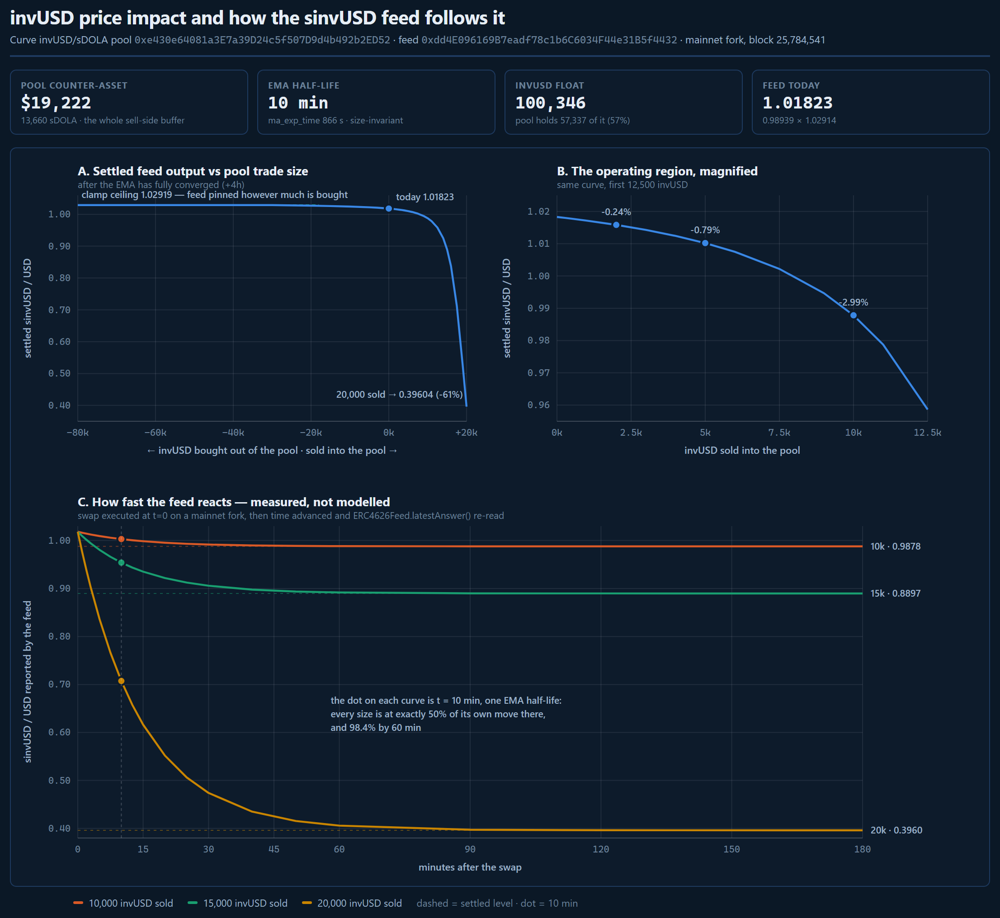
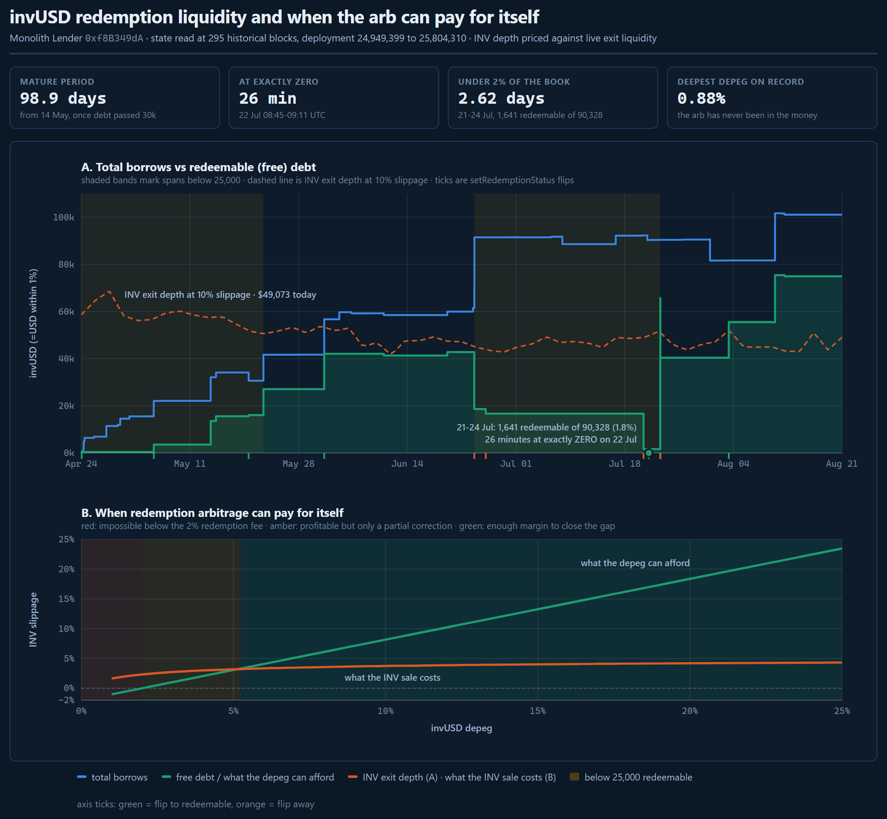
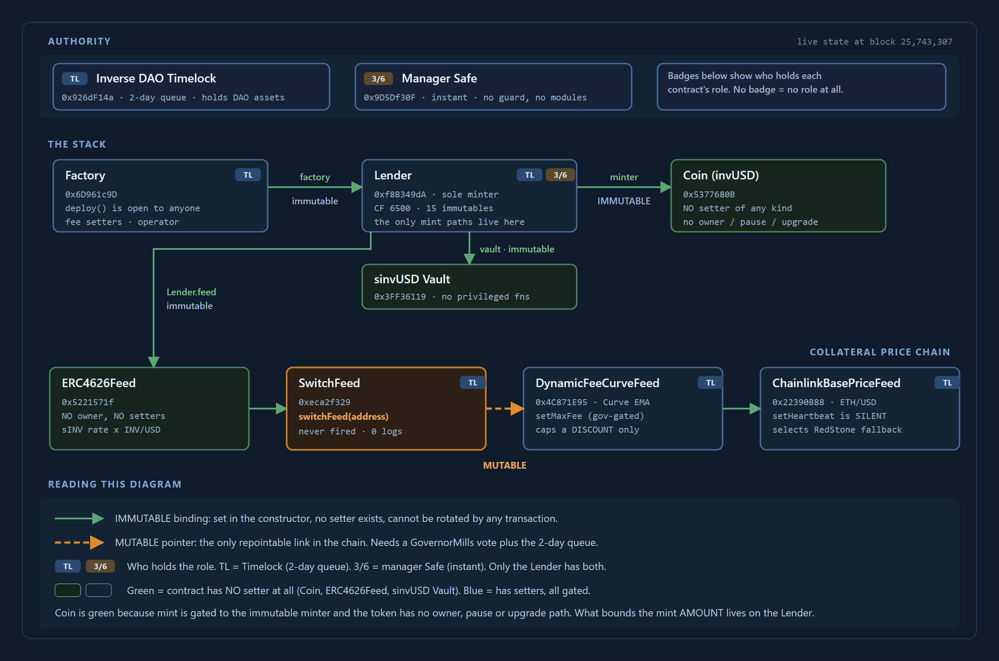

# FiRM Collateral Risk Assessment: sinvUSD Collateral on FiRM

Inverse Finance Risk Working Group, August 19th 2026

## Contents

- [Briefing](#briefing)
  - [Forward](#forward)
  - [Risk Vectors](#risk-vectors)
  - [Useful Links](#useful-links)
  - [Glossary](#glossary)
- [Protocol Analysis](#protocol-analysis)
  - [Overview](#overview)
  - [Audits and Bug Bounties](#audits-and-bug-bounties)
- [Collateral Risk Analysis](#collateral-risk-analysis)
  - [Liquidity](#liquidity)
  - [Volatility](#volatility)
    - [Reading the Chart](#reading-the-chart)
    - [Limited Effective Arbitrage](#limited-effective-arbitrage)
    - [Redemption Capacity Is Elective](#redemption-capacity-is-elective)
    - [Borrower Concentration](#borrower-concentration)
    - [Risk Summary](#risk-summary)
  - [Contracts](#contracts)
    - [Decentralization](#decentralization)
    - [Access Control + Impactful Variables & Functions](#access-control--impactful-variables--functions)
    - [Upgradable Proxy Implementations](#upgradable-proxy-implementations)
    - [Risk Summary](#risk-summary-1)
- [FiRM Deployments & Design](#firm-deployments--design)
  - [Price Feed](#price-feed)
- [Conclusion](#conclusion)
  - [Go-Forward Recommendations](#go-forward-recommendations)
  - [Parameter Recommendations](#parameter-recommendations)

## Briefing

### Forward

Monolith is a product built by our (Inverse Finance) own developers, which makes our understanding of contracts, documentation, and intent unusually good. It also makes us the counterparty to our own diligence, which is why the RWG's role here is strictly evaluative: to identify risks and recommend safeguard parameters, not to advocate for the listing. Monolith was deployed on mainnet in April 2026, roughly four months ago, which is against our typical six-month hard floor, with no TVL-based acceleration available at this size. The recommendations presented in the conclusion section are thus accordingly conditional and phased rather than a listing approval.

Monolith deploys each stablecoin as an isolated unit: risk sits per deployment rather than in a shared pool, and invUSD, minted against sINV at a 65% collateral factor, is the first deployed stablecoin on the Monolith stack. The Factory retains no upgrade or pause authority over what it builds; its remaining threads, the operator role and the shared interest model, are set out in the Overview.

sinvUSD, the asset under consideration, is the deployment's vault share and is defined in the Overview. Protocol Analysis covers the factory and the lending core it produces and closes with a carry-forward statement naming what the collateral inherits; the Collateral Risk Analysis then narrows to invUSD and the vault sitting on top of it, and FiRM Deployments & Design and the Conclusion turn to what FiRM would be taking on if the share were listed.

### Risk Vectors

**1. No production track record.** Monolith reached mainnet in April 2026, roughly ten weeks short of the six-month Lindy floor, and the deployment has never been through a stress event: no depeg, no redemption wave, no liquidation under pressure, and borrower behaviour observed only in calm conditions, so solvency resilience and manipulation susceptibility are inferred from mechanism rather than from history. The contracts that would hold FiRM's collateral also sit outside both the bug bounty scope and the SEAL Safe Harbor perimeter by written governance decision. Read more: [Forward](#forward), [Audits and Bug Bounties](#audits-and-bug-bounties)

**2. Exit liquidity is not sized for liquidations.** invUSD trades in two on-chain venues with no CEX listing, and only the roughly $76,000 Curve pool is usable for liquidations, since the Uniswap position is one-sided and buy-only. Every liquidation and every exit therefore routes through that single pool or through redemption into sINV, where INV's own exit depth becomes the binding constraint, and the borrower base behind the book reduces to two economic counterparties with no redemption history on record. Read more: [Liquidity](#liquidity), [Borrower Concentration](#borrower-concentration)

**3. A single, shallow price source with heightened economic-attack potential.** The feed FiRM reads prices invUSD from one Curve pool and nothing else, so a dislocation confined to that venue is reported at full depth regardless of prices anywhere else, and sales in the low tens of thousands of invUSD settle the feed tens of percent lower. Because the oracle's dampening cannot engage while the price sits at its own low, a liquidation executed inside a dislocation is priced at the raw depressed feed, on the same day it is stamped. Read more: [Volatility](#volatility), [Price Feed](#price-feed)

**4. Peg defense is elective, concentrated, slow, and shares one thin exit.** The unthrottled arbitrage path requires solvent, willing borrowers, and the path that survives distress, redemption, is backed by free debt that borrowers can revoke instantly, most of it standing on a single wallet's choice, while the rate controller meant to restore the ratio operates on a seven-day half-life against events measured in hours. What redemption can realise is bounded by INV's own exit depth, the same depth liquidations draw on, and exercising it sells INV, pressuring the collateral behind the coin it defends. The redemption-implied floor near $0.98 is therefore conditional, resting on a capacity that has already ranged to zero in calm conditions and a mechanism that has never once been in the money, and beneath it the depeg curve has no structural support. Read more: [Limited Effective Arbitrage](#limited-effective-arbitrage), [Redemption Capacity Is Elective](#redemption-capacity-is-elective), [Liquidity](#liquidity)

### Useful Links

**RWG Framework Outputs**

Trustfall Access Control Report - [Monolith invUSD](https://rwg-access-control-reports.vercel.app/reports/collateral/Monolith_invUSD.html)

**Monolith**

Official Docs - [docs.monolith.market](https://docs.monolith.market/)

Audits - [docs.monolith.market/security/audits](https://docs.monolith.market/security/audits)

Bug Bounty Program - [Sherlock](https://audits.sherlock.xyz/bug-bounties/287)

SEAL Safe Harbor - [docs.monolith.market/security/safe-harbor](https://docs.monolith.market/security/safe-harbor)

**Key Contracts**

invUSD Coin - [0x5377680B...832e56](https://etherscan.io/address/0x5377680B5986296AA4F9e684e5315a4F24832e56)

invUSD Lender - [0xf8B349dA...FD49c9](https://etherscan.io/address/0xf8B349dA9244253288f6853835e6582955FD49c9)

sinvUSD Vault - [0x3FF36119...f8427d](https://etherscan.io/address/0x3ff361197036ae1d24b939146d8a449a80f8427d)

sINV (collateral) - [0x08d23468...E2e994](https://etherscan.io/address/0x08d23468A467d2bb86FaE0e32F247A26C7E2e994)

FiRM feed, ERC4626Feed - [0xdd4E0961...5f4432](https://etherscan.io/address/0xdd4E096169B7eadf78c1b6C6034F44e31B5f4432)

Curve invUSD/sDOLA - [0xe430e640...b2ed52](https://etherscan.io/address/0xe430e64081a3E7a39D24c5f507D9d4b492b2ED52)

Curve INV/WETH - [0xdcd90d86...fb19ec](https://etherscan.io/address/0xdcd90d866ff9636e5a04768825d05d27b3fb19ec)

### Glossary

| Term | Meaning |
| --- | --- |
| invUSD | The stablecoin issued by the first Monolith deployment, minted against sINV at a 65% collateral factor |
| sinvUSD | The EIP-4626 vault share of that deployment, accruing its interest revenue, and the asset proposed for listing |
| Free debt | Debt carrying no interest and redeemable against by any invUSD holder |
| Paid debt | Debt carrying the controller-set variable rate and protected from redemption |
| Redemption | Presenting invUSD against a free position to take collateral at oracle price less the redemption fee |
| PPO | FiRM's Pessimistic Price Oracle. Caps borrowing power at the collateral's two-day low; effective against borrowing on a recovered price, but does not constrain a liquidation executed during a live dislocation. |

## Protocol Analysis

### Overview

Monolith is a decentralized stablecoin-as-a-service protocol built by Inverse Finance's own developers: anyone can deploy a crypto-backed stablecoin by supplying a collateral token, an oracle and a parameter set. The Factory then deploys an independent triplet of contracts, a Lender that holds collateral and issues debt, a Coin that is the stablecoin itself, and an EIP-4626 Vault whose shares accrue the deployment's interest revenue. Triplets share nothing: no common pool, no cross-deployment socialisation, no global pause, so a failure in one deployment stays inside it. The only threads the Factory retains are the operator role, which appoints each deployment's manager, and a shared InterestModel that every deployment reads for its rate. Nothing in a deployed triplet is upgradeable or pausable, so what the Factory builds is what runs, permanently.

invUSD is the first Monolith deployment and the only one carrying meaningful state. It is a CDP stablecoin minted against sINV, Inverse's staked governance token vault, at a 65% collateral factor, with roughly $245k of sINV deposited against roughly $100k of invUSD issued today. sinvUSD, the asset under consideration for FiRM, is the deployment's vault share: a claim on invUSD plus the interest stream its borrowers pay, so its value is the invUSD price multiplied by an accruing share rate. A FiRM lender against sinvUSD is therefore exposed, through one wrapper, to the solvency of the invUSD loan book and the behavior of its price.

Because this Overview is the document's one inventory of the deployment's mechanics, each peg defense and each solvency mechanic is named explicitly here; the sections that follow test how they hold up.

**Peg defense runs on three mechanics.** The first and the load-bearing one is redemption. Every borrower elects their own debt regime through `setRedemptionStatus`, instantly, costlessly and reversibly: free debt pays no interest but any invUSD holder can redeem coins against it, taking collateral at oracle price less the redemption fee, while paid debt accrues the controller's rate and cannot be redeemed against. Redemption is what ties invUSD to its collateral, and it implies a price floor of one dollar minus the fee. That floor is variable, not fixed: the fee is set by the deployment's manager or operator under a 500 bps source cap, currently 200 bps after one reduction from 300, so the floor sits near $0.98 today, can be loosened no further than $0.95, and holds only while free debt exists to redeem against, roughly three quarters of the book at present. The second mechanic is the rate controller that steers that free share: when the free-debt ratio falls below its target band, the borrow rate rises exponentially, pushing borrowers back toward free debt. The controller has a 0.5% floor and no ceiling in code, samples the ratio only at permissionless accrual calls and applies each reading retroactively across the whole elapsed gap, so its behavior is spiky in practice, with a live record including a climb from about 1% to nearly 20% APR over roughly six weeks. The third mechanic, a peg stability module against USDS, exists but is dormant and effectively empty, and is treated under Volatility.

**Solvency runs on four.** The first is overcollateralization with permissionless liquidation: positions are liquidatable from the 65% collateral factor, and four liquidations have executed to date in ordinary conditions. The cushion between liquidation eligibility and a position going underwater is roughly 35% of collateral value, and against a longtail collateral with thin on-chain liquidity that is a workmanlike margin rather than a wide one. The second is a pair of automatic, keyless safety states: if aggregate debt exceeds aggregate collateral value, or the oracle reverts or returns zero, the Lender enters `reduceOnly`, blocking new borrows and withdrawals while leaving repayment open, and the oracle-failure case disables liquidations alongside it. The third governs a stale but positive oracle: past the immutable 24-hour staleness threshold the reported price decays linearly to zero over a further 24 hours while liquidations remain enabled, so in that window eligibility and seizure size follow a clock rather than a market, and the defense that works at any decayed price is repayment. The fourth and final backstop is `writeOff`, which socialises an underwater position across all coin holders and thereby restores the coin's backing accounting, keeping the system solvent by recognizing the loss rather than carrying it. It is deliberately last-resort, callable only at an extreme collateral-wipeout threshold, with no intermediate bad-debt mechanism, insurance layer or junior tranche beneath it, so bad debt short of that threshold persists unrecognized on an open position.

Governance of the deployment is deliberately thin and is covered in Contracts: a manager Safe on the instant path for economic tuning, the operator behind Inverse Finance governance, and an immutability deadline in April 2030 after which most remaining setters lock. What carries forward into the rest of this assessment is a non-upgradeable, unpausable lending core whose peg defense is an elective property of its borrowers behind a variable floor, whose only continuous control loop is a rate controller with no upper bound, and whose loss recognition is binary: full solvency accounting until an extreme threshold, then socialisation onto every holder at once, including the vault FiRM would hold.

### Audits and Bug Bounties

Monolith has been audited seven times; six reports are published in the protocol documentation, and the ChainSecurity re-audit's final report is pending publication with a pre-publication draft linked in the interim:

- **Electisec (now yAudit), June 2025.** Private review of the five core contracts, Factory, Lender, Vault, InterestModel and Coin ([report](https://monolith-public-files.vercel.app/audits/yAudit-Monolith-Report-June-2025.pdf)).
- **ChainSecurity, October 2025.** Private audit of the same core suite, covering arithmetic precision, the ERC-4626 integration and the correctness of the redemption and liquidation systems ([report](https://monolith-public-files.vercel.app/audits/ChainSecurity-Monolith-Audit-Report-October-2025.pdf)).
- **Sherlock, December 2025.** Public contest across the core contracts plus Lens.sol, with over a hundred researchers participating ([report](https://monolith-public-files.vercel.app/audits/Sherlock-Monolith-Public-Audit-Contest-Report-December-2025.pdf)).
- **ChainSecurity, March to April 2026.** Re-audit of the material changes since October across multiple iterative code versions ([pre-publication draft](https://monolith-public-files.vercel.app/audits/ChainSecurity-Monolith-Re-Audit-Report-March-2026.pdf)).
- **Sherlock AI, Nemesis and Zellic v12, April 2026.** Three AI-assisted reviews of the core contracts run as one initiative ([Sherlock AI](https://monolith-public-files.vercel.app/audits/Sherlock-AI-Monolith-Audit-Report-April-2026.pdf), [Nemesis](https://monolith-public-files.vercel.app/audits/Nemesis-Monolith-Audit-Report-April-2026.md), [Zellic v12](https://v12.sh/runs/1892/public))

The Electisec review, the October ChainSecurity review and the Sherlock contest each state that all findings were resolved prior to deployment, while the March 2026 re-audit and the three April reviews carry no stated remediation status.

Monolith's bug bounty program is [hosted by Sherlock](https://audits.sherlock.xyz/bug-bounties/287) and has been open since May 19, 2026. The scope table lists the six core contracts, Factory, Lender, Coin, Vault, PSM and InterestModel, but the program states explicitly that no deployed instance of the Lender, Coin, Vault or PSM is currently in scope, so live coverage extends to the Factory and InterestModel singletons only. Payouts run from 5,000 to 20,000 USD for Critical, 3,000 USD for High, 1,000 USD for Medium and 250 to 500 USD for Low, paid in DOLA on Ethereum.

SEAL Safe Harbor was adopted for Monolith through Inverse Finance's [GovernorMills proposal #357](https://www.inverse.finance/governance/proposals/mills/357). The proposal raised the per-incident bounty cap to $1,000,000 at a 10% bounty rate and registered the agreement in the SEAL registry. Coverage extends to two addresses, the Factory and the InterestModel. Child markets deployed through the Factory are explicitly excluded. The invUSD Lender, Coin and Vault are Factory children, so the contracts that would hold FiRM's collateral sit outside both the Safe Harbor perimeter and the live bug bounty scope, while the two covered singletons are the same under both programs.

## Collateral Risk Analysis

### Liquidity

Of 100,345.83 invUSD outstanding, 98.78% sits in three venues: the Curve invUSD/sDOLA pool (57.14%), a Uniswap v4 position (25.03%) and the Monolith vault (sinvUSD, 16.61%). The largest wallet outside those venues holds 1.21% of supply, and the unaccounted remainder is 1.22%. There is no distributed holder base of any size, so the venues are both where the token trades and where nearly all of it is held.

| Venue / Pool | TVL | Composition | Notes |
| --- | --- | --- | --- |
| Curve invUSD/sDOLA | $75,930.67 | 56.71k invUSD / 13.66k sDOLA (75/20) | All sticky as Inverse-owned liquidity |
| Uniswap v4 | $24,606.22 | 25.1k invUSD / 0.00 USDC (100/0) | All sticky as Inverse-owned liquidity, buy-only (not useful for liquidations) |
| Total (2 pools) | 100,536.89 | 80/20 | $75,930.67 is true depth considered for liquidations |

No CEX lists invUSD, so every liquidation and every exit runs through these on-chain venues. invUSD trades at 0.988352 against a redemption-implied floor of $0.98 set by the 200 bps redemption fee, leaving it 0.85% above that floor. The floor holds while free debt exists, since redemption against free positions is the arbitrage that enforces it, and it lapses if the free-debt ratio collapses.

As for INV, All meaningful liquidity sits in three Curve pools on Ethereum mainnet. There are 3 additional micro-pools, each ~$10K or less on Balancer, and Sushiswap with negligible volume that are excluded from the table.

| Venue / Pool | TVL | Composition | Notes |
| --- | --- | --- | --- |
| Curve INV/DBR/DOLA | $790,563 | $263.5k INV / $263.5k DBR / $263.5k DOLA (33.3/33/33.3) | Tri-DBR |
| Curve INV/wETH | $445,857 | $225k INV / $220.77k wETH (50.5/49.5) | |
| Curve INV/wETH/USDC | $25,077 | $8.35k INV / $8.35k wETH / $8.35k USDC (33.3/33.3/33.3) | TriCryptoINV |
| Total (3 pools) | 1,261,497 | 40/60 | |

### Volatility

invUSD is a stablecoin, so the volatility that matters here is not market beta but how far and how fast the price FiRM reads can dislocate under liquidity stress, and what stands between a dislocated price and its recovery. The study below measures the first question directly against the live pool; the subsections that follow take up the second, tracing the paths that could restore a dislocated price and who actually holds them.



*Every point is a swap executed against the Curve invUSD/sDOLA pool on a mainnet fork at block 25,784,541, after which `ERC4626Feed.latestAnswer()` was read directly, the same call FiRM would make. Panels A and B advance time four hours so the EMA is fully converged; panel C samples that call repeatedly as time advances. The simulation idealizes in two ways, warped time and no trading after the initial swap, but every price is computed by the deployed contracts themselves rather than by a closed-form approximation; the observed convergence matches the closed form to within 0.29 percentage points.*

#### Reading the Chart

Panel A is flat on the buy side because ClampedPriceFeed pins invUSD at $1.00, so the feed cannot exceed the clamp ceiling however much is bought. On the sell side it is near-linear to about 7,500 invUSD, then turns over sharply as the pool's 13,660 sDOLA sell-side buffer is consumed: a 20,000 invUSD sale, about a fifth of the float, settles the feed at 0.396, a 61% markdown. Panel B magnifies the operating region, where 5,000 invUSD moves the settled feed 0.79% and 10,000 moves it 2.99%. Panel C is the measured step response: every sale size passes 50% of its own move at the 10-minute EMA half-life and 98.4% by the hour, so any borrow against this collateral is capped at essentially the full depth of the dislocation within sixty minutes, though a liquidation inside that window is priced at the live trough rather than the cap.

One thing the chart deliberately does not show is arbitrage. Nothing traded after the initial swap, so panel C is the oracle's own dynamics rather than a market simulation. Real arbitrage would push spot back and the feed would track the recovery. The settled levels therefore hold for a sustained repricing, which is the credit-event case that matters for collateral, and overstate a transient sale that gets arbitraged back. Whether arbitrage arrives is the subject of the next subsection.

#### Limited Effective Arbitrage

Three paths can retire discounted invUSD. Their capacities differ by four orders of magnitude, and each is constrained differently:

| Path | Capacity | Constraint |
| --- | --- | --- |
| Debt repayment at par | 101,061 invUSD (100.7% of float) | Solvent, willing borrowers |
| `redeem()` vs free debt | 74,917 invUSD (74.7% of float) | Ends in sINV; elective |
| PSM `sell()` | 1.38 invUSD | Dormant since June 2026 |

The PSM is not an exit. `sell()` decrements `freePsmAssets` on an unsigned integer, so it reverts above 1.38 invUSD, while `getSellAmountOut` quotes 1:1 at any size with no capacity check and therefore reads as live to any integrator that trusts the quote.

The largest path is a borrower buying invUSD below par and burning it against their own debt, which books the discount immediately and never touches INV. It is unthrottled, but it is a solvent-borrower mechanism: a borrower facing liquidation has no reason to put good money into a position they are about to lose, so it weakens precisely in the scenario where invUSD is genuinely impaired. Redemption is the path that survives a credit event, since `redeem()` carries no solvency check, but it converts invUSD into sINV, so realising it requires selling INV, where routed depth across both Curve venues reaches 10% slippage at roughly 4,800 INV. That is the same constraint that governs liquidation of the collateral itself.

#### Redemption Capacity Is Elective

Redemption is what ties invUSD to its collateral, and it applies only to borrowers who have opted into free debt. That choice is theirs, revocable, and instant:



*State read at 295 historical blocks from deployment to block 25,804,310. In panel A the shaded bands mark spans where redeemable capacity sat below 25,000 invUSD, the ticks under the axis are `setRedemptionStatus` flips, and the dashed line is INV exit depth at 10% slippage, the yardstick for what redemption could realise in cash. Panel B prices the redemption arbitrage against current liquidity, holding the purchase price fixed, so it is a deliberately conservative snapshot whose shape, rather than exact crossing, is the finding.*

That capacity also has a history, and it is volatile by election. Once the book matured past 30,000 invUSD in mid-May, redeemable capacity spent 37.8% of the following 99 days below 25,000 invUSD, including one continuous run of 29 days, and in late July it fell to 1.8% of a 90,000 book for two and a half days, touching exactly zero for 26 minutes. Every transition traces to a handful of `setRedemptionStatus` flips, and across the entire period no redemption has ever been exercised. Today's roughly three-quarters share is therefore the high end of the realized range rather than a resting state, and the July collapse shows the capacity can vanish in ordinary conditions, without any stress at all. Since early August the free-debt line has also run above INV exit depth at 10% slippage, roughly $49,000 today, so what the redemption channel could actually realise in cash is currently bounded by INV's own liquidity rather than by the size of the election.

Panel B asks whether the redemption trade pays at all. A redeemer buys discounted invUSD, burns it for sINV at the oracle price less the 200 bps fee, and sells the INV, so the trade clears only when the depeg exceeds the fee plus the INV slippage on the size sold. That single inequality explains the bands: nothing fires inside 2%, between roughly 2% and 5% the trade profits but corrects only part of the gap, and only beyond that is there margin to close it entirely. The deepest depeg on record is 0.88%, so the mechanism has never once been in the money, which is also why invUSD has drifted from 1.0047 to 0.9913 over four months without correction: nothing arbitrages inside the fee band, by construction.

The flips observed so far are rate optimisation rather than stress behaviour, since the ratio has sat above the target band throughout. They establish that borrowers actively manage the setting and can reverse it within minutes; the inference that they would flee redemption under pressure is an incentive argument, not an observed event.

A borrower being redeemed against is forcibly deleveraged: they give up 0.98 of collateral value to retire 1.00 of debt, which improves their LTV but closes a position they may want to keep. In a depeg, redemption pressure concentrates on exactly those borrowers, and the cost of escaping it is switching to paid debt and paying interest, currently 17.02% APR. A few days of that is cheap against forced exit from a leveraged INV position.

The only counterweight is the rate controller, which raises the borrow rate when the free-debt ratio falls below its target band. That band is 3,000 to 7,000 bps against a live ratio of 7,413 bps, and the controller's half-life is 7 days. A depeg resolves in hours; the controller cannot respond inside the window that matters.

#### Borrower Concentration

Monolith's invUSD book presents as five borrowers. On-chain funding traces reduce that to two economic borrowers plus a 0.6% tail: within each cluster, one wallet funded the other's entire collateral position.

| Cluster | Wallets | Debt (invUSD) | Share of book | Share of collateral |
| --- | --- | --- | --- | --- |
| A | 2 | 84,298.40 | 83.41% | 85.2% |
| B | 2 | 16,162.35 | 15.99% | 14.2% |
| Tail | 1 | 600.25 | 0.59% | 0.6% |

This matters to FiRM twice over. The write-off path socialises bad debt onto surviving borrowers, so with two economic counterparties a default by the larger leaves essentially one party to absorb it, and cluster A alone is 83.41% of the book. Redemption concentrates the same way: cluster A's lead wallet alone elects 78.4% of all redemption capacity, and the two clusters hold all of it between them, so the roughly three-quarters redemption figure quoted above is one wallet's standing choice, revocable in a single transaction, rather than a property of the market.

#### Risk Summary

1. **Settled discounts are reachable.** The entire liquidity behind the feed is a single Curve pool whose aggregate TVL is roughly $76,000 against a float above 100,000 invUSD, so sales in the low tens of thousands of invUSD settle the feed tens of percent lower without any move in INV. How fast that reverses depends on the cause: with INV healthy, borrowers can buy discounted invUSD and retire debt at par, an unthrottled incentive but not a guarantee, since clearing depends on borrowers noticing and choosing to act; with INV impaired, that path weakens because underwater borrowers prefer default, and redemption, the path that survives, is capped by the same INV exit depth that governs liquidation. FiRM's pessimistic oracle caps borrowing power at the collateral's two-day low, maintained by a daily keeper, which protects the borrow side against a recovered price but, by construction, cannot act while the price sits at its own low, so a liquidation executed inside a live dislocation is priced at the raw depressed feed rather than a dampened one. The liquidity case is the more likely of the two and the less justified, since positions are marked down against a shallow pool while the collateral itself is sound.
2. **Redemption capacity is a variable that has never been tested.** The free-debt share backing redemption, roughly three quarters of the book today, is the high end of a realized range that has already touched zero in calm conditions, and the fee places a dead zone around par: below a 2% depeg the redemption trade loses money at any size, the deepest depeg on record is 0.88%, and the coin has drifted from above par to 0.9913 over four months with nothing arbitraging inside that band, by construction. What the channel could realise in cash is currently bounded by INV exit depth near $49,000 rather than by the nominal capacity, most of the election stands on a single wallet, and the rate controller meant to restore the ratio operates on a seven-day half-life against events measured in hours. Redemption remains the presumptive primary support under a deep depeg, so state its capacity as a variable, judge it against INV exit depth, and monitor `RedemptionStatusUpdated` and `getFreeDebtRatio` rather than assume today's split holds.

### Contracts

The access control picture below is grounded in the Trustfall scan of August 13, 2026, covering 12 contracts, 35 role slots and 39 privileged functions across the Monolith stack and its Inverse governance surface, with a clean integrity check and no sanctioned addresses among those screened.



*Authority map built from the Trustfall data at block 25,743,307. Green marks contracts with no setter of any kind, blue marks contracts whose setters are all role-gated, and the orange dashed edge is the price chain's single mutable pointer, held by Inverse gov. and never exercised; the Trustfall report carries the detail. Solid green edges are immutable constructor bindings that no transaction can rotate. The TL badge marks roles held by Inverse gov, and 3/6 marks the instant TWG Safe; only the Lender carries both.*

#### Decentralization

Authority over invUSD runs in two tiers. The slow path is the [Inverse DAO Timelock](https://etherscan.io/address/0x926dF14a23BE491164dCF93f4c468A50ef659D5B), behind a 3-day voting period and 2-day queue administered by GovernorMills, holding the operator seat on the [Lender](https://etherscan.io/address/0xf8B349dA9244253288f6853835e6582955FD49c9), the [Factory](https://etherscan.io/address/0x6D961c9DCF1AD73566822BA4B087892e3839B849), and all three governed price-chain contracts. The fast path is the Inverse Finance Treasury Working Group (TWG), a [3-of-6 Gnosis Safe](https://etherscan.io/address/0x9D5Df30F475CEA915b1ed4C0CCa59255C897b61B) holding the manager role on the Lender for same-day economic tuning. The sINV deposit gate sits with the Inverse Finance Policy Committee, a [4-of-7 Safe](https://etherscan.io/address/0x4b6c63E6a94ef26E2dF60b89372db2d8e211F1B7). The asset's realized history is minimal: one configuration change to date, a redemption fee reduction from 300 to 200 bps on July 21, 2026, executed by the TWG.

#### Access Control + Impactful Variables & Functions

Most of invUSD is immutable. The [Coin's](https://etherscan.io/address/0x5377680B5986296AA4F9e684e5315a4F24832e56) only authority surface is an immutable minter pointer to the Lender, the price feed is set once in the Lender constructor and can never be repointed there, and the Lender's structural parameters were all fixed at construction with no setter in source:

| invUSD Constructor parameter | Value | Note |
| --- | --- | --- |
| `collateralFactor` | 65% | Factory cap 85% |
| `minDebt` | 500 invUSD | Minimum position size |
| `MIN_LIQUIDATION_DEBT` | 10,000 invUSD | No partial liquidation below this |
| `stalenessThreshold` | 24 hours | Then linear decay to zero over 24 hours |
| `psmVaultMinTotalSupply` | 1,000,000 sUSDS | Inflation-attack floor |
| `immutabilityDeadline` | April 23, 2030 | Reducible only, never extendable |

What follows is the mutable remainder.

The TWG's reach as manager covers four economic setters on the instant path, the rate controller's half-life and target band, the redemption fee (capped at 500 bps in source), and the borrow delta bound, plus `setManager`. It cannot mint, cannot pause, and cannot touch the oracle. The operator reaches the same setters through the 2-day queue and additionally holds the local reserve fee (capped at 1000 bps), operator rotation, and `enableImmutabilityNow`, which collapses the deadline to the current timestamp irreversibly.

Upstream of the Lender's constructor-set feed, the collateral price chain carries a small number of governed levers, including its single mutable pointer, held by Inverse governance and never exercised since deployment; the full lever inventory is documented in the Trustfall access control report linked under Useful Links. One mutable lever sits on the collateral token itself: [sINV's](https://etherscan.io/address/0x08d23468A467d2bb86FaE0e32F247A26C7E2e994) `setDepositLimit`, held by the Policy Committee, caps total deposits into the sINV vault. It applies to deposits only, not withdrawals, takes effect instantly, and emits no event.

The scan's single CRITICAL, an EOA holding the deployer role on the governance Guardian, was dismissed on a full source read: the role can only arm a proposal veto that the Policy Committee Safe must separately execute.

#### Upgradable Proxy Implementations

Nothing Monolith deploys or Inverse governs in this stack is upgradeable: every contract reads zero at every EIP-1967 slot, and the Coin's minter is baked into bytecode. No admin can change the rules under a lender, and equally no defect can be patched, only migrated away from. Etherscan's proxy flag on the Factory is a verified false positive triggered by linked deployer libraries. Four third-party contracts the stack points at are upgradeable and sit outside the guarantee: USDS and sUSDS behind the peg stability module, the RedStone ETH/USD fallback, which becomes the live source whenever Chainlink reads stale, and Chainlink's own aggregator proxy.

#### Risk Summary

The residual risks in this section are ordered by weight, and both carry the same qualifier: the levers involved are held by Inverse's own DAO and working groups, since Inverse is the operator of invUSD. They are recorded primarily as review items for future Monolith listings where the operator is a third party.

1. **Rate-controller forced liquidation.** The interest model has a rate floor but no ceiling in code, and a single call moving the target free-debt band above the live ratio flips it into exponential growth, compounding the borrow rate against paid-debt borrowers. An internal study replaying the deployed InterestModel with liquidators in the loop found the mechanism self-limiting: liquidations burn more than the accrual mints, the growth branch exits on its own, and net supply decreases, so the meaningful event is not inflation but a liquidation cascade that clears essentially the entire interest-bearing book inside days. For invUSD the lever sits with Inverse as operator and manager, and `enableImmutabilityNow` can retire it permanently, so it is graded low here. The bound is position-shaped rather than code-shaped, so it should be re-measured on any future Monolith coin Inverse does not operate, where an outside operator could ignite the cascade against a market holding the coin as collateral.
2. **Collateral deposit denial of service.** The sINV deposit limit is the asset's de facto supply ceiling, and a limit set too low, or to zero, blocks all new sINV deposits instantly and with no event, denying Monolith borrowers the ability to collateralize or defend their positions with fresh sINV while leaving withdrawals open. The limit is held by the Inverse Finance Policy Committee, so for invUSD this is an operational coordination item rather than an adversarial surface, but it is silent, so it belongs on the live-read monitoring list rather than the event feed.

## FiRM Deployments & Design

### Price Feed

FiRM would consume [ERC4626Feed](https://etherscan.io/address/0xdd4E096169B7eadf78c1b6C6034F44e31B5f4432), which reports the sinvUSD/USD price in 18 decimals. This chain is a FiRM-side deployment, distinct from the Monolith-side chain the invUSD Lender reads to price sINV; both chains contain contracts named ChainlinkBasePriceFeed and ERC4626Feed, but the instances are separate deployments with different configurations. The feed computes:

```
sinvUSD/USD = min(Curve invUSD-per-DOLA × Chainlink DOLA/USD, $1.00) × sinvUSD share price
```

Four contracts run in series over two market inputs and the sinvUSD share price. All values read at block 25,784,232:

| # | Component | Live value | Mutable surface |
| --- | --- | --- | --- |
| 1a | Chainlink DOLA/USD | 0.99802835 (8 decimals) | External push feed |
| 1b | Curve invUSD/sDOLA | `price_oracle(0)` 0.99134750 | External, 10-minute EMA |
| 2 | ChainlinkBasePriceFeed | Heartbeat 86,400s | Owner plus one setter |
| 3 | ChainlinkCurveFeed | 0.98939291 | None |
| 4 | ClampedPriceFeed | 0.98939291, ceiling $1.00 | None |
| 5 | [sinvUSD vault](https://etherscan.io/address/0x3FF361197036Ae1d24B939146D8a449A80F8427d) | `previewRedeem` 1.02913821 | External |
| 6 | [ERC4626Feed](https://etherscan.io/address/0xdd4E096169B7eadf78c1b6C6034F44e31B5f4432) | 1.01822205 | None |

**Mutability.** The entire mutable surface is one parameter on one contract: `setHeartbeat` on ChainlinkBasePriceFeed, plus its two-step ownership transfer, all `onlyOwner` and held by the [Inverse Timelock](https://etherscan.io/address/0x926dF14a23BE491164dCF93f4c468A50ef659D5B) behind its 2-day delay. ERC4626Feed, ClampedPriceFeed and ChainlinkCurveFeed have no owner and no setter of any kind; every pointer and parameter in them is a constructor-fixed immutable. There is no repointable feed anywhere in the chain.

**The clamp.** ClampedPriceFeed caps the invUSD leg at $1.00 with no floor, and sits deliberately before the vault multiply. invUSD is a stablecoin, so $1.00 is its correct ceiling: the clamp stops an upward depeg from inflating collateral while passing a peg break through at full depth. sinvUSD is a claim on a growing pile of invUSD and legitimately exceeds $1.00, so the accrual leg is left unbounded by design.

**Staleness.** Only the Chainlink leg carries a timestamp, which is correct: the Curve EMA and the vault share price are read live from chain state on every call and cannot go stale. The 86,400-second heartbeat is the sole staleness control, since `assetToUsdFallback` is unset and the aggregator's `minAnswer` and `maxAnswer` bounds (1 and 9.57e52) make the out-of-bounds check inert. On staleness the feed returns the last price with `updatedAt` set to zero, which propagates unchanged to the top of the chain.

## Conclusion

The concept behind this listing is sound. Monolith deploys each stablecoin as an isolated unit with no shared pool and no cross-deployment socialisation, nothing it deploys is upgradeable or pausable, and the audit record is deeper than the age of the code would suggest. Nothing in this assessment argues against Monolith coins becoming FiRM collateral as a class, and the framework the protocol establishes is one the RWG expects to reuse for future deployments. The limitations set out below stem from the longtail collateral behind this particular coin and from the concentration of its borrower base rather than from the architecture.

The binding constraint is a timing mismatch. The feed registers a dislocation almost immediately, passing 98.4% of any move within the hour on a ten-minute EMA half-life, and FiRM's oracle caps borrowing power at that collateral's two-day low, though a liquidation executed inside the dislocation is priced at the live trough rather than a dampened value. The defense moves on a different clock: the rate controller that rebuilds redemption capacity operates on a seven-day half-life, and realising whatever capacity exists means selling INV, where routed depth reaches 10% slippage at roughly 4,800 INV. FiRM would mark and liquidate in hours against a defense that repairs in days and spends the collateral's own bid as it works, and borrower concentration determines how often that gap stands exposed.

Whether redemption arbitrage closes the gap is unproven. The deepest depeg on record is 0.88% against a fee that places a dead zone of roughly 2% around par, so the trade has never been in the money and no participant has demonstrated that it will arrive when it is. Capacity itself is elective and has been volatile: it stands at roughly $75,000 today, the highest reading on record, after spending 37.8% of the preceding 99 days below 25,000 invUSD and touching zero for 26 minutes in late July, in calm conditions, on the standing choice of a single wallet that elects 78.4% of it. The safety of this market therefore cannot be quantified, because the load-bearing assumption is a behaviour with no history behind it.

The RWG's position is accordingly that sinvUSD should not be listed on the parameters that current conditions support. Sizing the market against the measured exit stack, with redemption contributing nothing, produces a ceiling and a collateral factor that would not attract borrowers, and the modelling conducted for this assessment did not identify a configuration that both survives the dislocation scenarios above and leaves a market worth operating. Every ceiling tested at or below 50,000 invUSD failed one of those two tests. Rather than propose a parameter set that fails on one count or the other, this assessment sets out what would have to change for a first parameter set to be proposable at all.

The measure the RWG adopts for redemption liquidity, here and for future Monolith listings, is the trailing thirty-day floor: the lowest total redeemable liquidity observed across the preceding thirty days rather than the reading on the day of assessment. The distinction is load-bearing in this case, because the spot figure is the highest on record while the floor across the same window sits far beneath it. The floor is a level the market has actually defended, so it is the level parameters can be sized against, and it is also the measure that establishes why borrower diversification is a precondition rather than an improvement. While five borrowing wallets reduce to two economic counterparties, the floor describes one participant's revocable election rather than a property of the market. The near-term direction is downward rather than upward: the variable rate sits at 5.24% and is being held just below the 70% free-debt target, and the last occasion on which the rate fell this far saw borrowers switch back into paid debt and redemption capacity go to zero. That episode is the closest thing to a precedent on record, and it argues against sizing anything against the current reading.

### Go-Forward Recommendations

The four items below are the changes that would move this market into a range where parameters can be set with evidence behind them. They are independent of one another and each relaxes a different constraint, so they are cumulative rather than a package to be delivered in full. The RWG's threshold for reassessment is one of them implemented. What can then be proposed scales with how many are met and how far each goes, so meeting two or three does not repeat the same reassessment with greater confidence, it raises the ceiling and the collateral factor that reassessment can support. Each of the four is actionable within the DAO rather than dependent on a third party.

**1. Deepen the price feed pool.** The Curve invUSD/sDOLA pool holds roughly $76,000 against a float above 100,000 invUSD, and it is the sole source behind the feed FiRM would read. A minimum of $200,000 is the level the RWG has been held to before on comparable architecture, most directly by LlamaRisk on the DOLA/scrvUSD pool backing EMA feeds in LLAMMA v1 ([Curve proposal 1153](https://www.curve.finance/dao/ethereum/proposals/1153-ownership)), and it is the level applied here. Pool depth is the single input that improves every finding in this document at once, since it raises the cost of dislocating the feed, widens the near-frictionless liquidation exit, and reduces how much of the defense has to route through redemption.

**2. Lengthen the moving average window on the feed pool.** The pool's EMA is currently set to ten minutes. At that setting roughly $30,000 moves the reported price far enough that fifteen minutes without arbitrage is sufficient to mark FiRM positions into bad debt on liquidation, and fifteen minutes of quiet is not a stress assumption at this depth. The moving average window is a parameter under Curve governance, so lengthening it is a governance action rather than a redeployment. The appropriate value is a research question the RWG has not yet answered, since a longer window buys manipulation resistance at the cost of slower recognition of a genuine repricing, and the two have to be traded against each other explicitly rather than by default.

**3. List the sinvUSD/(s)DOLA LP token rather than the naked vault share.** Taking the LP token as collateral prices the position against both sides of the pool and gives the market a direct interest in the depth of the venue the feed reads, which supports a higher ceiling and a higher collateral factor than anything the naked share can carry at present depth. It carries an incentive cost that has not been modelled, and the feed delivered for review is a naked sinvUSD feed, so adopting it means a different feed and a different assessment scope.

**4. Establish the redemption arbitrage as observed rather than assumed.** The document's central unknown is whether anyone will buy discounted invUSD and redeem it against free debt when the trade becomes profitable. Redemption capacity switches on and off with borrower election, so it is not obvious that generalised MEV is watching for it, and the trade has never once been in the money for anyone to have demonstrated otherwise. Either outcome resolves this: evidence that a searcher already runs this path, or a protection bot operated by Inverse that monitors the feed pool, sources available redemption liquidity, and closes the gap. A reliable arbitrage path into the feed pool functions as an extension of that pool's depth, which is why this item and the first are alternative routes to the same constraint rather than duplicates.

**5. Free-debt ratio targets (under research).** The rate controller's target band is what steers borrowers between paid and redeemable debt, so raising the band's floor would mechanically encourage more free debt and deepen the redemption channel that supports the price feed. The RWG is researching whether the current 3,000 to 7,000 bps band can be tuned upward to hold a higher standing redeemable share without pushing the controller toward the exponential-growth branch that the same lever can trigger, and whether a tighter or higher band meaningfully reduces the periods of thinned redemption liquidity the assessment documents. This is carried as a consideration rather than a recommendation, since the interaction between a higher target and rate stability needs to be modelled before the RWG would propose a specific band.

Meeting any one of these returns the market to the RWG for reassessment and a first parameter proposal. The decision on which to pursue sits with the business case rather than with this assessment, and the routes are not equivalent in cost or in speed: incentivising the pool toward $200,000 is a treasury question, lengthening the EMA is a governance question, the LP market is a product question, and the arbitrage bot is a development question.

The operator-side findings in this document are recorded primarily as review items for future Monolith listings where Inverse is not the operator, since the levers involved currently sit with Inverse's own DAO and working groups.

### Parameter Recommendations

*Held pending the outcome above.*
