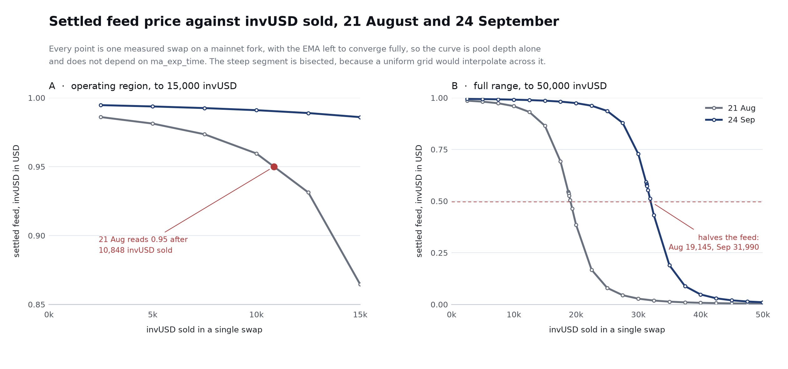
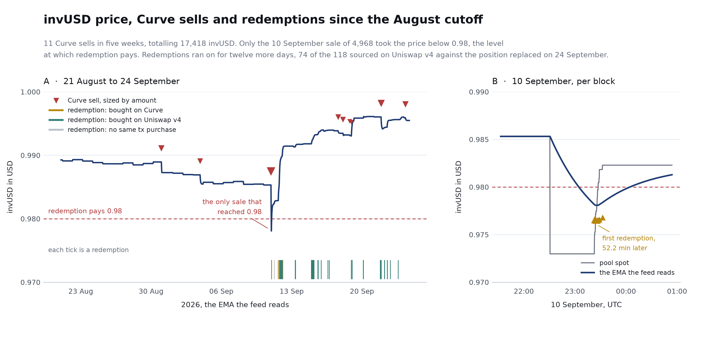
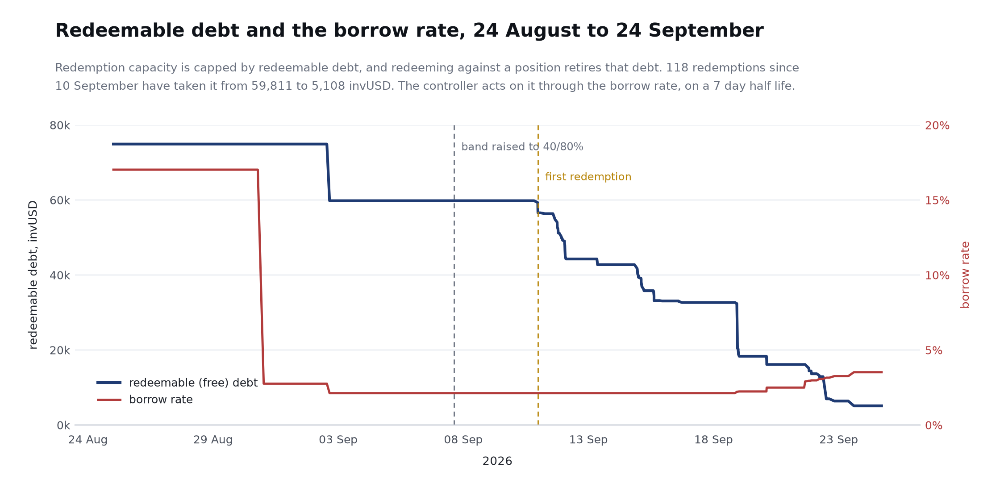

# sinvUSD Reassessment: Mitigation Log and Conclusion

*September 30, 2026. Inverse Finance Risk Working Group. Companion to the [sinvUSD Collateral Risk Assessment](https://github.com/InverseFinance/Risk-Assessments/blob/main/Monolith_sinvUSD/FiRM_Risk_Assessment_sinvUSD_Monolith.md) of August 2026.*

## Contents

- [Forward](#forward)
- [Useful Links](#useful-links)
- [At a Glance](#at-a-glance)
- [Mitigation Log](#mitigation-log)
  - [1. Deepen the price feed pool](#1-deepen-the-price-feed-pool)
  - [2. Lengthen the moving average window on the feed pool](#2-lengthen-the-moving-average-window-on-the-feed-pool)
  - [3. List the LP token rather than the naked vault share](#3-list-the-lp-token-rather-than-the-naked-vault-share)
  - [4. Establish the redemption arbitrage as observed rather than assumed](#4-establish-the-redemption-arbitrage-as-observed-rather-than-assumed)
  - [5. Free-debt ratio targets](#5-free-debt-ratio-targets)
- [Updated Risk Picture](#updated-risk-picture)
- [Conclusion](#conclusion)
  - [Parameter Recommendations](#parameter-recommendations)

## Forward

This document is the reassessment the August 2026 sinvUSD Collateral Risk Assessment called for. That assessment found the concept sound and nothing in Monolith's architecture arguing against Monolith coins becoming FiRM collateral as a class, but concluded that the conditions around this deployment did not yet support a parameter set that was both safe and attractive enough to bring in borrowers. It set out five go-forward recommendations and committed to reassess once any one of them was implemented. Four have been acted on, two of them as ongoing tuning rather than one-time changes, and the fifth was closed by decision.

The August assessment is not revised. It stands as the dated record of the problem, and this document is the record of what was done about it: each recommendation against the action taken, what the action changed, and what it did not, with the August side of every comparison re-measured by the same method as the September side so both come from one source.

invUSD remains a small market, and at its size every figure moves materially week to week. This document therefore records direction and mechanism rather than levels: whether each mitigation did what it was meant to do, and by roughly how much. The levels themselves belong on the RWG's monitoring dashboard, and the RWG will not re-derive its conclusions on each reading. The Conclusion sets out an opening parameter set for an experimental market under a guarded deployment ceiling, and the conditions under which the RWG will take each step toward it. The RWG's role remains evaluative: to identify residual risk and recommend safeguard parameters, not to advocate for the listing.

## Useful Links

sinvUSD Collateral Risk Assessment, August 2026 - [Github](https://github.com/InverseFinance/Risk-Assessments/blob/main/Monolith_sinvUSD/FiRM_Risk_Assessment_sinvUSD_Monolith.md)

Trustfall Access Control Report - [Monolith invUSD](https://rwg-access-control-reports.vercel.app/reports/collateral/Monolith_invUSD.html)

Curve governance vote 1493, EMA lengthening - [curve.finance](https://www.curve.finance/dao/ethereum/proposals/1493-ownership)

Uniswap v4 invUSD/USDC pool - [app.uniswap.org](https://app.uniswap.org/explore/pools/ethereum/0x240ef56f01f4de8e23aa8daa8593f7cebfc4250d91f2b0817cb2b19f8d5dd372)

## At a Glance

| Measure | August 21 | September 24 |
| --- | --- | --- |
| invUSD sold in one swap to move the settled feed 5% | about 11,800 | about 24,100 |
| Bid-side DEX liquidity for invUSD, all venues | about $19,000 | about $67,000 |
| Feed EMA half-life | 10 minutes | 42 minutes |
| Redemptions on the Lender, lifetime | 1 | 119 |
| Organic dislocation to first corrective redemption | never observed | 52 minutes |
| Redeemable (free) debt | about 75,000 invUSD | about 5,000 invUSD |
| Borrowers carrying debt | 5 | 10 |

## Mitigation Log

Each entry records what was done, what it changed, and what it did not. Entries are deliberately brief; the measurements behind them are in the RWG's September research note.

### 1. Deepen the price feed pool

**What was done.** The TWG withdrew the one-sided Uniswap v4 invUSD/USDC position and relaunched it two-sided on September 24, with roughly $35,000 of USDC on the bid across a $0.98 to $1.00 range, and the Curve invUSD/sDOLA pool's sDOLA bid side grew by about two thirds. The Curve pool, which is the pool the feed reads, was not taken to the $200,000 the August document asked for; its total is flat near $76,000.

**What it changed.** Bid-side liquidity for invUSD across all venues rose roughly three and a half times, and the amount of invUSD it takes to move the settled feed roughly doubled: a 20,000 invUSD sale that marked the feed down 61% in August marks it down about 2% today. The larger effect is on what defends the feed pool between dislocations. In August the only corrective path into the feed pool was redemption, which pays nothing until invUSD is below $0.98, so nothing arbitraged inside that band. A two-sided v4 pool gives the feed pool a second path: any Curve dislocation opens a spread that a searcher can close by buying invUSD on Curve and selling it into the v4 USDC bid, profitable at any gap wider than the pools' fees and needing no redemption at all. The feed pool is therefore now defended by cross-venue arbitrage from $1.00 down to $0.98 and by redemption below it, and searchers were already routing through v4 before the relaunch, with 74 of the 118 recent redemptions sourcing their invUSD there.

**What it did not.** The feed still reads the Curve pool alone, so v4 supports it through arbitrage rather than adding depth to it directly. The two-sided position is days old and untested under stress, its bid is fully spent at $0.98, and it is owned by the TWG, so its support is as durable as the TWG's decision to keep it in place.

*Settled feed price against invUSD sold in a single swap, August and September. Each point is a measured swap on a mainnet fork with the EMA left to converge, so the curves are pool depth alone.*

### 2. Lengthen the moving average window on the feed pool

**What was done.** [Curve vote 1493](https://www.curve.finance/dao/ethereum/proposals/1493-OWNERSHIP) executed on September 2, raising the pool's `ma_exp_time` from 866 to 3,600 seconds and the feed's EMA half-life from 10 to about 42 minutes.

**What it changed.** A dislocation must now be held roughly four times longer for the feed to register it: what fifteen minutes of undisturbed dislocation did to the feed in August now takes about an hour. The EMA changes how long a move takes to register, not where it settles, so this compounds with the depth gain rather than duplicating it.

**What it did not.** The lengthening is symmetric by construction. A genuine repricing of invUSD registers four times more slowly too, and any liquidation gated on this feed is delayed by the same factor. That is the price of the mitigation, and the August document said it should be paid explicitly.

**Price Feed Update.** The launch feed, [ERC4626Feed](https://etherscan.io/address/0x52920ea458fe7316fdc4656c044cf275076b9ba5), keeps the structure reviewed in August with one change: DOLA is priced from the EMA of the Curve [DOLA/sUSDS pool](https://etherscan.io/address/0x8b83c4aA949254895507D09365229BC3a8c7f710) through Inverse's existing [DOLA/USD feed](https://etherscan.io/address/0x6255981e2a1EBeA600aFC506185590eD383517be), rather than from Chainlink DOLA/USD. The pool rate-adjusts sUSDS to USDS, and USDS is anchored to dollars through [Chainlink DAI/USD](https://etherscan.io/address/0xAed0c38402a5d19df6E4c03F4E2DceD6e29c1ee9), wrapped by a [base feed](https://etherscan.io/address/0x070287A072cf7Ead994F5b91d75FBdf92A5eAFB7) with a 3,600-second heartbeat and no fallback, which makes DAI/USD the only external price input in the stack. The DOLA/sUSDS pool's EMA runs on a 10-minute half-life, and because DOLA's price is obtained by inverting it, the StableSwap EMA cap gives the DOLA leg a floor near $0.50. That floor does not carry through to sinvUSD: the invUSD leg reads its own pool directly and can fall to zero, and the two legs multiply, so the composite keeps its full downside sensitivity, tracking down to 0.0105 in fork testing. On the upside, ClampedPriceFeed still caps the invUSD leg at $1.00, as reviewed in August.

### 3. List the LP token rather than the naked vault share

Decided against. The business request is to onboard the naked sinvUSD share, and this item is closed.

### 4. Establish the redemption arbitrage as observed rather than assumed

**What was done.** Nothing was deployed. Searchers arrived on their own.

**What it changed.** The Lender's history held one redemption in August, a 1 invUSD self-redeem. Since then there have been 118, totalling about 55,000 invUSD from eight addresses. The one organic dislocation on record came on September 10, when a 4,968 invUSD sale took the feed to 0.978, inside the fee band for the first time in the deployment's life. Redemption arbitrage answered 52 minutes later, buying invUSD on the Curve pool and redeeming it in the same transaction, and four addresses cleared the dislocation within about five minutes. The recovery routed through the feed pool itself. This is the behaviour the August document said had no history behind it, and it now has one. The chain also corrects one detail: there was no late-August depeg; September 10 is the first and only print below 0.98.

**What it did not.** It is one episode, at a depth of about 2.7%, and most of the 52 minutes was time nobody was looking rather than execution, which nothing in the mitigation set controls. Not all of the redemption volume is clean evidence: 74 of the 118 redemptions sourced their invUSD on the old one-sided v4 position at prices above what redemption returns, in a configuration that no longer exists, and their motive is not established, so the evidence the RWG relies on is the Curve-sourced arbitrage and the September 10 episode. And redemption retires the free debt it redeems against, which is entry 5.

**What continues.** The Inverse Finance team continues to monitor redemption activity, including the potential for toxic flow against the Monolith market, and will tune the invUSD redemption fee to reach the most efficient and safe conditions for the market. The fee is the parameter that sets where redemption arbitrage begins to pay, so a lower fee brings the peg defense in closer to par and a higher one gives borrowers more protection from being redeemed against; the team will set it against what the observed flow shows rather than leaving it at its current 200 bps by default.

*invUSD price, Curve sells and redemptions since the August cutoff, and the September 10 dislocation per block. Below 0.98 the redemption trade is in the money.*

### 5. Free-debt ratio targets

**What was done.** On September 7 the TWG raised the rate controller's target band from 30 to 70% up to 40 to 80%, through the manager Safe's instant path. It is the first use of that lever in the deployment's history, and the operator-side path the August document described working as designed.

**What it changed.** The controller no longer decays the borrow rate while the coin sits below par. Replayed across the deployment's history, the old band would have spent almost a third of the period decaying the rate and the new band essentially none of it. Since the change the rate has turned up, from about 2% to 3.5%, and the controller is pushing borrowers toward free debt.

**What it did not.** It has not kept up. Redemptions since September 10 retired most of the redeemable debt, taking it from about 60,000 to about 5,000 invUSD in two weeks, and one borrower's election flip took a further 15,000 out on September 2. The controller acts on a seven-day half-life while borrowers set the ratio instantly, so it could not prevent that fall and cannot quickly reverse it. Borrowers carrying debt rose from five to ten, but the redeemable side did not diversify: two wallets hold all of it, the largest about 79%, unchanged from August.

**What continues.** The Inverse Finance team continues to tune the free-debt ratio band using market data and observed borrower behaviour, and may introduce further adjustments under close observation. The band sets where the controller starts pushing borrowers toward free debt and where it stops, so the tuning question is how much standing redeemable capacity the market can hold without the controller working against rate stability; the September change is the first data point on that, not the last.

*Redeemable debt and the borrow rate, August 24 to September 24. The band change on September 7 stopped further rate decay; redemptions from September 10 retired most of the redeemable debt.*

## Updated Risk Picture

The four risk vectors from the August Briefing, re-graded against the state above.

| August vector | Status | What moved it, and what remains |
| --- | --- | --- |
| 1. No production track record | Partly relaxed | The first organic stress event was handled by market participants. The deployment is five months old with one episode on record. |
| 2. Exit liquidity not sized for liquidations | Relaxed | Bid-side liquidity is three and a half times larger and the feed pool is about twice as deep to a sale. Total liquidity is still about $120,000, and the largest bid is protocol-supplied. |
| 3. Single shallow price source, economic-attack potential | Substantially relaxed | Roughly double the depth and four times the EMA window compound against a manipulator, and two-sided v4 liquidity gives the feed pool an arbitrage path inside the fee band it did not have in August. The feed still reads one venue and its chain carries a $1.00 ceiling with no floor. |
| 4. Peg defense elective, concentrated, slow, sharing one thin exit | Mechanism proven, capacity spent | Redemption arbitrage is observed and closes the loop through the feed pool. Redeemable debt is about 5,000 invUSD, held by two wallets, rebuilding on the controller's multi-day clock. |

## Conclusion

The mitigations are net positive and the direction is unambiguous. Every recommendation that was acted on moved the finding it targeted: the feed is roughly twice as expensive to move and takes four times as long to register a move, two-sided liquidity now defends the feed pool inside the fee band where nothing corrected it in August, the controller no longer works against the peg below par, and the peg defense the August document could only assume has been exercised by third parties against a real dislocation, through the feed pool, and won. Those are the indications of integrity the August document asked to see.

They are also early, and the RWG does not want to overstate them. The two-sided bid is days old, untested under stress, and supplied by the protocol itself. The arbitrage evidence is one episode. The mechanism that proved itself did so by spending its own capacity: redemption retires the free debt it redeems against, and redeemable debt now stands near 5,000 invUSD, concentrated in two wallets, rebuilding only as borrowers re-elect free debt under a controller that moves on a seven-day half-life. And the Monolith market is itself under active tuning, with the redemption fee and the free-debt band both being adjusted against observed flow. A market whose parameters are moving is not one to size FiRM exposure against on any single reading. The market has demonstrated that redemption flow works; it has not yet demonstrated that it is sustained, and until it does the trailing 30-day floor of free debt, not any spot reading, remains the measure of what redemption can be relied on for. Today that floor is near its lowest reading on record.

The RWG's position is therefore that sinvUSD should be listed as an experimental market and treated as one. The 200,000 DOLA supply ceiling below is a guarded deployment ceiling: the market is observed on the RWG's monitoring cadence, and any increase to the ceiling or the collateral factor is taken only after time without incident in production, as invUSD settles into its new configuration and redemption flow normalizes. In practice FiRM's exposure is bounded well below the ceiling for now, since invUSD's outstanding supply limits what can be borrowed against it and the daily borrow limit caps how fast that exposure can grow. Both bound the economic-attack surface directly, because the profit available from dislocating the feed scales with the exposure FiRM has outstanding against it. Each increase is judged against the conditions this document measured: the trailing 30-day floor of free debt and its concentration, bid-side liquidity by venue including whether the two-sided position persists, the response time on the next dislocations, and the Monolith market's own tuning, since changes to the redemption fee or the free-debt band move the peg floor and the net liquidation incentive and are reviewed against the parameters below. Each is a line on the dashboard, and each increase will be justified against them rather than against a calendar.

The lasting outcome of this assessment is the capability it built. Through the August study and this reassessment the RWG now knows which markers govern this market and holds the tools to measure them directly: fork-based price-impact and depth ladders for the feed pool, the feed's step response at any EMA setting, the full redemption and free-debt history, and the response timing of the arbitrage that defends the peg, each re-runnable at any block. Future increases to this market will therefore come with focused RWG reassessments rather than new assessments: short documents that re-read the markers that matter, compare them to the last reading, and put an evidenced proposal forward on the monitoring cadence. The same approach, a small opening cap backed by measurement and expanded through focused follow-ups, is one the RWG expects to apply to future collateral more broadly.

### Parameter Recommendations

Proposed opening set, for team review. The values follow the August parameter rationale as revised by the mitigations above, with the supply ceiling treated as a guarded deployment ceiling rather than an opening size.

| Parameter | Recommendation | Driving scenario |
| --- | --- | --- |
| Collateral Factor | 75% | Preserves a 25% buffer to insolvency against a feed that is now roughly twice as costly to move and four times slower to register a move; reviewed upward only after time without incident |
| Liquidation Factor | 100% | Full clears on a concentrated book, bounded by the daily limit and minimum debt |
| Liquidation Incentive | 10% | Covers the 200 bps redemption fee with margin for the exit; reviewed if the redemption fee changes. |
| Supply Ceiling | 200,000 DOLA | Guarded deployment ceiling, kept small relative to FiRM's other markets to bound the exposure available to a feed-dislocation attack; near-term exposure is further bounded by invUSD's outstanding supply and the daily borrow limit, and the ceiling is increased only after time without incident, against the conditions in the Conclusion |
| Daily Borrow Limit | 20,000 DOLA | Caps one-day exposure growth at 20,000 DOLA, limiting the position an attacker can build ahead of a feed dislocation, and encourages borrower diversity. |
| Minimum Debt | 3,000 DOLA | Aligned with all other FiRM markets; keeps every position profitably liquidatable after gas at the incentive |
| Staleness Threshold | 3700 | DAI-USD Chainlink Heartbeat + 100s |
