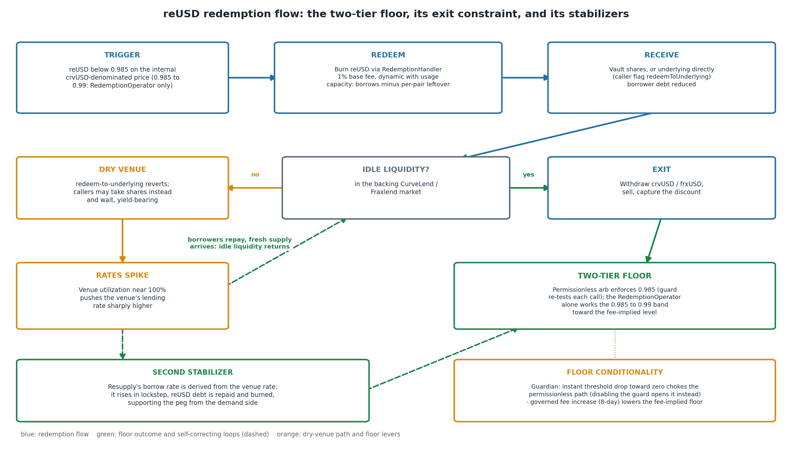
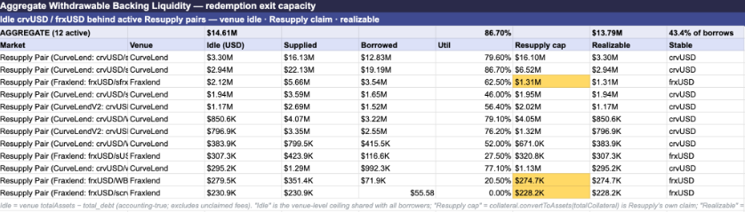
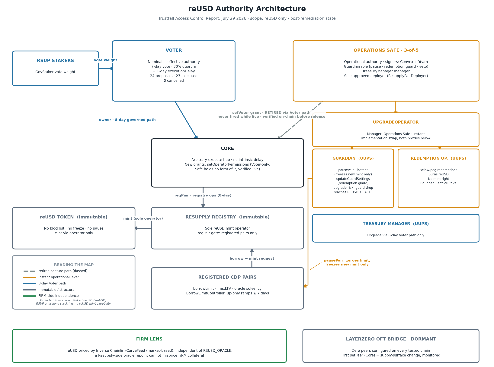
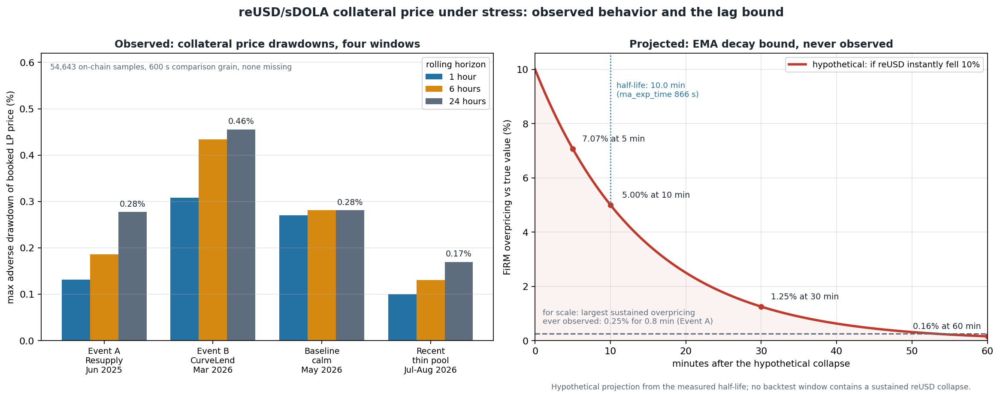

**FiRM Collateral Risk Assessment**

**reUSD/sDOLA LPT Collateral on FiRM**

Inverse Finance Risk Working Group, August 7, 2026

# **Table of Contents**

**[Briefing](#briefing)**

[Risk Vectors](#risk-vectors)

[Useful Links](#useful-links)

[Glossary](#glossary)

[Forward](#forward)

**[Protocol Analysis](#protocol-analysis)**

[Overview](#overview)

[Audits and Bug Bounties](#audits-and-bug-bounties)

**[Collateral Analysis](#collateral-analysis)**

[Liquidity](#liquidity)

[Volatility](#volatility)

[Decentralization](#contracts)

**[Competitive Analysis](#competitive-analysis)**

**[Deployments & Design](#deployments--design)**

[Valuation Methodology](#valuation-methodology)

**[Conclusion](#conclusion)**

[Parameter Recommendations](#parameter-recommendations)

# **Briefing**

## **Risk Vectors**

**1. Thinned liquidity around the pricing surface.** All meaningful reUSD liquidity is 10.89M USD across four Curve pools, down 84% from the first assessment performed in April 2025 and still contracting week over week, with the primary pool's composition deteriorating from 67/33 to 77/23 reUSD-heavy across three consecutive reads, and the ecosystem's entire reUSD pricing surface, FiRM's proposed feed and Tangent's live markets alike, reads one pool holding roughly 7.75M, of which 4.5% is already leveraged collateral that would unwind into the pool first under stress. A minimum source-pool TVL threshold stands as the listing control. Read more:[ Liquidity](#liquidity),[ Competitive Analysis](#competitive-analysis).

**2. Single-source EMA valuation in the untested tail.**The pessimistic feed prices the entire LP as pure reUSD exposure times virtual price, from one Curve EMA with a 10 minute half-life. A four-window on-chain backtest spanning both historical exploits (Resupply, Curve Llamalend v1) found the booked price quieter than a calm control (worst 24 hour drawdown 0.46%), but no window contains a genuine reUSD collapse, so the lag scenario remains untested rather than disproven. The scenario is also narrow in shape: only a discontinuous, exploit-style dislocation engages the lag, since gradual depegs are tracked within the half-life and backing depegs reprice through the Chainlink leg. The measured half-life bounds overpricing after a true 10% fall to 1.25% within 30 minutes, and flow controls, not the feed, cap what could exit through that window. As the first sizable lender against this collateral, FiRM would also carry no external liquidation history to lean on. Read more:[ Valuation Methodology](#valuation-methodology),[ Competitive Analysis](#competitive-analysis).

**3. Backing dependency through a conditional floor.** reUSD is pegged to crvUSD and frxUSD rather than the dollar: its two-tier redemption floor (0.985 permissionless, 0.99 operator-only) is denominated in those backing terms, so a backing depeg passes straight through it to FiRM's ledger via the Chainlink crvUSD/USD leg. The floor is also conditional, chokeable instantly through the Guardian's threshold lever and weakened by fee increases, and its exit capacity depends on idle backing-market liquidity, tracked weekly (14.1M at the first reading, 42% of outstanding borrows). Read more:[ Volatility](#volatility).

**4. Flight-capable demand against a thin first-loss cushion.** 65.9% of all reUSD sits in sreUSD, redeemable permissionlessly at any moment with its demand anchored to a roughly 20% reward rate, while free float is 1.1% and the recursive crvUSD/sreUSD market adds reflexivity under stress. The Insurance Pool standing ahead of reUSD holders has thinned to roughly 2.5M, 7.1% coverage at the August 5 dashboard read, so the cushion between a Resupply market failure and our collateral's backing is small and shrinking. Read more:[ Volatility](#volatility).

**5. Counterparty authority and maturity.** Following this engagement, Resupply's one instant path to supreme authority was retired: the operations Safe's setVoter grant is closed through the Voter path, with on-chain verification a precondition to listing, leaving nominal and effective authority converged on the 8-day governed cycle. The protocol is 13.1 months past its June 2025 exploit, clearing the 12-month maturity standard with the fix verified in deployed bytecode. Read more:[ Contracts](#contracts),[ Audits and Bug Bounties](#audits-and-bug-bounties).

## **Useful Links**

**RWG Framework Outputs.**

  - [Trustfall Access Control Report (July 29, 2026)](https://rwg-access-control-reports.vercel.app/reports/collateral/Resupply_reUSD.html)
  - [FiRM Pre-Screening Assessment (July 29, 2026)](https://github.com/InverseFinance/Risk-Assessments/blob/main/Resupply_reUSD/FiRM_Prescreening_reUSD_Resupply.md)
  - [reUSD KPI Dashboard](https://docs.google.com/spreadsheets/d/1QfMO-uqjW3fP_ocsHxaMv9gW_vuoY-tWT5ei2Yff4DA/edit?usp=sharing)
  - [Assessment repository](https://github.com/InverseFinance/Risk-Assessments/tree/main/Resupply_reUSD)

**Documentation.**[ Official Resupply documentation](https://docs.resupply.finance);[ Resupply GitHub](https://github.com/resupplyfi);[ full deployed contract list](https://github.com/resupplyfi/resupply/blob/main/deployment/contracts.json).

**Governance and community.**[ Governance forum](https://gov.resupply.finance);[ Resupply Risk Framework](https://gov.resupply.finance/t/resupply-finance-risk-framework/30);[ X](https://x.com/resupplyfi);[ official site](https://resupply.finance).

**Audits and bug bounty.**[ Audits repository](https://github.com/resupplyfi/resupply/tree/main/audits), covering the two pre-launch reports and the six post-exploit engagements from ChainSecurity and Electisec;[ self-hosted bug bounty program](https://docs.resupply.finance/faq/bug-bounties).

## **Glossary**

  - **reUSD**: Resupply's CDP stablecoin, minted against CurveLend crvUSD and Fraxlend frxUSD vault tokens.
  - **sreUSD**: an ERC-4626 auto-compounding savings vault over reUSD, permissionlessly redeemable at share price at any time.
  - **LPT**: liquidity pool token; here, the Curve reUSD/sDOLA LP token proposed as FiRM collateral.
  - **Insurance Pool**: the protocol's first-loss buffer of user-deposited reUSD, burned against bad debt, with a 7-day withdrawal cooldown.
  - **Core and Voter**: Resupply's authority spine; Core is the single ownership hub through which every privileged action executes, and the Voter is the on-chain governance contract that reaches it through an 8-day cycle (7-day vote at 30% quorum plus a 1-day execution delay).
  - **EMA**: exponential moving average; the Curve pool price oracle that FiRM's feed reads, smoothed by design and therefore both manipulation-resistant and slow to react.
  - **PPO**: FiRM's pessimistic price oracle layering, taking the lower of the current price and a time-weighted average.
  - **Onlyboost**: Stake DAO's optimized Curve LP staking architecture, through which the planned market 2 escrow stakes the LP.

## **Forward**

This risk assessment has been prepared by the Inverse Finance RWG at the request of internal stakeholders interested in integrating reUSD-based collateral. While the RWG has conducted thorough analysis and provides parameter recommendations, this document should not be interpreted as the RWG advocating for or against the integration of this asset. Our role is strictly evaluative, focused on identifying risks and appropriate safeguards rather than promoting specific growth initiatives.

This is a second-pass assessment. A first Complete Risk Assessment of this collateral was published in April 2025; the associated FiRM feeds and markets were deployed but never activated. The present document is grounded in the FiRM Collateral Pre-Screening of July 29, 2026, which concluded with a provisional conditional verdict on three findings: oracle depth dependency, the setVoter effective-authority bypass, and an unconfirmed bug bounty program. The Resupply team responded on August 4, 2026, committing to a setVoter retirement proposal within the week and confirming an active self-hosted bug bounty program.

# **Protocol Analysis**

## **Overview**

**The protocol.** Resupply Finance is a CDP stablecoin protocol from the Convex and Yearn ecosystem, launched March 13, 2025 as a SubDAO credited to C2tP and collaborators. Users deposit yield-bearing lending market shares, CurveLend crvUSD vault tokens or Fraxlend frxUSD vault tokens, into one of 19 registered ResupplyPair markets (10 active at pin) and borrow reUSD against them up to per-market debt ceilings. The borrow rate is derived from the underlying lending rate, the sfrxUSD rate, and a 2% constant, scaled by a priceWeight factor between 50 and 60% that rises as reUSD trades below peg. Peg defense rests on a socialized redemption mechanism (a 1% base fee split 0.8/0.2 between the redeemed borrowers and the protocol, permissionless when reUSD trades below roughly 0.985 and restricted to the RedemptionOperator arbitrage proxy above that) and on the Insurance Pool, whose deposits are burned against bad debt.

**Governance.** Governance follows the Prisma Core and Voter pattern: a single Core ownership hub reachable either through an 8-day on-chain RSUP vote (7-day vote, 30% quorum, 1-day execution delay) or through instant operator grants, none of which carries an AuthHook delay. The on-chain path has a real and clean history of 24 proposals with 23 executed and none cancelled. The effective-authority implications of the instant grants, including the retirement of the most consequential one, are treated in the Contracts section. This on-chain process is a genuine evolution since our 2025 review: collateral standards are now codified in a published[ Risk Framework](https://gov.resupply.finance/t/resupply-finance-risk-framework/30) restricting onboarding to ERC-4626 lending receipts over frxUSD or crvUSD in isolated markets for high-quality stablecoins and blue-chip assets, with requirements for solvency history, transparent rate models, and low governance risk. Onboarding runs through forum proposals with a consistent shape (asset overview, enumerated risks, parameter rationale, conservative initial ceilings), from the[ sUSDS-long proposal](https://gov.resupply.finance/t/onboard-susds-long-llamalend-market/28) in May 2025 through the[ sreUSD CurveLend onboarding](https://gov.resupply.finance/t/onboard-sreusd-curve-lend-market/79) in December 2025, and parameters are actively managed after listing, as in the December 2025[ borrow limit readjustment](https://gov.resupply.finance/t/readjust-market-borrow-limits/77). The framework is observed in practice, not just published: the census in our[ Trustfall Access Control Report](https://rwg-access-control-reports.vercel.app/reports/collateral/Resupply_reUSD.html) of all 19 registered markets shows every one to be a CurveLend or Fraxlend supply receipt over crvUSD or frxUSD, with collateral confined to stablecoin and ETH or BTC blue-chip markets, and every inactive market carries a borrowLimit of exactly zero, the framework's stated wind-down mitigation executed in production. The registry also records what the pipeline filtered out: the[ sdeUSD market proposed in August 2025](https://gov.resupply.finance/t/onboard-sdeusd-long-llamalend-market/74) was never registered, and deUSD subsequently depegged and wound down in late 2025. The single self-referential listing, the crvUSD/sreUSD pair, entered through the proposal process with its recursive dynamics explicitly assessed.

**The June 2025 exploit.** On June 26, 2025 the protocol suffered a 9.5M USD loss when a freshly deployed, near-empty market was drained via an ERC-4626 donation attack: the attacker inflated the empty collateral vault's share price so the solvency check divided to zero and every position appeared infinitely solvent, then borrowed 10M reUSD against one wei of collateral. The loss was socialized: 6.0M reUSD was burned from the Insurance Pool, roughly 2.86M USD arrived through treasury and personal donations,[ 1.4M of it from founder C2tP personally](https://www.dlnews.com/articles/defi/resupply-developer-donates-funds-after-9m-exploit/), and the remaining 1.13M was carried and repaid by August 2025. The vulnerable code was in scope for both pre-launch audits and flagged by neither, which is why per-pair collateral-oracle sanity bounds are the first item we verify on any newly added Resupply market. The remediation record that followed is covered under Audits & Bug Bounties. Under the FiRM Collateral Screening Framework the incident reset the maturity clock; 13.1 months have elapsed since, clearing the 12-month standard.

**Lindiness and contagion track record.** The protocol has operated continuously for roughly 16.5 months, 13.1 of them since the exploit, and that window includes a live contagion test. On March 2, 2026 the CurveLend sDOLA/crvUSD market was exploited through an oracle manipulation that hard-liquidated its borrowers; Curve's official[ post-mortem](https://gov.curve.finance/t/llamalend-sdola-long2-post-mortem/11020) records lenders as unaffected, and Resupply's dependency runs entirely through the lender side, so the incident passed through without loss to Resupply. The corrective was systemic rather than local: the affected market was deprecated, Swiss Stake standardized a smoothed oracle for all[ LlamaLend v2](https://news.curve.finance/introducing-llamalend-v2/) markets, and v2 itself, an extension rather than an overhaul that retains the v1 LLAMMA liquidation core, rolled out conservatively through audit preparation and a zero-cap Optimism phase before the[ first mainnet markets went live](https://news.curve.finance/llamalend-v2-is-live-on-ethereum/) with sDOLA among the initial listings. The roughly 700,000 USD of LlamaLend bad debt from the October 2025 CRV-long liquidations arose in a collateral class Resupply's standards exclude. The honest limit of this record is that neither backing stablecoin has suffered a major depeg on Resupply's watch. Half of the named contingency is nonetheless proven on-chain, with the Trustfall census showing every inactive market wound down to a borrowLimit of exactly zero; what remains unexercised is the full depeg sequence, zeroing under live stress combined with Insurance Pool absorption at scale.

**Current state.** Supply stands at 32,059,835 reUSD at pin, down roughly 60% from the May 2025 peak, against an aggregate pre-approved borrow ceiling of 634.9M reUSD across the 19 registered markets, roughly 5% utilized. That 20x overhang makes the nominal cap economically meaningless as a bound, though each individual market remains constrained by its own borrowLimit, maxLTV, and oracle solvency checks, and ceiling increases ramp up-only over at least 7 days. The distribution of supply is itself an integration map: 65.9% of all reUSD (21.13M) sits in the sreUSD savings vault, 7.8% in the Insurance Pool, 25.2% across the four Curve pools, and roughly 1.1% circulates as free float. sreUSD is itself used as collateral in a Resupply market (the crvUSD/sreUSD pair, 7.6M borrowed at 30.6% utilization), a recursive structure worth noting.

**Governance token.** RSUP is staked via GovStaker for Voter weight and a share of protocol revenue. Vest manager concentration has unwound to 56.90% this cycle (43.07M of 75.69M RSUP), re-verified on-chain. Concentration remains material but the trend is in the right direction, and on-chain participation is real, with the 30% quorum consistently met.

**Risk management and operational security.** The team remains drawn from active Convex and Yearn contributors, with multisig responsibilities split between the two organizations, and its risk work is visible beyond its own protocol: the Curve post-mortem above was produced in collaboration with a Resupply core contributor. The exploit recovery is itself operational evidence. Losses were absorbed in seniority order, with the Insurance Pool burning first-loss capital exactly as designed, and the burn was deliberately capped rather than exhaustive, the remainder covered by treasury and personal capital, including the founder's 1.4M USD, and a loan repaid within weeks. A team protecting the pool that anchors its backstop with its own capital is a meaningful signal, though it should be read as a discretionary act by this team rather than a structural guarantee. The post-exploit posture is significantly more conservative than the launch posture: new market ceilings ramp gradually by construction, the pause history (8 pausePair events) is consistent with orderly market wind-downs visible in the registry, and the team was responsive and concrete when presented with our remediation asks, retiring the setVoter grant through the Voter path.

## **Audits and Bug Bounties**

**Audit history.** Pre-launch, the protocol was audited by yAudit/Electisec (January 2025; 3 critical and 3 high findings, all fixed) and ChainSecurity (February 2025; no critical or high findings, 3 accepted low-severity risks including potential collateral insolvency in the pair). The June 2025 exploit vector was in scope for both engagements and flagged by neither, per Resupply's official[ post-mortem](https://mirror.xyz/0x521CB9b35514E9c8a8a929C890bf1489F63B2C84/ygJ1kh6satW9l_NDBM47V87CfaQbn2q0tWy_rtp76OI), a fact that tempers the assurance any single audit provides here. The post-exploit re-audit record is the more relevant evidence, and it is substantial: six engagements across the two incumbent firms, all with zero unresolved critical or high findings.

| **Engagement** | **Date** | **Findings** | **Scope** |
| :-: | :-: | :-: | :-: |
| [Electisec Update Report (exploit fixes)](https://github.com/resupplyfi/resupply/blob/main/audits/Electisec-Resupply-Inflation-Fixes.pdf) | Jul 14-15, 2025 | 0C / 0H / 0M / 0L / 4 info | Exchange-rate fixes in ResupplyPairCore, updated PairDeployer, new BorrowLimitController (7-day up-only ceiling ramps) |
| [ChainSecurity Resupply v2](https://github.com/resupplyfi/resupply/blob/main/audits/ChainSecurity_Resupply_audit_v2.pdf) | Aug 12, 2025 | 0C / 0H / 6M (all corrected) / 20L | Share-price inflation mitigations and BorrowLimitController |
| [ChainSecurity sreUSD](https://github.com/resupplyfi/resupply/blob/main/audits/ChainSecurity_Resupply_sreUSD_audit.pdf) | Aug 19, 2025 | 0C / 0H / 2M / 5L | sreUSD vault, PriceWatcher, InterestRateCalculatorV2, fee distribution. Public |
| [ChainSecurity CurveLend Operators](https://github.com/resupplyfi/resupply/blob/main/audits/ChainSecurity_Resupply_CurveLend_Operators_audit.pdf) | Oct 15, 2025 | 0C / 0H / 1M (corrected) | CurveLend minter factory and operator. Public |
| [Electisec CurveLend Operator](https://github.com/resupplyfi/resupply/blob/main/audits/Electisec-Resupply-CurveLendOperator.pdf) | Nov 24, 2025 | Low / informational only | 2 contracts, 120 LOC |
| [Electisec sreUSD](https://github.com/resupplyfi/resupply/blob/main/audits/Electisec-Resupply-sreUSD.pdf) | Nov 25, 2025 | 0C / 0H / 1M / 3L / 1 info | 7 contracts, 750 LOC. Medium: PriceWatcher weight can exceed the 1e6 scale |

**June 2025 exploit fix.** The fix is confirmed in deployed bytecode, not only in source. The floor-to-zero mechanism behind the exploit is neutralized at the oracle layer: the[ BasicVaultOracle](https://etherscan.io/address/0xa346BA5E838D6Ee40204A69549c81AB982644150) (verified, non-proxy, deployed August 13, 2025, after the June 26, 2025 exploit) enforces require(_price < 1e22) on the ERC-4626 share-to-asset conversion, and because the pair inverts this value (exchangeRate = 1e36 / _price), the exchange rate can never floor to zero and a zero price reverts outright. Both the 1e22 bound and the revert string are present in runtime bytecode. Eighteen active CurveLend markets price through this shared oracle; the nineteenth registered market is the decommissioned exploited crvUSD/wstUSR market itself, now inert with a null oracle and its exchange rate frozen at the exploit.

The exploited class also has a bounded surface going forward. The incident required two conditions together: a fresh, near-empty vault behind a newly registered market (the deployment condition) and the truncation edge case in the exchange-rate logic that nullified the solvency check (the code condition). The bytecode-enforced price bound removes the code condition categorically, regardless of how any future market is seeded. The deployment condition is addressed operationally: every active market is mature and collateralized by established CurveLend and Fraxlend vaults, and the scanner's per-market ceiling census flags any newly registered market, so a fresh or thin market re-exposing the class would surface automatically in monitoring.

**Bug bounty.** Resupply operates a[ self-hosted bug bounty program](https://docs.resupply.finance/faq/bug-bounties) with a defined scope covering vulnerabilities that could cause substantial loss of funds, broken liveness conditions, or irreversible loss. Payouts scale with severity and likelihood up to 250,000 USD for high-severity, almost-certain findings, under a published disclosure policy with a direct security contact.

# **Collateral Analysis**

## **Liquidity**

All meaningful reUSD liquidity sits in four Curve StableswapNG pools on Ethereum mainnet. GeckoTerminal additionally surfaces eight Uniswap v4 micro-pools, each under 2.3K USD with zero volume; they are excluded from the table. Figures in this subsection are drawn from the RWG's reUSD KPI Dashboard read of August 5, 2026.

| **Venue / Pool** | **TVL** | **Composition** | **Notes** |
| :-: | :-: | :-: | :-: |
| Curve reUSD/scrvUSD | $7.75M | 5.85M reUSD / 1.77M scrvUSD (77/23) | Primary venue; the EMA source pool for the FiRM reUSD/USD feed. Roughly 4.5% of pool TVL is leveraged through Tangent positions (see Competitive Analysis). |
| Curve reUSD/sfrxUSD | $2.59M | 1.97M reUSD / 532.0K sfrxUSD (79/21) | Secondary venue and anchor pool. |
| Curve reUSD/fxUSD | $522.7K | 395.9K reUSD / 130.4K fxUSD (75/25) | fxUSD is f(x) Protocol. StableswapNG, A=200, deployed April 2025. |
| Curve reUSD/sDOLA | $22.4K | 16.1K reUSD / 4.6K sDOLA | Dust. Inverse-adjacent pool from the 2025 LP listing work; the collateral asset for the proposed markets. |
| Total (4 Curve venues) | $10.89M | Roughly 77/23 reUSD-heavy in aggregate | Implied aggregate non-reUSD depth roughly $2.7M USD, derived from reserves. |

**Trajectory.** Against the April 2025 baseline in our first assessment (68.76M USD cumulative Curve TVL), cumulative TVL has declined roughly 84%, and the contraction is continuing at the weekly scale: 11.14M USD on July 29 to 10.89M on August 5. TVL is the primary sizing metric in this assessment, since it reflects the pool's aggregate arbitrage and settlement capacity; pairing depth and composition ratio are momentary quantities that a single trade can shift, and are tracked as supporting indicators. The composition trend is nonetheless one-directional: the primary pool has moved 67/33 (July 21) to 74/26 (July 29) to 77/23 (August 5) reUSD-heavy across three consecutive reads. Liquidity is thinning and the imbalance is deepening.

**Ongoing measurement.** The reUSD KPI Dashboard now provides the standing instrument for this surface. It runs Tuesday and Friday at 09:00 PT, mirroring the DOLA Risk Checklist cadence, and every run appends to a snapshot history carrying week-over-week deltas on total reUSD DEX TVL (as well as many other KPIs including aggregate reUSD borrowed, Insurance Pool balance and coverage, Tangent leverage, the EMA source-pool TVL, etc). This converts the point-in-time pins of the pre-screening into a continuous series, so when this market is revisited for parameter reassessment the depth, composition, and coverage trends will be directly observable rather than reconstructed.

**CEX presence.** reUSD has no presence on centralized exchanges; all price discovery and exit liquidity is on-chain.

**Liquidity support mechanics.** The protocol's strategy still routes through RSUP incentives on Curve pools (Votium and yBribes vote markets) and the Insurance Pool backstop. The redemption mechanism provides an arbitrage-driven soft floor roughly 1% below peg, permissionless when the discount exceeds roughly 1.5%. These mechanics function, but at current depth they operate on a much smaller base than at the first assessment.

## **Volatility**

**Token distribution.** reUSD supply sits near 32.06M at pin, and its distribution is dominated by yield venues rather than circulating float. 65.9% of all reUSD (21.13M) sits in the sreUSD savings vault, 7.8% in the Insurance Pool, and 25.2% across the four Curve pools, leaving roughly 1.1% as free float. The sreUSD concentration means most reUSD is held for yield rather than payments or trading, and the recursive crvUSD/sreUSD collateral market adds a reflexive element under stress, since sreUSD itself can collateralize new reUSD borrowing.

**The Insurance Pool.** The Insurance Pool is the protocol's first-loss capital: depositors earn yield in exchange for absorbing bad debt ahead of ordinary reUSD holders, with withdrawals subject to a 7-day cooldown. It is distinct from the sreUSD savings vault: sreUSD wraps reUSD for yield with no loss-absorption duty, while Insurance Pool deposits are explicitly the capital that takes losses first. This is not a theoretical backstop; it absorbed the June 2025 exploit's bad debt through a burn of pooled deposits, which is exactly its designed function, and the cooldown means the buffer cannot flee instantly at the first sign of stress, a timescale that matches the protocol's 8-day governance cadence. At pin the pool holds roughly 2.5M reUSD (7.8% of supply), a materially thinner first-loss buffer than it has historically carried. Because bad debt is denominated in reUSD, that 2.5M is the absolute size of the cushion standing between a Resupply market failure and the reUSD our collateral is built on.

**Peg behavior and the redemption floor.** The FiRM feed read 0.99230 at pin, consistent with reUSD's persistent slight discount inside the redemption fee band, and redemption is what holds that equilibrium. The flow below traces the loop, including its exit constraint when backing-market liquidity runs dry and the rate dynamics that restore it. The floor has never been approached in practice: across the backtest's 54,643 samples the closest pass was 10.6 bps above the threshold. Two properties matter for risk. The floor is two-tier and denominated in backing terms: permissionless arbitrage enforces 0.985 (the guard re-tests each call and shuts the path once price recovers to it), the RedemptionOperator alone works the 0.985 to 0.99 band toward the fee-implied level, and both tiers are crvUSD or frxUSD per reUSD rather than USD, so a backing depeg passes straight through them, reaching FiRM through the Chainlink crvUSD/USD leg. And it is conditional: the Guardian can choke the permissionless path instantly by dropping the guard's price threshold toward zero (disabling the guard outright does the opposite, opening redemption unconditionally), while a governed fee increase, around a 1% base that already breathes with usage, lowers the fee-implied floor in lockstep. Resupply's own immutable ReusdOracle carries the fee-implied floor internally and is informational only for FiRM; our feed has no floor and would track the market through a true depeg.

*The redemption loop enforcing reUSD's two-tier floor: 0.985 permissionless, 0.99 fee-implied and operator-only in the band between. Green paths are self-correcting: a dry venue spikes rates, restoring idle liquidity and simultaneously raising Resupply's derived borrow rate, which burns reUSD through repayments. Orange marks the dry-venue path and the levers that can choke or weaken the floor.*

**Peg risks.** The material vectors are: underlying collateral dependency (reUSD is pegged to crvUSD and frxUSD rather than to the dollar directly, and because the redemption floor is denominated in those backing terms, it offers no protection against a depeg in either); redemption floor conditionality (per above, the discount equilibrium assumes the permissionless backstop stays active, and both suspension paths exist); thin arbitrage liquidity (aggregate TVL across the four Curve pools stood at 10.89M USD at the August 5 dashboard read, thin relative to supply and the cap on the exit and arbitrage flow that peg maintenance depends on); Insurance Pool coverage thinness (per above, roughly 2.5M reUSD at pin); and demand durability (the yield-driven base concentrated in sreUSD could unwind quickly if the roughly 20% APR reward rate is cut; with no cooldown on sreUSD, the 65.9% concentration is instantly flight-capable, in contrast to the cooldown-gated Insurance Pool).

**Standing monitoring.** Aggregate withdrawable backing liquidity across the active venues, the live measure of the redemption exit constraint above, is tracked on the weekly Trustfall rescans, alongside the EMA source pool's minimum-TVL threshold described under Valuation Methodology.

## **Contracts**

**Scan surface.** This section is grounded in the Trustfall Access Control Report of July 29, 2026, covering 26 contracts, 138 role slots, and 161 privileged functions, with zero EOA role holders anywhere in the stack. All 56 role-holding addresses screened clean against the OFAC SDN and Chainalysis sanctions lists. Every user path (borrow, repay, redeem below peg, liquidate, Insurance Pool deposit and withdraw) is fully permissionless, and the reUSD token itself carries no blocklist, freeze, or pausability.

*Post-remediation authority map built from the Trustfall data. Orange marks the instant operational levers held by the operations Safe, blue the 8-day Voter path, grey the immutable mint spine, with the retired setVoter capture path shown dashed. FiRM's independent market-based pricing (green) sits outside the Resupply authority surface entirely.*

### **Access Control + Impactful Variables & Functions**

**Nominal versus effective authority.** Authority over the protocol converges on the[ Voter](https://etherscan.io/address/0x11111111063874cE8dC6232cb5C1C849359476E6), Resupply's on-chain governance contract, which enforces an 8-day path on every action it originates (7-day vote, 30% quorum, 1-day executionDelay) and carries a clean record of 24 proposals, 23 executed, none cancelled. Alongside it sits the 3-of-5[ operations Safe](https://etherscan.io/address/0xFE11a5009f2121622271e7dd0FD470264e076af6), with signers drawn equally from Convex and Yearn, which holds the protocol's instant operational levers: the Guardian role (pair pausing, redemption guard, proposal veto), the manager seat on the UpgradeOperator over two UUPS proxies, the manager seat on the TreasuryManager, and the sole approved deployer slot on the ResupplyPairDeployer.

Until August 2026 the balance sat differently. The Safe held a live, hookless setVoter grant on[ Core](https://etherscan.io/address/0xc07e000044F95655c11fda4cD37F70A94d7e0a7d), through which a single multisig transaction could reassign the supreme arbitrary-execute authority; because Core carries no delay of its own, a second Core.execute call would then have reached any lever in the stack, including reUSD.setOperator and direct mint, with no on-chain recovery once fired. This was the single most consequential finding of the pre-screening, since it made the Safe rather than the Voter the protocol's effective authority. Following our engagement, the Resupply team retired the grant through the 8-day Voter path; it was never fired during its lifetime. Closure is verified on-chain: the operatorPermissions read for the setVoter selector on Core returns false with a zero hook, and the wildcard slot is equally clear [TBD: confirm on-chain before release]. With the retirement executed, no instant path to Core remains, nominal and effective authority coincide, and the Safe's remaining powers are the bounded operational levers itemized below.

| Lever | Authority | Latency | Notes |
| :-: | :-: | :-: | :-: |
| setVoter on Core | Retired (formerly Operations Safe) | n/a | Retired via the Voter path following the pre-screening; never fired while live; on-chain verification before release [TBD] |
| Core.execute (all protocol levers) | Voter | 8 days | 7-day vote, 30% quorum, 1-day executionDelay |
| setOperatorPermissions (new grants) | Voter only | 8 days | Safe holds neither the target-specific nor the wildcard form (verified live) |
| pausePair | Guardian (same Safe) | Instant | Freezes new mint only; repay, redeem, liquidate unaffected; fired 8 times historically |
| updateGuardSettings (redemption guard) | Guardian (same Safe) | Instant | Can disable the below-peg redemption backstop |
| UUPS upgrade: GuardianUpgradeable, RedemptionOperator | Safe via UpgradeOperator | Instant | Blast radius capped at grants the proxy already holds |
| UUPS upgrade: TreasuryManager | Voter | 8 days |   |
| Pair registration (regPair) | Core, Voter path | 8 days | Only entry point for new mint capacity |
| borrowLimit increases | BorrowLimitController | Ramp of at least 7 days | Up-only ramps; Guardian pause zeroes a limit instantly |
| Base redemption fee | Core, Voter path | 8 days | Unbounded up to 100% |
| LayerZero setPeer (bridge activation) | Core, Voter path | 8 days | Dormant today; a first setPeer is a supply-surface change (monitored) |

**Mint and supply authority.** reUSD mint routes through a single chokepoint: the token's only operator is the ResupplyRegistry, whose regPair gate admits only registered pairs, each bounded by its own borrowLimit plus maxLTV and oracle solvency checks. Registering a new pair is Core-only on the 8-day path, and ceiling increases ramp up-only over at least 7 days via the BorrowLimitController. Two caveats apply: the withdrawFees path mints accrued interest as new reUSD outside the borrowLimit accounting, and the aggregate ceiling overhang of roughly 20x live supply noted in the Overview. The RSUP emissions stack holds no reUSD mint capability.

**Halt authority.** The Guardian role can pause any or all pairs instantly, which zeroes borrowLimit and freezes new minting but never blocks repay, redeem, or liquidate; collateral cannot be trapped by a pause. The same Safe can instantly disable the permissionless below-peg redemption backstop through the updateGuardSettings wildcard, and Core can raise the base redemption fee to 100% on the slow path. pausePair has fired 8 times historically, consistent with orderly market wind-downs.

**Cross-chain surface.** The April 2025 assessment treated LayerZero OFT bridge risk as a live vector. The scanner shows it is dormant: zero peers are configured on every tested chain for both reUSD and sreUSD, so the bridge is scaffolded but not exercisable. Because Core can activate a peer plus DVN configuration in one transaction, a first setPeer event is a supply-surface change and sits on the monitoring list rather than in the active risk set.

### **Upgradable Proxy Implementations**

**Upgrade authority.** Three UUPS proxies exist; everything else in the stack, including the entire mint and supply spine (the reUSD token, the ResupplyRegistry as sole mint operator, Core, and both oracles), is non-proxy and cannot be upgraded. A hostile upgrade therefore cannot rewrite mint logic and cannot grant itself new powers: new grants require setOperatorPermissions, which is Voter-only, and the Safe holds neither the target-specific nor the wildcard form of that grant (verified live). The blast radius of any upgrade is capped at the grants the proxy already holds.

Of the three proxies, the Safe can fast-upgrade two through the UpgradeOperator.[ GuardianUpgradeable](https://etherscan.io/address/0xA4745e0B1F40ab3DCFD98F381835De591a8974E3) is graded critical inside Resupply because a malicious implementation drops the guardedRegistryKeys check and repoints REUSD_ORACLE.[ RedemptionOperator](https://etherscan.io/address/0x3F7C15d053Ab332D194D0040815E466d34387E40) is graded high but bounded and anti-dilutive, since redemption burns reUSD and the proxy holds no mint right. TreasuryManager is upgradeable only through the 8-day Voter path. Through the FiRM lens the Guardian vector is mitigated on our side: FiRM prices reUSD from our own market-based feed, not REUSD_ORACLE, so an oracle repoint inside Resupply cannot misprice collateral on our ledger. The team characterizes the Guardian proxy's upgradeability as an ABI-adaptation convenience, which is consistent with its single historical upgrade (March 16, 2026, one pause-related function added), though the guard-drop vector exists regardless of intent; given our feed independence we did not press the secondary ask of delaying the upgrade grant.

# **Competitive Analysis**

**Competitor markets with supply and borrow capacity**. At the April 2025 assessment no lending protocol had integrated reUSD. One has since appeared: Tangent Finance lists reUSD LP collateral in two USG-denominated markets, reUSD/scrvUSD LP and reUSD/fxUSD LP, at 84% CF, each capped at 250K USG. At the August 5 dashboard read the two markets carry 341.3K USG borrowed against the 500K aggregate cap (68.3% utilization), with the caps raisable at any time by the Tangent team. The listing is small but establishes two useful reference points: an external CF precedent of 84% for reUSD LP collateral, and demonstrated third-party borrower demand against exactly the collateral class we are assessing. FiRM would remain the first protocol to list the reUSD/sDOLA LP specifically, and the first at any meaningful intended scale, so the pioneer framing of the first assessment still substantially applies: no established parameter benchmarks and no liquidation history for reUSD-based collateral under stress.

**Competitive exposure to our pricing surface.** Tangent's presence is not only a benchmark but a structural overlap: roughly 4.5% of the TVL in the reUSD/scrvUSD pool, the EMA source for the FiRM reUSD/USD feed, is LP held as leveraged collateral on Tangent (roughly 345.7K USD), with a further 40% of the fxUSD pool similarly encumbered. Leveraged LP is the first liquidity to exit under stress, since a Tangent liquidation or deleveraging unwinds directly into the pool our feed reads. At current size this is immaterial, but the share is tracked per-run on the KPI Dashboard's Tangent leverage watch, and a material rise in the leveraged share of the source pool should feed into the minimum-depth threshold discussion under Valuation Methodology.

**Competitor oracle solutions.** Each market uses a composed LP oracle that combines a reUSD/USD sub-feed, a paired-asset/USD sub-feed, and the market's Curve pool, a design structurally parallel to FiRM's own LP feed architecture. The important finding is that both Tangent markets share a single reUSD/USD sub-feed, and that feed derives its reUSD price from the same reUSD/scrvUSD Curve pool EMA that sources the proposed FiRM feed, chained through a crvUSD/USD leg that wraps the Chainlink crvUSD/USD aggregator with a 24 hour staleness window. Tangent's pricing therefore does not provide independent validation of our own; it instead concentrates the ecosystem's entire reUSD pricing surface on one pool holding roughly 7.75M USD in TVL, of which Tangent borrowers already lever approximately 4.5%. Any EMA manipulation or depletion event in that pool would propagate to both protocols simultaneously.

**Notable competitor failures.** None involving reUSD as listed collateral. The relevant failure history is the protocol's own June 2025 exploit, covered in the Protocol Analysis, and our internal precedent: the RWG's April 2025 conservative posture on this asset was validated when the exploit occurred two months after our first assessment, while the deployed FiRM market, never activated, carried no exposure.

# **Deployments & Design**

**Collateral contracts.** The collateral is the LP token of the[ reUSD/sDOLA Curve pool](https://etherscan.io/address/0x48d670d189b4b48757992d36897bca6e3f889040), pairing reUSD with sDOLA.

**Deployed feed stack.** FiRM prices this collateral exclusively through Inverse's own deployed feed stack, verified live, with each feed's configuration re-verified on-chain this cycle. Resupply's internal oracle plays no role in FiRM's valuation: reUSD reaches FiRM's ledger only through the contracts below.

[reUSD/USD ChainlinkCurveFeed](https://etherscan.io/address/0x8e1c73f212b81c327ee06467453c5927c14e44c4)

  - curvePool: the Curve reUSD/scrvUSD pool (the EMA price source)
  - assetToUsd: the crvUSD/USD Chainlink wrapper
  - assetOrTargetK: 0
  - targetIndex: 0
  - Staleness threshold: 86,460 seconds (24 hours), inherited from the crvUSD/USD feed

[reUSD/sDOLA Feed](https://etherscan.io/address/0x62cb0c8fe7d9e026f4e16451b1318c03d874cf1d)

  - Verified on-chain: CurveLPPessimisticFeed, description() reads "reusdsdola / USD"
  - coin1Feed: the reUSD/USD feed above
  - coin2Feed: the DOLA fixed-price feed
  - curvePool: the reUSD/sDOLA pool

[Yearn reUSD/sDOLA Feed](https://etherscan.io/address/0x8c8a46bbaad08c3b90eeb687ca6e25abb9203561)

  - yearn: the Yearn reUSD/sDOLA vault
  - coinFeed: the reUSD/sDOLA feed above

**Escrows and markets.** Market 1 uses a SimpleERC20Escrow holding the Yearn reUSD/sDOLA vault token, served by the existing Yearn market. Market 2 will route through a new Onlyboost v2 escrow, which replaces the earlier Convex escrow design; the Convex contracts will not be used. The Onlyboost v2 escrow's implementation review, reward-claim path, and liquidation gas profile are completed as part of its deployment ahead of activation. Whether the existing feeds and Yearn market are reused as-is or redeployed alongside the new escrow is a deployment decision for the dev team; either way, the activated contract set enters the bug bounty scope ledger and Safe Harbor scope at activation.

## **Valuation Methodology**

**Price feed solution.** FiRM values the collateral through its own pipeline, following the pessimistic LP pricing design FiRM already operates for its Curve LP markets. Resupply's internal REUSD_ORACLE, which serves the protocol's own CDP accounting and sits inside Resupply's authority surface, is not consumed at any step and does not meet FiRM's independence requirement for collateral pricing. The pipeline, verified live:

  - **Step 1:** Price reUSD in USD by combining the Curve reUSD/scrvUSD pool's price_oracle(0) EMA with the crvUSD/USD Chainlink wrapper.
  - **Step 2:** Confirm the crvUSD USD price through Chainlink as the externally verified anchor.
  - **Step 3:** Take the pessimistic price: the lower of DOLA fixed at 1 USD and the live reUSD price.
  - **Step 4:** Retrieve the LP virtual price via get_virtual_price().
  - **Step 5:** Multiply the virtual price by the pessimistic minimum, yielding a conservative USD valuation of the LP token.

For market 1, the Yearn feed wraps this LP valuation with the vault's pricePerShare.

**The depth caveat.** The feed's structural independence from Resupply governance is verified: the contract exposes no setters, its parameters are constructor-fixed, and neither the Curve pool EMA nor the Chainlink wrapper is touchable by any Resupply lever. The dependency runs the other way, through market structure. The EMA source pool holds 7.58M USD, and the cost of bending the EMA scales with the pool's overall size. The standing control is a minimum source-pool TVL threshold below which the market pauses or the feed is reviewed, tracked on the RWG's weekly checklist. TVL is the deliberate indicator: composition and pairing depth shift too frequently to anchor a control, and with TVL present and arbitrage active the EMA stays representative. The PPO layering on the FiRM side (the lower of current price and time-weighted average) provides additional protection against upward manipulation, which is the direction that matters for excessive borrowing.

**Oracle management.** The FiRM feed carries a governance-set ownership role limited to setHeartbeat; every other parameter is constructor-fixed and unsettable after deployment. Feed-side monitoring on listing consists of the reUSD/USD feed heartbeat on the standard variance alert, plus the EMA source pool's TVL, the live input behind the minimum-TVL threshold control described above.

**Feed Performance Under Stress.** The RWG [backtested the deployed feed](https://github.com/InverseFinance/Risk-Assessments/blob/main/Resupply_reUSD/feed_stress_summary.md) on-chain across four windows: the June 2025 Resupply exploit, the March 2026 CurveLend exploit, a calm control, and the current thin-pool regime (54,643 samples, every block through the 36 hours after each event onset). The results are unremarkable in the best sense. The worst drawdown of the booked collateral price anywhere in the dataset was 0.46% over 24 hours, the stress windows moved no more than the calm control, and EMA lag never sustained beyond 0.25%. The one large single-block move, a 3.7% rise during the March 2026 event, was a real transfer of backing into sDOLA booked instantly; that channel is structurally up-only, and with FiRM debt denominated in DOLA at a hardcoded 1, the sDOLA sleeve is hedged on both sides. The untested case remains a genuine sustained reUSD collapse, where the pool's 10 minute EMA half-life would bound FiRM's overpricing to 1.25% within 30 minutes of a true 10% fall, as charted below.

*Left: maximum adverse drawdown of the booked collateral price at three rolling horizons across all four backtest windows; stress events register at the same order of magnitude as the calm control, with nothing beyond 0.46% over 24 hours. Right: a hypothetical projection from the pool's measured 10 minute EMA half-life, showing how quickly the feed would digest an instantaneous 10% reUSD collapse; no such collapse appears in any window, and the dashed line marks the largest overpricing actually observed.*

**Risk Summary**

**Single-source EMA lag, an extreme-tail concern.** The valuation pipeline's market leg rests on one data source, the Curve reUSD/scrvUSD pool's EMA, whose 10.0 minute half-life makes it both expensive to manipulate and slow to accept a genuine collapse (a direction the PPO's lower-of construction cannot help). The pessimistic minimum selected the reUSD leg in every backtest sample, so the collateral effectively prices as a pure reUSD exposure times the virtual-price multiplier, and the residual risk concentrates entirely in this leg, the one component exogenous to Inverse that can actually fall. As established above, that lag was immaterial in every observed regime and binds only in the untested tail where reUSD dislocates from its own backing faster than the redemption floor can act: an exploit that wipes out or redeems through the backing, or a suspension of the redemption path. A depeg of the backing stablecoins themselves is the separate, faster channel, repricing through the Chainlink crvUSD/USD leg at Chainlink latency rather than EMA latency.

# **Conclusion**

This assessment supports listing the reUSD/sDOLA LP as FiRM collateral in a measured initial phase. On the dimensions that most often disqualify a candidate, the picture is clean: the access control surface is among the strongest the RWG has reviewed, the post-exploit audit record is deep and unblemished, the maturity clock has cleared, and the FiRM feed performed within 0.46% across every stress window backtested. The open question is not whether to list but how large to start, and the honest answer is small, because the protocol itself is early in a rebuilding phase and the liquidity beneath our pricing surface has thinned.

The sizing logic follows a strict ordering principle: reUSD inherits the full risk profile of its crvUSD and frxUSD backing and adds a layer of its own, so our exposure to reUSD should always trail our comfort with crvUSD, never lead it. That inheritance holds only while redemption liquidity functions, and while redemption arbitrage has performed flawlessly to date, the failure case, a discontinuous collapse that continues through the redemption floor, is absorbed by the feed's 10 minute EMA half-life only gradually. The daily borrow limit is the binding control against that tail: an instantaneous collapse can leave the feed overpricing the collateral in extreme cases while the EMA converges, and the aggregate limit caps what can be extracted against any such window to an amount the DAO can absorb. Loss tolerance is sized against the DAO's current position, not against an abstract ceiling.

The initial parameters below are therefore a floor, not a forecast. Resupply is scaling into LlamaLend v2 with new markets ramping now, and we expect aggregate withdrawable backing liquidity and reUSD DEX depth to grow in tandem. Rather than pre-committing to that growth, ceiling increases will be proposed against observed data: a rolling 30 day view of aggregate withdrawable backing liquidity, DEX depth, and the full KPI series the RWG's monitoring instrument now captures twice weekly, so each subsequent proposal can quantify market performance directly rather than argue from projection.

Activation carries one hard precondition: on-chain verification that the setVoter grant on Core has been retired, the closure the Resupply team agreed to with us, per the Contracts section. No pool seeding gate applies: the collateral is the liquidity pool token itself, so pool depth grows with the market by construction, each position minted by adding liquidity, and liquidations exit through redemption of the underlyings rather than pool swaps. All other Inverse-side components are ready, and deployment proceeds via factory once verification lands.

## **Parameter Recommendations**

The parameters recommended in this assessment represent the RWG's professional judgment regarding appropriate risk controls for this asset based on the information available. These recommendations should be considered independent technical guidance rather than an endorsement of the market's integration. The decision to proceed with implementation remains with Inverse Finance governance and those championing this growth initiative.

| **Parameter** | **Recommended Value** | **Considerations** |
| :-: | :-: | :-: |
| Supply Ceiling | 2,000,000 DOLA aggregate across both markets | Initial-phase sizing against the thin EMA source pool and current aggregate withdrawable backing liquidity. Increases proposed against 30 day rolling liquidity data per the Conclusion. |
| Daily Borrow Limit | 500,000 DOLA aggregate across both markets | The binding control against EMA lag in a rapid depeg; caps single-window extraction. Aggregate daily exposure across both markets is the operative figure. |
| Collateral Factor | 85% | In line with the Tangent precedent of 84% for reUSD LP collateral; supported by the stable-stable composition and the backtested feed stability, tempered by reUSD's persistent trade near 0.992. |
| Liquidation Factor | 100% | Post-October 10 convention for LP and longtail collateral; confirmed against the Liquidation Factor Model for both escrow paths. |
| Liquidation Incentive | 5% | Carried from the April 2025 recommendation for the stable-stable LP. |
| Minimum Debt | 3,000 DOLA | Carried from April 2025 per the Min Debt Methodology, gas-adjusted for the heavier escrow path. |

FiRM's defense-in-depth applies: the independent feed with PPO layering, daily borrow limits, per-user escrow isolation, and jrDOLA as a first-loss capital buffer absorbing residual tail risk. That last layer is a genuine positive for this listing: the jrDOLA junior tranche has grown to 87.43K DOLA of dedicated risk capital with first claim on residual losses ahead of DOLA holders, which lets the parameter set address the material scenarios without chasing every small residual quantification. With the parameters above in place, this market can be launched in the measured fashion the framework prescribes.
