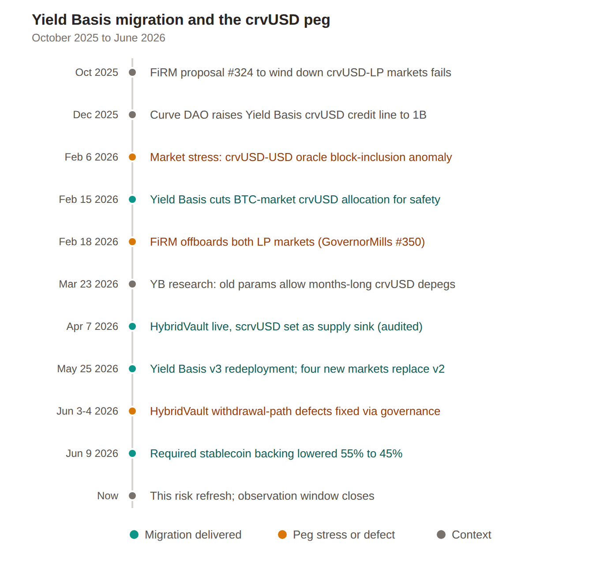
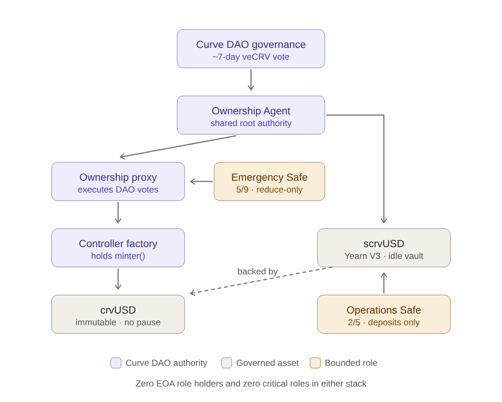
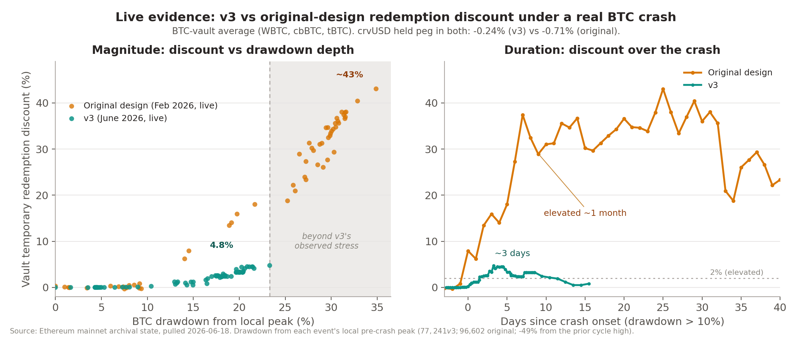

# Risk Refresh Assessment - crvUSD Collaterals on FiRM

- [**Useful Links**](#useful-links)
- [**Introduction**](#introduction)
- [**Overview**](#overview)
- [**Yield Basis and the crvUSD Peg**](#yield-basis-and-the-crvusd-peg)
  - [The counterparty](#the-counterparty)
  - [How Yield Basis pressures the peg](#how-yield-basis-pressures-the-peg)
  - [What v3 changed, and what it does not settle](#what-v3-changed-and-what-it-does-not-settle)
  - [The peg-defense stack](#the-peg-defense-stack)
  - [Counterparty integrity and production lindy](#counterparty-integrity-and-production-lindy)
- [**Collateral Analysis**](#collateral-analysis)
  - [Contract(s)](#contracts)
  - [Access Control + Impactful Variables & Functions](#access-control--impactful-variables--functions)
  - [Upgradable Proxy Implementations](#upgradable-proxy-implementations)
  - [Risk Summary](#risk-summary)
  - [Concentration of Control](#concentration-of-control)
  - [Overall Impact](#overall-impact)
- [**Liquidity & Supply**](#liquidity--supply)
  - [Liquidity](#liquidity)
  - [Volatility](#volatility)
  - [Lending Supply](#lending-supply)
- [**FiRM Market Design**](#firm-market-design)
  - [Oracles](#oracles)
  - [Escrow](#escrow)
- [**Conclusion**](#conclusion)
  - [Parameter Recommendations](#parameter-recommendations)

## Useful Links

**RWG Framework Outputs:**

* crvUSD Trustfall - [Access Control Report](https://inverse-public-files-inverse-tools.vercel.app/vercel-report-directory/reports/Web/crvUSD.html)  
* scrvUSD Trustfall - [Access Control Report](https://inverse-public-files-inverse-tools.vercel.app/vercel-report-directory/reports/Web/scrvUSD.html)  
* RWG Battlestation - [crvUSD KPI Dashboard](https://docs.google.com/spreadsheets/d/1X6p1UMgvA1zw-eb5tEDnkKNFRaelJe7q5yoV-UkLGbI/edit?usp=sharing)  
* Yield Basis v3 vs pre-v3 — [Temporary Redemption Discount (TRD) evidence](https://inverse-public-files-inverse-tools.vercel.app/YieldBasis/yield_basis_v3_vs_pre_v3_TRD_evidence_2026-06-18.md)

**Documentation**

* YieldBasis Audits - [ChainSecurity](https://www.chainsecurity.com/security-audit/yield-basis-core), [MixBytes](https://github.com/mixbytes/audits_public/tree/master/Yield%20Basis/Hybrid%20Vault)  
* StakeDao Onlyboostv2 Audits - [https://github.com/stake-dao/audits/tree/main/staking-v2](https://github.com/stake-dao/audits/tree/main/staking-v2)  
* YieldBasis - [Analysis and improvements of YB pools (v3)](https://forum.yieldbasis.com/t/analysis-and-improvements-of-yb-pools/34)  
* YieldBasis - [Governance](https://yieldbasis.com/govern)

**Contract Addresses**

* crvUSD Token — `0xf939E0A03FB07F59A73314E73794Be0E57ac1b4E`  
* scrvUSD Token (Savings crvUSD) — `0x0655977FEb2f289A4aB78af67BAB0d17aAb84367`  
* crvUSD ControllerFactory — `0xC9332fdCB1C491Dcc683bAe86Fe3cb70360738BC`  
* crvUSD OwnershipProxy — `0xb7400D2EA0f6DC1d7b153aA430B9E572F28afB79`  
* Curve DAO Ownership Agent (shared authority) — `0x40907540d8a6C65c637785e8f8B742ae6b0b9968`  
* crvUSD emergency Safe (5/9, reduce-only) — `0x467947EE34aF926cF1DCac093870f613C96B1E0c`  
* scrvUSD RewardsHandler — `0xE8d1E2531761406Af1615a6764B0d5fF52736F56`  
* scrvUSD operational Safe (2/5) — `0xe286b81d16FC7e87eD9dc2a80dd93b1816F4Dcf2`  
* Yield Basis Factory — `0x370a449FeBb9411c95bf897021377fe0B7D100c0`  
* scrvUSD-sDOLA Curve pool `/ LP token — 0x76a962ba6770068bcf454d34dde17175611e6637`  
* Stake DAO scrvUSD-sDOLA OnlyBoost RewardVault — `0x017EC76D2f32D018CbB0f9Ae507d5E5F9BdCeE3c`  
* StakeDaoEscrow — `[fill]`

**Reserve Documentation**

Foreward

This assessment refreshes the Inverse Finance RWG's view on crvUSD and crvUSD LPTs as FiRM collateral, to decide whether it is safe to re-onboard. It follows the February 2026 offboarding of the crvUSD-LP markets under [GovernorMills #350](https://www.inverse.finance/governance/proposals/mills/350) and its [Phase 2](https://forum.inverse.finance/t/firm-crvusd-lp-market-sunset-phase-2-collateral-factor-reduction-to-85/642) follow-up, which was a judgment about the crvUSD market environment rather than the contract model. The RWG held reassessment open until the Yield Basis migration that drove much of that environment had matured. That migration has now substantially completed, which closes the observation window and is the reason this refresh exists.

The collateral's risk is, at one remove, Yield Basis risk. The LP under consideration holds scrvUSD, scrvUSD is backed by crvUSD, and crvUSD is the asset Yield Basis moves. The Yield Basis Factory holds a $1B credit line, and its pool behavior is the main force on the peg, so the counterparty and the peg are one problem rather than two, and the LP inherits both. The assessment treats the Yield Basis counterparty and the peg as a single problem, works the collateral mechanics on top, and only then turns to parameters.

The RWG's role here is evaluative, to identify risks and recommend safeguards rather than to advocate for the listing. The assessment covers the crvUSD and scrvUSD contract and access-control surface, the Yield Basis counterparty and its v3 migration, the state of crvUSD's peg defenses, the scrvUSD vault, and how the LP is priced and liquidated on FiRM, including the Stake DAO OnlyBoost escrow the proposed market will route through. The headline is that the original risk locus has materially improved and that what is left open is timing rather than design. The v3 redesign reworks the mechanism behind the offboarding, and it has now held through one live stress event, June's roughly 23% BTC drawdown, but it carries only weeks of live history and has not faced a deeper move, so the binding question is whether the system has seasoned enough to re-onboard at conservative parameters 

## Introduction

This assessment refreshes the collateral risk view on the sDOLA-scrvUSD LP token, to determine whether it is now safe to reintroduce as FiRM collateral. The two FiRM markets backed by it, the scrvUSD-sDOLA market and its Yearn-wrapped counterpart yv-scrvUSD-sDOLA, were wound down in February 2026 under GovernorMills proposal #350, which cut collateral factor to 87.5%, raised the liquidation incentive to 6.5%, and set the market supply ceilings to zero.

The offboarding was a judgment about the crvUSD market environment, not the contract model. Four developments drove it: Curve's PegKeeper peg defense had been depleted to zero capacity, the borrow-based backstop was shrinking, the February 6 stress event produced block-inclusion anomalies in the crvUSD-USD oracle feed, themselves a symptom of the peg-and-liquidity stress, and Yield Basis's crvUSD credit line was on an open-ended expansion (60M to 1B, with a further increase and a full liquidity migration proposed) that could not be sized with confidence. Yield Basis's own later research confirms the call was sound: its pool price-tracking deviated in late February, and under the parameters in force at the time, crvUSD depeg episodes could have persisted for months.

Rather than treat the offboarding as permanent, the RWG deferred reassessment until the Yield Basis migration matured. That migration has now substantially completed, so the observation window can close, and this refresh evaluates whether reintroduction is warranted.

## Overview

The refresh is organized around five components. The headline is that the original risk locus has materially improved and that the remaining question is one of timing rather than design.

**Contract layer (settled).** The crvUSD and scrvUSD authority surface is clean and governance-gated: a single-minter token whose only inflationary path runs through a roughly seven-day Curve DAO vote, a reduce-only emergency multisig, zero EOA role holders, and a fully immutable contract set. The offboarding was never a contract-risk event, and nothing in the contract layer argues against reintroduction.

**Yield Basis counterparty and migration (substantially complete).** The migration the RWG was waiting on has landed: the HybridVault went live on April 7 with scrvUSD as its crvUSD supply sink, and the full v3 pool redeployment executed on May 25. The v3 pools are not a cosmetic upgrade. Per Yield Basis's own simulation research they directly target the peg-pressure mechanism that drove the offboarding, cutting temporary redemption discount by roughly three times and its duration by up to an order of magnitude, with pressure on the crvUSD peg significantly reduced. The previously open-ended 1B credit line is now bounded by a liquidity-anchored cap tied to Curve's peg defenses. The caveat is seasoning: v3 has been live only since late May and required withdrawal-path bug fixes through early June, and although it held through June's roughly 23% drawdown (see Volatility), it has not yet been tested by a deeper move.

**crvUSD peg and PegKeepers (improved, still BTC-coupled).** The PegKeeper set that #350 flagged as depleted has been diversified to five crvUSD pools, including the newer frxUSD and GHO pools, and partly rebuilt, holding roughly $89M of pool TVL and $33.75M of PegKeeper debt (concentrated in the USDT pool) against zero capacity in February. The structural coupling remains: Yield Basis pools are large, one-sided routing hubs that sell crvUSD into falling markets, so the new mechanisms manage the peg pressure rather than remove it. crvUSD behavior under sustained stress stays a market-state judgment the RWG holds.

**scrvUSD vault (low standalone risk, inherited risk dominant).** scrvUSD is an idle Yearn V3 vault over crvUSD: redemptions are unconditionally serviceable today, with no withdrawal-freeze surface and no strategy custody. Its principal risk is therefore inherited crvUSD peg risk, and its price-per-share is a soft, manipulable rate that must not be used as a trusted oracle input. The migration adds one dimension: scrvUSD is now the Yield Basis supply sink, so its demand profile is tied to Yield Basis growth.

**Collateral mechanics and the binding constraint.** What remains genuinely open is how the sDOLA-scrvUSD LP token is priced and liquidated on FiRM under stress, and whether the environment has seasoned enough to size that safely. Exit friction is real: Yield Basis vault capacity has frequently been filled, and during pool imbalances the redemption value of a position can sit below its fundamental value, the temporary redemption discount that the old pool parameters could sustain for extended periods. The binding constraint on reintroduction is not contract risk, and no longer the peg design itself, but production lindy: the v3 fix targets exactly the failure mode that caused the offboarding, yet it carries only weeks of live history and no stress test on the new code. The reintroduction decision is, in substance, a timing decision.

## Yield Basis and the crvUSD Peg

*The arc from the first wind-down attempt through the offboarding to the now substantially complete v3 migration. Teal marks delivered migration milestones, amber marks peg stress or migration defects, gray marks context.*

The sDOLA-scrvUSD LP token's risk is, at one remove, Yield Basis risk. Yield Basis is the dominant force acting on the crvUSD peg, and crvUSD is what backs scrvUSD, so the counterparty and the peg are one problem rather than two. This section walks the counterparty, the mechanism by which it pressures the peg, what the v3 migration changed, the state of the peg-defense stack, and the production-seasoning question that gates reintroduction.

### The counterparty

Yield Basis is a leveraged-LP protocol. A depositor's BTC, and now ETH, is paired with crvUSD borrowed against it into a Curve pool, held at roughly 2x leverage and 50% debt-to-value, so the position tracks the underlying asset close to 1:1 without impermanent loss while earning trading fees. The structural consequence for crvUSD is that Yield Basis is a supply sink: the crvUSD it borrows is deposited straight into the pool rather than sold, so the protocol can scale crvUSD supply without the usual sell pressure, as long as the pools stay balanced.

That scale is now large. The Yield Basis Factory holds a 1B crvUSD debt ceiling, roughly 48% of crvUSD's approximately 2.09B supply, with the line fully minted, roughly 267M deployed in pools and about 733M idle in the factory as of June 16. The credit line reached that level through a year of escalating governance grants: 60M in September 2025, 300M in October, and 1B in December. Yield Basis flows also account for a large share of all crvUSD volume. From FiRM's perspective this is the single most important fact about crvUSD's trust topology: the asset backing the proposed collateral is roughly half-claimed by one counterparty, and that counterparty's behavior is what moves the peg.

### How Yield Basis pressures the peg

The supply-sink argument holds only while the pools are balanced, and they are not always balanced. The mechanism, documented in Yield Basis's own March 2026 simulation research, runs as follows. Each pool should sit at 50% BTC and 50% crvUSD. It stays balanced only when price_scale, the price the pool centers liquidity around, equals the market price. When volatility moves the market faster than price_scale follows, the pool goes out of balance, by as much as 22% crvUSD to 78% at the observed peak, and a pool heavy with crvUSD is crvUSD sell pressure on the peg. The same imbalance shows up to LPs as a temporary redemption discount: the redemption value of a position sits below its fundamental value until the pool rebalances.

The research is candid about the severity. price_scale tracked the market well through 2025 but broke down in late February 2026, precisely the offboarding window, and Yield Basis concluded that under the parameters then in force, in a higher-volatility regime, the durations of these depegs could be really large, on the order of months. In other words, the protocol's own analysis found that the pre-migration design could hold crvUSD off-peg, and LP redemptions below fair value, for months at a time. This both validates FiRM's offboarding and identifies the exact failure mode that reintroduction must confirm is resolved.

### What v3 changed, and what it does not settle

The May 2026 v3 redeployment targets that mechanism directly. Three changes matter. First, price_scale steps are now capped, to roughly 0.5% per move, so the pool tracks price more smoothly instead of in large, value-leaking jumps. Second, the pool fee split, previously hard-coded at 50% to LPs and 50% to rebalancing, is now tunable and set nearer 40/60, after the research found the old even split sat on the edge of feasibility and that spending more on rebalancing keeps the pool closer to balance. Third, the parameter selection now penalizes imbalance directly. Yield Basis's simulations report the result as a roughly threefold reduction in temporary redemption discount and a reduction in its duration by up to an order of magnitude, with pressure on the crvUSD peg significantly reduced.

Two qualifications keep this from being decisive. The headline figures are simulation-derived, though June's roughly 23% drawdown has since reproduced them live at that depth (the data and chart are in the Volatility section); what stays untested is a deeper or more sustained move, and Yield Basis itself notes the market is back in a high-volatility regime. v3 went live on May 25 and required corrective governance votes through early June to fix migrator logic that trapped users mid-migration and HybridVault withdrawals that were reverting, with the withdrawal fix landing only on June 3. The redesign is well-aimed and, on the available evidence, effective in simulation. It is simply young.

### The peg-defense stack

Behind the pool mechanics sit three layers of crvUSD peg defense, and proposal #350 was triggered partly because the first had failed. Their current state:

**PegKeepers** are the automated mint-and-burn first line, and the set that #350 flagged as depleted has been diversified and partly rebuilt from zero. It now spans five crvUSD pools, two of them, frxUSD and GHO, brought online since the offboarding, which widens the counterparty base beyond the original USDC, USDT, and PYUSD pools. The reserve still remains small against the Yield Basis flows it has to counter; the live depths and the scalability logic are in the Volatility section. 

**The crvUSD mint markets** are the second line: as crvUSD slips below peg, the borrow rate rises and pushes borrowers to repay, pulling crvUSD off the market. #350 was left leaning on this layer once PegKeepers were spent, and documented its reach shrinking as borrows fell; its current depth and recovery path are covered in volatility below.

**The liquidity-anchored credit cap** is the newest and most structural layer. The open-ended credit line that #350 flagged is now bounded by a cap that keeps Yield Basis's size proportional to Curve's available stablecoin defenses, explicitly so that a crash cannot let Yield Basis drain PegKeeper reserves. This converts an open-ended exposure into one scaled to the defenses that backstop it, and it directly answers the "cannot be sized" objection that was one of the four offboarding triggers.

### Counterparty integrity and production lindy

Two residual questions remain. The first is Yield Basis's own integrity as a counterparty holding roughly half of crvUSD's supply: a critical bug or exploit in Yield Basis while it holds that balance is a crvUSD-backing event, not merely a Yield Basis event. The HybridVault contracts were audited by ChainSecurity and MixBytes ahead of the April launch, and Yield Basis carries a broader audit history, but the relevant precedent is the June 2025 Resupply exploit, an audited crvUSD-adjacent vault that still lost roughly $10M to a donation attack. Audits reduce this risk; they do not eliminate it, and the concentration makes the tail heavier.

The second question, and the binding one, is production lindy. Every architectural concern that drove the offboarding has a credible answer now: the peg-pressure mechanism is redesigned, the credit line is bounded, the PegKeeper set is rebuilt. But the redesign is roughly six weeks live, was still being bug-fixed in early June, and the one live stress event it has faced, June's roughly 23% drawdown, was moderate; a deeper move on the new code is still unobserved. The defensible reintroduction posture is therefore not that the architecture is fixed and FiRM should proceed, but that the architecture is plausibly fixed, so FiRM should reintroduce at conservative parameters and scale only as the v3 system seasons, through a defined clean-operation period dated from its last corrective vote. . The next section turns to how the LP token is priced on FiRM, a deliberately conventional construction whose risks the v3 peg work above is what actually addresses.

## Collateral Analysis

### Contract(s)

The [crvUSD](https://inverse-public-files-inverse-tools.vercel.app/vercel-report-directory/reports/Web/crvUSD.html) and [scrvUSD](https://inverse-public-files-inverse-tools.vercel.app/vercel-report-directory/reports/Web/scrvUSD.html) contract surfaces are documented in two Trustfall access-control reports, both generated 2026-06-15 with no scan-integrity issues detected. The crvUSD report covers five contracts (the crvUSD token, the ControllerFactory, the OwnershipProxy, the Curve DAO Ownership Agent, and the 5/9 emergency Safe); the scrvUSD report covers four (the Yearn V3 vault, the RewardsHandler, the same Ownership Agent, and the 2/5 operational Safe). The Curve DAO Ownership Agent (`0x4090…9968`) is shared between the two stacks and is the ultimate authority over both assets.

The headline finding does most of the work for parameter sizing: across both reports the scanner resolves zero EOA role holders and zero critical roles. Every privileged function in either stack resolves to Curve DAO governance, a reduce-only emergency multisig, or an immutable contract reference. Every finding below is independently re-verifiable against on-chain state at the scan block; the linked reports are the RWG's auditable record.

### Access Control + Impactful Variables & Functions

*Both assets resolve to one Curve DAO authority gated by a ~7-day vote. The only non-DAO roles (amber) are bounded: reduce-only on crvUSD, deposits-only on scrvUSD. There are no EOA role holders in either stack.*

**On-chain authority architecture**. crvUSD is an immutable Vyper 0.3.7 ERC-20 built on a single-minter pattern: one slot, `minter()`, currently set to the ControllerFactory (`0xC933…38BC`). That slot has changed only once since deployment, on 2023-05-14. The factory's `admin()` is the OwnershipProxy (`0xb740…fB79`), whose `dao()` is the Curve DAO Ownership Agent. The full chain is veCRV → Aragon Voting → Aragon Agent → OwnershipProxy → ControllerFactory → crvUSD. Supply expansion is indirect: `set_debt_ceiling()` mints crvUSD to a recipient and `add_market()` mints to a newly deployed controller, both gated by `admin()` and therefore both requiring a passed Curve DAO vote. There is no direct, uncapped `mint()` path held by any operational key. 

**Reaction window.** The most important structural property is the buffer between decision and execution. There is no separate TimelockController in the stack, but Curve Ownership votes carry a hard ~7-day Aragon voting period that cannot execute until the full window elapses, verified non-collapsible by the scanner. Every inflationary crvUSD action is therefore preceded by a multi-day, on-chain-observable buffer. For an RWG running monitoring, that buffer is the difference between reacting to a hostile parameter change and discovering it after the fact.

**Emergency layer.** The emergency authority is asymmetric by design. A 5/9 Gnosis Safe (`0x4679…1E0c`) holds `emergency()` on the OwnershipProxy and can `reduce_debt_ceiling()`, change monetary policy, and halt new borrowing without a DAO vote, but it cannot mint crvUSD or transfer ownership. Its authority is strictly deflationary; the multisig's worst case is shrinking a market, never expanding supply. Every inflationary lever requires the full veCRV vote.

**Monitoring caveats**. The stack's silent setters require calldata or storage-level monitoring rather than event feeds. `set_minter()` emits no event, so a minter rotation is invisible to event-based monitoring and recoverable only via calldata scraping or storage reads; it is the single most dangerous function on the token, though it currently resolves to the governance-gated ControllerFactory (practical rotation requires DAO capture or a factory flaw). `set_implementations()` is likewise silent, which matters for the blueprint/soft-upgrade vector on future markets. `set_debt_ceiling()`, by contrast, is the only high-velocity parameter in the stack (66 historical changes) but does emit a `SetDebtCeiling` event, so it is event-observable and alert-tracked; the value that warrants live reads is the off-registry drawn balance (notably Yield Basis), not the ceiling parameter itself. Note also that crvUSD has no pause and no blacklist on the token itself; for collateral this is a feature, not a gap, since there is no admin discretion to freeze or seize crvUSD transfers, and supply emergencies are handled by the reduce-only brake rather than a global freeze. 

### Upgradable Proxy Implementations

Every contract in both report scopes is non-upgradeable. crvUSD and the Yearn V3 vault are immutable Vyper deployments with no proxy pattern, recorded by the scanner as Proxy Status: No. The Aragon Agent and OwnershipProxy are ERC-1967 proxies whose implementations expose no upgrade function (immutable proxies), and the factory's blueprint references (`controller_implementation`, `amm_implementation`) and the vault's immutable references are confirmed non-reassignable. `set_implementations()` on the factory can change blueprints, but only for future markets; existing collateral keeps its deployed implementation. Non-upgradeability removes the in-place bug-fix path; here that trade-off is offset by the multi-day governance reaction window that precedes any parameter change.

### Risk Summary

**crvUSD authority surface.** The only inflationary path on crvUSD runs through a ~7-day Curve DAO vote, and no EOA holds a supply-altering role anywhere in the stack. There is no operational minter key and no single-block path to expanded supply. Practical compromise of crvUSD supply requires either capture of Curve DAO governance (slow, expensive, and on-chain-observable) or a flaw in the ControllerFactory itself. From a contract-authority standpoint this is a low residual surface. 

**Supply concentration (Yield Basis).** The scanner surfaces one item that dominates crvUSD's trust topology and is not an access-control finding: the Yield Basis Factory (`0x370a…00c0`) holds a 1B crvUSD debt ceiling, roughly 48% of the ~2.09B total supply, granted by direct `set_debt_ceiling()` calls rather than through the controller registry. Most of the fully minted 1B is idle (~733M at the June 16 snapshot), awaiting deployment against BTC strategies, and Yield Basis's hybrid-vault and v3 migration is now substantially complete. This single counterparty was a contributing factor in crvUSD's February 2026 offboarding from FiRM (GovernorMills #350) and remains the RWG's primary on-chain watch-item for reintroduction. The ceiling value is scanner-tracked and fires an alert on change; the pre-minted balance is not a setter-written value and must be read live via `balanceOf()` each cycle. 

**scrvUSD risk surface.** scrvUSD is an unmodified Yearn V3 ERC-4626 vault over crvUSD, and its risk is overwhelmingly inherited rather than vault-specific. The vault is idle: zero strategies have ever been registered, `totalDebt` is 0, and no accountant or deposit/withdraw-limit module is set, so 100% of deposited crvUSD sits in the vault and redemptions are unconditionally serviceable from idle; there is no withdrawal-freeze surface today. Yield is donated crvUSD borrow fees streamed into price-per-share over seven days, not an external strategy, so there is no strategy-custody or strategy-loss vector. Operational authority is split between just two holders: the RewardsHandler contract (the yield engine) and a 2/5 Safe (`0xe286…Dcf2`) that can pause deposits or shut the vault down without a DAO vote, but a V3 shutdown freezes only new deposits, never withdrawals. The vault's meta-authority, `role_manager`, is the same Curve DAO Ownership Agent that governs crvUSD. 

Three latent paths could change this: registering a strategy (custody), installing a withdraw-limit module (redemption freeze), or setting an accountant (fee dilution). All are real but inert: the relevant manager roles are unassigned, and activating any of them requires a Curve DAO role grant through the same ~7-day vote. Each is an observation-phase watch-item. One hard constraint for any FiRM integration: scrvUSD's price-per-share is a soft, manipulable exchange rate, not a hardened oracle. The reward weight is driven by a permissionless TWA that ChainSecurity documents (and Curve accepts) can be skewed by flashloan-sandwiched deposits to game the yield rate. This is a yield-rate manipulation, not a principal-theft vector, but scrvUSD share-price growth must not be used as a trusted oracle input.

### Concentration of Control

Every high-impact authority in both stacks resolves to the same Curve DAO Ownership Agent (`0x4090…9968`): `minter()` on crvUSD via the factory, `admin()` on the ControllerFactory via the OwnershipProxy, and `role_manager()` on the scrvUSD vault. This is concentrated, but it is concentrated in on-chain governance behind a multi-day vote, not in a multisig or an EOA set. The only non-DAO authorities are deliberately bounded: the 5/9 emergency multisig is reduce-only on crvUSD, and the 2/5 Safe on scrvUSD can stop deposits but not exits. No EOA holds a supply-altering role anywhere in either stack.

### Overall Impact

At the contract level, crvUSD and scrvUSD present a clean, governance-gated authority surface. The properties that matter for parameter sizing are bytecode-enforced: a single-minter token whose only inflationary path runs through a ~7-day Curve DAO vote, an asymmetric emergency multisig that can only contract supply, zero EOA role holders, and a fully immutable contract set across both stacks.

The residual risks are therefore not access-control risks. In order of weight they are: 

1. The inherited trust in Curve DAO governance, which is slow and observable but absolute over supply;   
2. the Yield Basis 1B counterparty concentration (~48% of supply), the dominant crvUSD-specific exposure and the standing reintroduction watch-item;   
3. for scrvUSD, the soft, TWA-manipulable price-per-share, which constrains how the asset may be used as a collateral input but does not threaten principal; and   
4. the silent setters `set_minter` (the supply-authority transfer) and `set_implementations` (the blueprint vector for new markets), which emit no event and so require calldata or storage-level monitoring rather than an event feed. crvUSD's earlier offboarding was driven by peg dynamics and counterparty concentration, not by the contract authority model; on this evidence the contract authority model is a point in favor of reintroduction rather than against it. 

## Liquidity & Supply

### Liquidity

The table below covers all material crvUSD and scrvUSD DEX pools as of June 16, 2026. "Pairing Depth" reflects the USD value of the non-crvUSD/scrvUSD asset in the pool — this is the primary exit liquidity metric. The DOLA side is excluded from independent exit liquidity totals since DOLA is protocol-issued and would be consumed in the same liquidation event it is meant to support. As crvUSD isn’t listed on any centralized exchange, the on-chain picture makes up the entirety of its available liquidity.

| Pool | Venue | Pool total TVL | crvUSD TVL | Pairing TVL |
| :---: | :---: | :---: | :---: | :---: |
| CRVUSD-CBBTC | Curve Dex | $83,947,984 | n/a | n/a |
| USDT-CRVUSD | Curve Dex | $52,831,535 | $21,111,051 | $31,716,279 |
| CRVUSD-WETH | Curve Dex | $45,031,351 | n/a | n/a |
| CRVUSD-WBTC | Curve Dex | $39,480,594 | n/a | n/a |
| CRVUSD-TBTC | Curve Dex | $35,550,157 | n/a | n/a |
| CRVUSD-CBBTC | Curve Dex | $25,684,541 | n/a | n/a |
| USDC-CRVUSD | Curve Dex | $19,602,106 | $12,752,238 | $6,849,887 |
| CRVUSD-WETH | Curve Dex | $17,330,085 | n/a | n/a |
| CRVUSD-WBTC | Curve Dex | $15,205,075 | n/a | n/a |
| FRXUSD-CRVUSD | Curve Dex | $14,293,961 | $7,928,694 | $6,365,583 |
| CRVUSD-TBTC | Curve Dex | $11,290,744 | n/a | n/a |
| PMUSD-CRVUSD | Curve Dex | $3,651,753 | $203,933 | $3,440,545 |
| CRVUSD-TBTC-WSTETH | Curve Dex | $3,553,170 | n/a | n/a |
| CRVUSD-WETH-CRV | Curve Dex | $2,250,387 | n/a | n/a |
| GHO-CRVUSD | Curve Dex | $1,480,440 | $85 | $85 |
| PYUSD-CRVUSD | Curve Dex | $1,137,771 | $758,237 | $374,541 |
| CRVUSD-YB | Curve Dex | $1,040,991 | n/a | n/a |
| CRVUSD-ZCHF | Curve Dex | $679,905 | n/a | n/a |
| CRVUSD-SUSDE | Curve Dex | $667,358 | $316,558 | $350,798 |
| USDE-CRVUSD | Curve Dex | $337,131 | $172,568 | $164,591 |
| CRVUSD-CJPY | Curve Dex | $234,981 | n/a | n/a |
| FRAX-CRVUSD | Curve Dex | $233,897 | $39,332 | $194,537 |
| VUSD-CRVUSD | Curve Dex | $98,007 | $49,252 | $48,754 |
| CRVUSD-PROS | Curve Dex | $59,958 | n/a | n/a |
| CRVUSD-RCH | Curve Dex | $57,891 | n/a | n/a |
| **TOTAL — crvUSD ex-DOLA, ex-volatile, ex-in-kind** |  | **$375,731,773** | **$43,331,949** | **$49,505,600** |

| Pool | Venue | Pool total TVL | scrvUSD TVL | Pairing TVL |
| :---: | :---: | :---: | :---: | :---: |
| REUSD-SCRVUSD | Curve Dex | $7,488,406 | $2,139,563 | $5,349,030 |
| SCRVUSD-SUSDE | Curve Dex | $2,662,193 | $1,259,726 | $1,402,538 |
| SCRVUSD-SUSDS | Curve Dex | $1,300,098 | $684,103 | $616,047 |
| USD3-SCRVUSD | Curve Dex | $671,524 | $346,469 | $325,075 |
| FRXUSD-SCRVUSD | Curve Dex | $648,110 | $348,078 | $300,064 |
| FXSAVE-SCRVUSD | Curve Dex | $553,165 | $468,228 | $84,963 |
| SCRVUSD-SDOLA | Curve Dex | $424,215 | $81,485 | $342,735 |
| YNUSDX-SCRVUSD | Curve Dex | $295,885 | $97,036 | $198,854 |
| SFRXUSD-SCRVUSD | Curve Dex | $216,502 | $123,379 | $93,126 |
| SCRVUSD-USDAF | Curve Dex | $55,651 | $14,732 | $41,061 |
| **TOTAL — scrvUSD ex-DOLA, ex-volatile, ex-in-kind** |  | **$13,891,534** | **$5,481,316** | **$8,410,757** |

| 3RD-PARTY PAIRING LIQUIDITY (ex-DOLA, ex-volatile, ex-in-kind, ex-TVL-only) — 19 pools contributing | $57,916,358 |
| :---: | :---: |

### Volatility

**Yield Basis factor.** crvUSD does not move like a reserve-backed stablecoin. Its short-term price is set less by collateral quality or redemption mechanics than by what one counterparty is doing. Yield Basis is the largest holder of crvUSD and the largest single force on its peg, so the volatility the sDOLA-scrvUSD LP token carries onto FiRM is mostly Yield Basis volatility, reaching the collateral through scrvUSD.

The size of that dependency sets the terms. The Yield Basis Factory holds a 1B crvUSD ceiling, about 48% of crvUSD's ~2.09B supply. The full line is minted, but only about 267M is deployed in pools; the other ~733M sits idle in the factory, pre-minted and not yet circulating [confirmed on-chain, June 16]. The posture today is calm but loaded: only a quarter of the line is live, and the rest is ready to deploy. The vehicle for that growth is the HybridVault, which is backed by scrvUSD (governance eased the required backing from 55% to 45% in June), so Yield Basis expansion now structurally bids the asset this collateral is built on.

That same growth also exposes more crvUSD to pool imbalance. Each pool should hold 50% BTC or ETH and 50% crvUSD, and it stays balanced only while price_scale keeps up with the market. When price moves faster than price_scale follows, the pool tilts crvUSD-heavy, by as much as 22/78 at the pre-migration peak, and a crvUSD-heavy pool sells crvUSD into the peg.

For an LP, that imbalance shows up as a temporary redemption discount: the position redeems for less than it is fundamentally worth until the pool rebalances. This is the volatility specific to the collateral, not abstract peg deviation but a measurable gap between what the LP token is worth and what it redeems for. Under the old pool parameters, that gap could last for months.

The v3 redeployment goes after the imbalance directly, with a price_scale step cap (~0.5% per move) and a rebalancing-weighted fee split (~40/60). Yield Basis's March simulations projected the temporary redemption discount cut to about a third and its duration shortened by up to an order of magnitude, and the live data now bears that out. Through the June 2026 BTC drawdown, with v3 at real size, the BTC vaults' discount peaked near 4.8% and cleared within about three days, against 41 to 45% sustained for roughly a month in the original design's February crash. Matched on drawdown depth, the discount was cut to roughly a third or less, and crvUSD held peg better (-0.24% versus -0.71%). The one caveat is depth: June reached about -23% from the local peak, so v3's behavior beyond that, where the old design ran to 44%, is still unobserved.

*Live on-chain evidence ([Ethereum archival state, June 18](https://inverse-public-files-inverse-tools.vercel.app/YieldBasis/yield_basis_v3_vs_pre_v3_TRD_evidence_2026-06-18.md)). Left: at matched BTC drawdown, v3's redemption discount tops out near 4.8% where the original design reached about 43%, and beyond -23% (shaded) v3 has no data yet. Right: under v3 the discount cleared in about three days, against roughly a month in the original design.*

**Backstop and correlation.** The coupling is also directional. Yield Basis pools are one-sided routing hubs that sell crvUSD into falling markets by design, so crvUSD's downside is tied to the same BTC and ETH drawdowns that pressure the rest of FiRM's collateral. This volatility is not idiosyncratic; it arrives alongside broad market stress.

Two automated layers meet a downside move, and both scale with usage rather than being fixed. PegKeepers burn the crvUSD they have parked, about $33.75M today, all in the USDT pool; that ammo builds when crvUSD trades above peg and grows with pool deposits and governance ceilings. The crvUSD mint markets are the second line: as crvUSD slips, the borrow rate rises and pushes borrowers to repay, pulling crvUSD off the market, bounded by the ~$29.59M borrowed today. That figure is low by historical standards and is partly a symptom of the same Yield Basis-driven rate volatility described above, which suppressed borrowing demand; as demand returns, the base scales back toward the hundreds of millions it has carried before. The real constraint is speed, not ceiling: neither layer grows during an acute drawdown, so the defense in the moment is roughly the standing depth, modest against a counterparty that can deploy hundreds of millions in a single move.  

The mechanism has been redesigned to dampen this, and the June crash shows the redesign holding live at moderate depth, not only in simulation. The open question is now narrower: whether it holds at the deeper drawdowns v3 has not yet faced. Size the collateral's stress-case volatility against that unobserved tail rather than the benign June outcome, and set the collateral factor and oracle work below accordingly.

### Lending Supply

As of June 16th, 2026, no third-party collateral footprint detected for crvUSD or scrvUSD (≥ $50,000 threshold) on the likes of  Aave, Morpho, Spark, Fluid, and Euler. crvUSD-LPTs were once present on FiRM and presently can be found on newly-deployed Tangent Finance.  
	

| Market | Venue | CF % | Borrow Rate % | TVL $ | Borrowed $ |
| :---: | :---: | :---: | :---: | :---: | :---: |
| frxUSD/scrvUSD Curve LP | Tangent | 84 | 4.57 | 448,710 | 374,580 |
| USDT/crvUSD Curve LP | Tangent | 84 | 4.57 | 300,650 | 250,490 |
| reUSD/scrvUSD Curve LP | Tangent | 84 | 0 | 239,350 | 199,360 |
| **TOTAL** |  |  |  | **$988,710** | **$824,430** |

## FiRM Market Design

The market under review is the scrvUSD-sDOLA Curve LP market, escrowed through a Stake DAO OnlyBoost v2 escrow. 

### Oracles

To ensure accurate and reliable valuation of the sDOLA/scrvUSD LP on FiRM, we can utilize the sDOLA/scrvUSD pool on Curve by implementing the pessimistic LP token price feed logic. This approach involves using the Chainlink price feed for crvUSD, and the virtual price from the Curve pool's smart contract. Here's the detailed process:

* **Step 1:** Pull the Chainlink price feed for crvUSD to get USD value.  
* **Step 2:** Determine the Pessimistic value DOLA/crvUSD, by taking the lowest of DOLA (fixed at $1) and crvUSD.  
* **Step 3:** Calculate the LP Token Value: Use the virtual price of the LP token from the Curve pool's smart contract.  
* **Step 4:** Multiply the lowest price by the pool's virtual price to get the pessimistic USD value for the LP token.

Example:

| crvUSD Chainlink Price: $0.99780714 | DOLA Price: $1 |
| :---- | :---- |

Lowest Price: $0.99780714

Pool Virtual Price: 1.00003831360051995  
Pessimistic LP Token Price: 1.00003831360051995 * 0.99780714 \= $0.99784537

This construction is unchanged from FiRM's prior crvUSD-LP markets. What has changed is upstream: the Yield Basis volatility that drove the February peg and liquidity stress is exactly what v3 dampens, as the Volatility section shows. The pessimistic build does the rest, capping crvUSD at $1 and reading it low, and because the Yield Basis pools deepen on the crvUSD side precisely during the drawdowns when liquidations would fire, FiRM is structurally insulated from a soft peg whatever the feed does.

### Escrow

The proposed market places the scrvUSD-sDOLA Curve LP in a Stake DAO OnlyBoost v2 escrow, FiRM's first use of one, with more markets intended to follow. The escrow stakes the LP into Stake DAO's OnlyBoost v2 RewardVault and holds the vault shares for the borrower, so the position keeps earning boosted CRV and extra rewards while it backs a loan. As with the Convex escrows FiRM already runs, this places a yield protocol between FiRM and the collateral, which makes the Stake DAO withdrawal path part of the liquidation guarantee. The only material risk that introduces is a deliberate Stake DAO governance attack, buffered by a timelock that FiRM can step out of through a guardian withdrawal.

**The exit it must guarantee is shares back to LP.** On repayment or liquidation, pay() withdraws the LP from the vault to the liquidator, who unwinds it through the routes covered above. As in a Convex escrow, the LP only reaches the liquidator if the yield venue returns it. What is genuinely different with Stake DAO sits one layer deeper, and is where the real question lies: the vault returns the LP only through a strategy contract that Stake DAO governance can replace.

**Vault accounting is not a concern.** The deployed vault is a non-upgradeable 1:1 wrapper, so the value the market reads and the amount pay() can withdraw are the same number and cannot drift apart. A fee-bearing or loss-bearing vault could only ever be a different, newly deployed contract, never a change to this one.

The replaceable strategy is a question of trust in Stake DAO governance, not an everyday hazard. Every Curve vault routes through one shared strategy that Stake DAO's owner, a multi-day timelock behind a 3/5 Safe, can replace. In normal operation this is a routine, fund-preserving upgrade, performed roughly every seven weeks since launch with no losses. Causing a loss would instead take a deliberate, coordinated attack:

* a purpose-built malicious strategy, deployed by the attacker;  
* the 3/5 Safe scheduling it at both the ProtocolController and the locker;  
* the timelock passing with no cancel and no exit;  
* the malicious strategy then called to send the LP to the attacker.

A routine strategy change cannot cause a loss; only a deliberate governance capture by the Safe, behind the timelock delay, can.

**A guardian withdrawal lets FiRM act inside that delay.** A FiRM-side guardian withdrawal can pull the whole position out of the vault into plain LP held in the escrow before any queued change takes effect, after which liquidation runs on the escrow's own LP and no longer touches Stake DAO. Because it goes through the still-honest strategy while a change is only queued, the timelock window is something FiRM can act on, not just observe. The guardian is bounded where it matters: its only destination is the escrow itself, never a third party, so it adds no theft vector. That leaves the remaining task operational: monitor the Timelock for a strategy or allocator change and act within the window.

**Two mitigations back up that watch.** The first is operational: an automated alert tracks the Stake DAO ProtocolTimelock and fires on any queued operation against the shared custody and authority contracts (the controller, gateway, locker, allocator, and the timelock itself), decoding the action and its time to maturity so the RWG can tell a routine, fund-preserving upgrade from a hostile change and trigger the guardian withdrawal inside the window.

**The second is structural:** Stake DAO has agreed to establish a separate, independent security council holding the Timelock's CANCELLER_ROLE, with an Inverse RWG signer among its members. This adds a veto alongside the guardian withdrawal, where the guardian exit steps FiRM's position out ahead of a hostile change, the cancel-only council can void the queued operation at its source, with FiRM holding a direct seat and no added theft surface, since a wrongful cancel is a recoverable nuisance rather than a loss. Both the veto and the admin-role concern resolve together once the Safe's direct admin over the Timelock is revoked, the hardening FiRM has requested: until then an admin could strip the canceller's role without the delay, so completing it is what turns the timelock window from one FiRM can observe and exit into one it can veto.

## Conclusion

The contract surface is clean, the peg-pressure mechanism that drove the February offboarding has been redesigned, and the redesign has now held through one live stress event. What remains is not a design question but a seasoning one: v3 carries only weeks of live history and has not faced a drawdown deeper than June's roughly 23%. The reintroduction decision is therefore a timing decision, and our recommendation is therefore to begin, conservatively, rather than to wait.

The RWG recommends reintroducing the sDOLA-scrvUSD market in a phased launch: a conservative collateral factor and supply ceiling, sized so that a worst-case redemption discount at the unobserved tail is absorbed without loss to FiRM. This treats June's event as what it was, a real stress test passed at moderate depth that justifies a position, but not the deeper event that would justify full size. A guarded launch is how FiRM earns that deeper observation on live exposure, rather than waiting for it from the sidelines.

Rather than commit to a fixed schedule, the RWG will re-evaluate the market's parameters on a monthly basis, weighing the completeness of the Yield Basis v3 migration and its clean-operation history, demand into Inverse's global junior tranche jrDOLA, and Yield Basis's performance under broader market conditions, including any deeper drawdown than June's. The intent is for FiRM's exposure to grow steadily as lindy accrues, and deliberately not to overextend and be forced to backtrack: pulling a collateral factor down later forces deleveraging on borrowers who took their loans in good faith, which is precisely the unpredictability fixed-rate lending exists to remove. Each parameter is therefore treated as a commitment, raised only as the monthly review supports.

### Parameter Recommendations

| Supply Ceiling | 5,000,000 |
| :---- | :---- |
| Daily Borrow Limit | 500,000 |
| Collateral Factor | 87% |
| Liquidation Factor | 100% |
| Liquidation Incentive | 5% |
| Minimum Debt Amount | 3000 |
