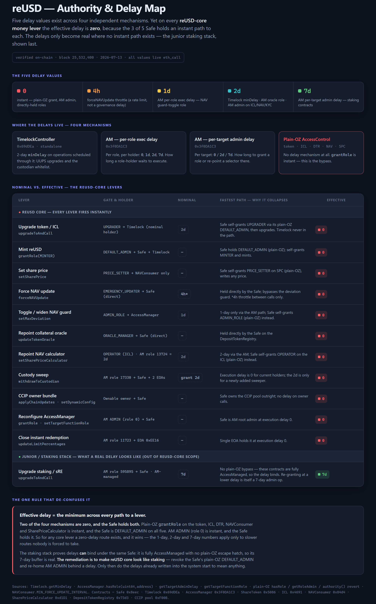
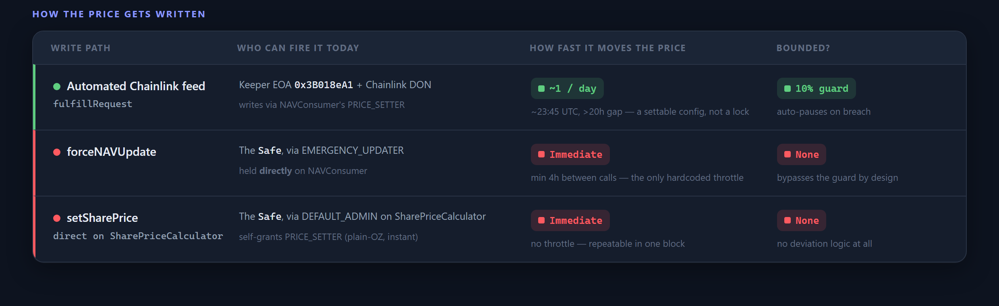

# FiRM Collateral Pre-Screening Assessment

### reUSD — Re Protocol

July 7, 2026

**[Protocol Overview](#protocol-overview)**

[DeFi Integrations and Liquidity](#defi-integrations-and-liquidity)

[Audits and Bug Bounty](#audits-and-bug-bounty)

**[Access Control Scanner Findings (2026-07-03)](#access-control-scanner-findings-2026-07-03)**

[Pricing Authority (mint + redeem)](#pricing-authority-mint--redeem)

[Upgrade Authority (the master lever)](#upgrade-authority-the-master-lever)

[AccessManager: Delay in Form, Not Substance](#accessmanager-delay-in-form-not-substance)

[Mint and Redemption Halt Authority](#mint-and-redemption-halt-authority)

[Market Feed Independence (NAV propagation)](#market-feed-independence-nav-propagation)

Monitoring Surface

**[Framework Findings & Remediation](#framework-findings--remediation)**

**[Sources](#sources)**

> [!WARNING]
> **PROVISIONAL VERDICT: DOES NOT MEET FiRM COLLATERAL ELIGIBILITY IN CURRENT FORM**
>
> Three findings drive the provisional disposition:
>
> 1. Pricing authority is uncapped, and the market cannot check it. Every value that determines what a reUSD token is worth — the NAV, the deposit-collateral oracles, the mint-asset whitelist, and the redemption payout configuration — is instantly mutable by the 3/5 Safe (directly, or via instant DEFAULT_ADMIN self-grant on the plain-OZ half of the stack) or by a single delay-0 EOA, with no on-chain cap: setMaxDeviation is uncapped and Safe-toggleable, forceNAVUpdate bypasses the deviation guard by construction, direct setSharePrice is self-grantable with no deviation logic, and there is no mint cap or Ethena-style delta guard anywhere in the protocol. The market provides no counter-signal: the dominant Fluid DEX venue (\~90% of volume, majority depth) re-centers on getSharePrice() by contract, selling exhausts it (\~$3.75M) before moving its price a tenth of a percent, and the same untimelocked parties can close instant redemptions concurrently — disabling the arbitrage that would refill the band for exactly the window a pessimistic oracle needs it to hold. A Chainlink market feed remains strictly preferable to a NAV feed (it corrects under genuine market stress: depeg, redemption failure, dumping) but degrades to a NAV feed with extra steps against authority manipulation inside the band.
> 2. Effective upgrade authority is the Safe at zero delay — the master lever above every other finding. The two upgradeable contracts in reUSD's critical path (the token and the ICL) nominally gate UPGRADER behind a 2-day TimelockController, but the Safe's instant self-grant path makes effective upgrade authority the 3/5 quorum at zero delay, an unbounded all-axes path; the documentation's “48-hour timelock, no bypass” claim does not match chain state.
> 3. Expanding, unaudited scope with no bug bounty. Audit coverage of what is actually deployed is partial — Certora (Sept 2025) covers the core only; the earlier Hacken review reported \~47% branch coverage; the CCIP mint layer, the AccessManager periphery, and contracts deployed as recently as 17 days ago are unaudited — while the weekly rescan shows the dependency tree grew by 4 contracts, 10 roles, 1 EOA, and a new redemption controller between the pinned assessment snapshot and now, the second such expansion for this asset. There is no bug bounty; no stable collateral currently listed on FiRM lacks one.
> Exit liquidity: \~$25M of mainnet DEX TVL against \~$152.5M supply-at-NAV — parameterization is sized accordingly. Halt authority: minting and instant redemption can each be halted unilaterally and instantly by separate single-key EOAs, while the token itself is not pausable and keeps trading — so a redemption halt at a stress moment produces a depeg-then-markdown scenario for FiRM rather than a frozen-collateral scenario. Precedent matters here: comparable EOA shutoffs exist on Ethena, USR, and deUSD and have been treated as security features; what distinguishes reUSD is how load-bearing the switched-off pipe is, given the thin realizable exit depth — the grading reflects reliance, not the feature's existence.
>
> In addition to the remediation asks below, any FiRM listing of reUSD is conditional on the DAO first establishing meaningful jrDOLA deposits as standing loss-absorption capacity. This condition attaches to the asset as a whole rather than to any single finding: reUSD's size and complexity are unlike anything the RWG has previously assessed — two entangled authority layers, sixteen-plus contracts, seven off-chain dependencies, and a contract-alteration cadence that expanded the dependency tree twice during this assessment alone — and the asset has been rated poorly or passed on by peer risk teams, with Morpho the sole lending listing to date. Where protocol-side guarantees are form rather than substance, FiRM-side protection must be capitalized, not merely procedural; a junior loss buffer is the only control in this document that bounds damage independent of detection, response, or the accuracy of any single finding. This posture is consistent with the defensive stance that proved decisive in the Resolv (USR) case

# **Protocol Overview**

Re Protocol channels stablecoin capital into fully collateralized reinsurance. reUSD is the senior-tranche deposit token: a plain ERC-20 (OZ AccessControl + UUPS proxy, no transfer hooks, no token-level blacklist or pause) carrying value through a single appreciating share price rather than rebasing. Users deposit admitted collateral — USDC, USDT, USDe, sUSDe (DAI retired) — into the InsuranceCapitalLayer (ICL), which values deposits through per-collateral status-guarded oracles and mints reUSD at the live share price. Minting is permissionless subject to KYC (KYCRegistry; eligible non-U.S. persons only). In credit terms reUSD absorbs losses last: the sole reinsurer's equity (\~$77M, Cover Re SPC Ltd, Cayman-licensed) is first-loss, then the junior reUSDe tranche, then reUSD.

Backing splits \~26% on-chain / \~74% off-chain: at the pinned scan block, $39.65M on-chain (ICL, RedemptionVault, FeeVault, Fireblocks custodian sweep address) against $112.86M implied off-chain — deployed into the quota-share treaty with Cover Re SPC, short-dated U.S. T-bills, an NY Reg-114 trust, and an Ethena sUSDe/USDe basis trade on undeployed capital. The Network Firm attests off-chain reserves daily to a Chainlink Proof-of-Reserve feed on Avalanche ($177.66M protocol-wide at 2026-07-02, \~$64.8M headroom over implied backing). That feed is informational only: no Ethereum contract consumes or enforces it, and no on-chain mechanism detects or reacts to its staleness or divergence. Separating this kind of transparency from protocol-level security is a core aim of this assessment.

reUSD is the most governance-dense asset in this program: around twenty in-scope contracts and well over a hundred privileged role slots, run through two OpenZeppelin authority models at once. Plain AccessControl secures the core token and oracle contracts; a central AccessManager secures the redemption, registry and staking layers; and a standalone 2-day Timelock and an Ownable CCIP pool sit alongside. Delay is layered just as heavily, with the Timelock, the AccessManager's per-role and per-target delays, and plain AccessControl's zero delay together producing five distinct values from zero to seven days. Findings are stated against the pinned Trustfall snapshot and hardened through a two-analyst, claim-by-claim review with live on-chain verification of role membership, storage slots, swap simulation, and event history. Cutting through that depth is one organizing fact: the Safe's plain-OZ self-grant means effective authority is the 3-of-5 Safe at zero delay wherever it applies, so the layered delays that look protective on paper do not bind reUSD's core money levers.

| **Attribute** | **Detail** |
| :-: | :-: |
| **Issuer (legal)** | Re Foundation (Cayman); sole reinsurer Cover Re SPC Ltd (Cayman-licensed, \~$77M first-loss equity); NY Reg-114 trust; Fireblocks-managed custody (docs cite 3/5 and 5/8 MPC) |
| **Asset Under Evaluation** | reUSD ([Ethereum](https://etherscan.io/token/0x5086bf358635b81d8c47c66d1c8b9e567db70c72)) — UUPS upgradable proxy, plain ERC-20: no transfer hooks, no token-level blacklist/pause. Junior tranche reUSDe shares the AccessManager/Safe/custody stack; out of deep scope |
| **Scan Surface** | Trustfall scan 2026-07-03, block 25,449,030: 16 contracts; 113 role slots / privileged functions; 16 supply-capable roles; 10 EOA holders; 13 critical parameter levers; 7 off-chain control dependencies; scan integrity clean; sanctions 53 addresses / 0 flagged. Weekly rescan drift since snapshot: +4 contracts, +10 roles, +1 EOA, one additional redemption controller (contracts deployed \~17 days ago) — assessed under Scope Stability below; this document grades the pinned snapshot |
| **Admin / Upgrade Authority** | Gnosis Safe 3/5 is root of both authority layers: AM ADMIN, plain-OZ DEFAULT_ADMIN on core contracts, CCIP pool owner, all three Timelock roles. Self-grant pattern applies: effective authority on the core half is the Safe at **zero delay**, including upgrades of the token and ICL. The 2-day Timelock gates grants on two AM roles and nominally holds UPGRADER; it constrains nothing the Safe cannot bypass instantly. |
| **Mainnet Age (Lindy)** | Core (token + ICL implementations): unmodified since 2025-01-21 (\~17.5 months; 1 proxy event). Periphery: AM role migration 2026-05-13, LZ minter revoked 2026-05-16, CCIP minter granted 2026-06-10 — 1–2 months old. CCIP layer outside the audit of record's scope |
| **Supply / Backing** | 140,317,042 reUSD × NAV 1.0869 = $152.51M. On-chain $39.65M (26.0%; mostly sUSDe: $30.65M at custodian sweep addr, $8.86M RedemptionVault); off-chain implied $112.86M (74.0%). Avalanche Chainlink PoR attests $177.66M protocol-wide (reUSD+reUSDe), \~$64.8M headroom |
| **Aggregate Exit Liquidity** | \~$25.4M mainnet DEX TVL (2026-07-07): Fluid reUSD/USDT $12.24M (deepest venue) + seven Curve reUSD pools \~$13.1M (largest reUSD/scrvUSD $7.05M; only $459K directly vs USDC). reUSDe: \~$0.67M. See Liquidity Table Below. |
| **Oracle / NAV Pipeline** | Daily NAV via Chainlink Functions DON → NAVConsumer (sole PRICE_SETTER) → SharePriceCalculator (non-upgradeable). 10% deviation guard binds only the automated path and fails safe (auto-pause). Safe paths bypass it: forceNAVUpdate (EMERGENCY_UPDATER held directly, guard bypassed by construction, 4h interval) and direct setSharePrice via self-grant (no deviation logic, no rate limit). Guard parameters (setMaxDeviation — uncapped — and toggle) sit behind the same self-grant |
| **Redemption** | 3-tier; only the instant tier is on-chain — pays sUSDe from RedemptionVault ($8.86M ≈ 5.8% of backing), dailyLimitBps 2000 / userLimitBps 1000, fee 6 bps (hard cap 10%), KYC-gated. Entire config cluster (limits, fee, fee vault, payout registry, emergency switch) is one delay-0 EOA. Window/scheduled tiers are off-chain-operated and slowest under stress |
| **Governance Token** | RE — TGE + public governance opened 2026-06-18. Live (2026-07-07): \~$0.63, \~$101M mcap, \~$634M FDV, \~160M/1B circulating (16% float; \~706M locked); listed on Binance, Coinbase, OKX, Upbit + margin pairs; Anchorage custody support added 2026-07-07. No observed on-chain wiring from RE voting to stack authority; staking proxies have unresolved upgrade controllers (out of deep scope) |
| **Permissioning** | Mint/redeem KYC-gated (KYCRegistry; 3 KYC_PROVIDER EOAs can approve/revoke), non-U.S. persons only. Token transfers permissionless (confirmed: no hooks) |
| **Sanctions Screening** | 53 stack addresses screened (OFAC SDN cache 2026-07-02 + Chainalysis): 0 flagged |

## **DeFi Integrations and Liquidity**

Mainnet DEX liquidity tallied per-venue as of 2026-07-07 (Curve UI, Fluid app, Uniswap):

| **Venue / Pool** | **TVL** | **Volume** | **Notes** |
| :-: | :-: | :-: | :-: |
| **Fluid DEX reUSD/USDT (#44)** | $12.24M | $9.66M / 7d | Deepest venue and only large hard-stable pair ($6.80M USDT / $5.44M reUSD). Smart-collateral pool, concentrated \~±0.3% around center 1.0878 — deep at NAV, empties beyond the band |
| **Curve reUSD/scrvUSD** | $7.05M | $105K / d | Largest Curve pool; CRV-incentivized (3.2→7.9%) |
| **Curve reUSD/sfrxUSD** | $3.21M | $6.8K / d | CRV-incentivized (4.8→12.1%); thin volume relative to TVL |
| **Curve reUSD/sUSDe** | $1.53M | $180K / d | 30x Ethena sats + 20x Re points; most active Curve pool; Ethena-correlated exit |
| **Curve reUSD/fxUSD** | $678K | $16.9K / d | <0.01% CRV |
| **Curve reUSD/USDC** | $459K | $80K / d | 20x Re points; the only direct USDC pair |
| **Curve sUSG/reUSD + reUSD/sDOLA** | $209K | <$4K / d | Marginal; sDOLA pair noted for Inverse-ecosystem adjacency |
| **Subtotal — reUSD exit venues** | **\~$25.4M** | **\~$1.5M / d** | **\~16.6% of $152.5M supply-at-NAV** |
| **reUSDe (context)** | \~$0.67M | $57K / d | Curve reUSDe/sUSDe $552K + Uniswap v4 reUSDe/USDC $116K; junior tranche effectively illiquid on DEXes |

Aggregate depth of \~$25M against $152.5M supply-at-NAV is workable for a conservatively sized market and not disqualifying on its own, but several characteristics bind the parameter envelope.

- Composition: of the $12–13M in paired-asset liquidity composition, only \~$7.3M is hard-dollar (Fluid's USDT side plus the small USDC pair); the remainder exits into yield-bearing stables (scrvUSD, sfrxUSD, sUSDe), adding a hop and correlating reUSD's exit path with the health of other yield-stable protocols, with the sUSDe leg stacking on the Ethena exposure already present in backing and redemption payout.
- Shape: the single deepest venue is a concentrated \~±0.3% band around NAV — excellent depth while reUSD trades at NAV, near-zero once price leaves the band, which is precisely the depeg scenario in which FiRM liquidations would need it.
- Persistence: Curve depth carries 20x/30x points multipliers and CRV gauges (Season 2 runs to \~Nov 2026; vesting TVL requirements hold large-claimant protocol TVL through mid-2028, though protocol-TVL stickiness does not guarantee DEX depth specifically).

- Lending: reUSD accepted as collateral on Morpho (points-incentivized). Survey market parameters as FiRM-comparable reference points.
- Other chains: 11 live CCIP lanes (docs list Avalanche, Arbitrum, Base, BNB, Katana, Ink); Blackhole concentrated liquidity pools on Avalanche. Supportive only — mainnet clearing depth is the stress measure.

Overall, liquidity is a constraint rather than a blocker — any FiRM parameterization is sized to a conservative fraction of near-NAV one-directional depth, stress-cased for the band-cliff, and the price-feed risk tier is set accordingly.

## **Audits and Bug Bounty**

Audit of record: Certora, “Re Core Security Assessment Report” (2025-09-26; 13 findings, all fixed), scoped to Re Core (ICL, token, oracle-core, redemption) — superseding the August 2024 Hacken review whose centralization findings (single-address minting, abusable manualRebalance, 42% branch coverage) applied to the pre-migration stack. Coverage gap: the Chainlink CCIP bridge layer added June 2026 — which holds MINTER on reUSD — falls outside the audit of record's scope, as does the AccessManager-governed redemption/payout/pricing periphery in its current wiring. No bug bounty identified in documentation or on Immunefi/Sherlock/HackenProof — absence is a Framework FLAG.

# **Access Control Scanner Findings (2026-07-03)**

## **Pricing Authority (mint + redeem)**

All pricing authority affecting reUSD mint and redemption is instantly mutable and uncapped. Mint feeds: the Safe can swap deposit-collateral oracles or add mint assets instantly (updateTokenOracle / addToken on the DepositTokenRegistry) — no timelock. Share price: the 10% deviation guard binds only the automated Chainlink Functions path and fails safe (auto-pause); the Safe holds two uncapped instant paths around it — forceNAVUpdate (EMERGENCY_UPDATER held directly; bypasses the guard by construction; 4h interval) and direct setSharePrice via self-grant (no deviation logic, no rate limit) — and the guard's own parameters (uncapped setMaxDeviation, enable/disable toggle) sit behind the same self-grant. Redeem payout: the delay-0 redemption-config EOA controls payout token configuration. There is additionally no supply gate anywhere: no mint cap and no Ethena-style delta guard bounding issuance against backing — Ethena's 200M cap is high but exists relative to overcollateralization; here there is nothing. The protocol's 2-day timelock covers none of this surface. Because a changed setSharePrice is baked into every liquidity pool (Finding: Market Feed Independence), a manual markdown or markup reprices all pooled reUSD simultaneously — unlike every yield-bearing collateral FiRM has previously assessed, whose exchange rates are structurally one-way, this share price is designed to move both ways.

## **Upgrade Authority (the master lever)**

The two upgradeable contracts in reUSD's critical path — the token and the ICL — nominally gate UPGRADER behind the 2-day TimelockController, but self-grant applies: effective upgrade authority is the 3/5 Safe at zero delay, the unbounded all-axes path above every other finding in this document. The Safe also holds all three Timelock roles (PROPOSER, EXECUTOR, CANCELLER), so even the nominal delay is Safe-authored and Safe-cancelable. Staking layer, dispositioned: ReProtocolStaking and StakedRe are in scan scope but out of reUSD's risk surface — their upgrades resolved on-chain to a dedicated AM role (sole member the Safe) behind a mandatory 7-day AM execution delay with no delay-0 path, and live checks confirm neither holds MINTER on reUSD (the only minters are the ICL, the CCIP pool, and InstantRedemption). The scan's four staking CRITICALs were scanner heuristics (AM-gated _authorizeUpgrade unresolvable; shared-AM inherited MINTER over-attribution) and are dispositioned false positives: scanner severity is inverted there — the staking layer is better gated than the core.

## **AccessManager: Delay in Form, Not Substance**

The AM governs only the operational half of the stack; the core sits on plain OZ AccessControl entirely outside its delay framework. Where the AM does carry execution delays on reUSD-critical roles (oracle-repoint 2-day, NAV-guard 1-day), a faster plain-OZ self-grant routes around them, so they never bind; the genuinely delay-0 roles are redemption-config (11723) and AM ADMIN (role 0). The AM's 7-day execution delay is used only where it can't be bypassed — the staking layer.. Role bundling re-concentrates what the AM's granularity separates on paper: role 11723 alone packages redemption limits, payout configuration, and the emergency switch into one delay-0 EOA. And the admin apex collapses to the same authority the framework would need to constrain — the Safe can self-modify the AM's protections. Net: no independent check exists anywhere in the authority graph.

## **Mint and Redemption Halt Authority**

Minting can be paused instantly by a single EOA (PAUSER on the ICL and DepositTokenRegistry); instant redemption can be closed in one transaction by a separate single EOA (updateLimitPercentages to the 0.01% floor, or emergencySwitch on the payout leg). Neither is timelocked or multisig-held. The token itself is not pausable, so transfers and DEX trading continue through any halt — a redemption halt at a stress moment therefore produces a depeg-then-markdown scenario for FiRM (collateral trades at a widening discount while the arb floor is off) rather than a frozen-collateral scenario. Precedent: EOA-held shutoffs on the collateral-backing path are standard in RWA/reserve-backed designs (Ethena, USR, DUSD) and the RWG has treated them as security features; the reliance is what differs here — with \~$3.75M realizable DEX exit, redemption is both the primary exit and the arbitrage glue holding Curve venues to NAV, so the switched-off pipe is load-bearing in a way those precedents were not.

## **Market Feed Independence (NAV propagation)**

A Chainlink reUSD/USD market feed would not provide independent resistance to authority manipulation. The dominant venue (Fluid) concentrates liquidity in a ±0.3% band centered on getSharePrice(); when NAV moves the band re-centers and the feed follows, and selling cannot push back — the pool exhausts its USDT (\~$3.75M) before price moves a tenth of a percent, then simply stops trading. Protection is asymmetric and thresholded: under genuine market stress (depeg, redemption failure, unbacked-mint dumping) the feed beats a NAV feed and remains strictly preferable; against authority manipulation or concealment inside the band it degrades to a NAV feed with extra steps. The halt authority compounds it: the same untimelocked parties can close instant redemptions concurrently with a NAV move, disabling the arbitrage that refills the band for exactly the window the pessimistic oracle needs it to hold. Residual defenses are FiRM-side and detection-based, not preventive: the pessimistic oracle's two-day low forces an inflated print to remain on-chain and visible for 24–48h before it pays off — which helps only if monitoring plus a pre-agreed response act inside that window, since an authority can sustain the print for free and patience defeats the lag; the Curve NG residual (price_oracle) is the one on-chain signal that flags an unratified NAV in either direction; ceiling/CF sizing is the only piece that bounds damage without any response at all.

## **Monitoring Surface**

Standing watchers if the asset advances (all events verified against live contracts): ShareToken/ICL RoleGranted (DEFAULT_ADMIN, MINTER, direct OPERATOR grants bypassing the AM); AM RoleGranted / TargetFunctionRoleUpdated / AuthorityUpdated / TargetClosed; setSharePrice step anomalies, forceNAVUpdate, setDeviationCheckEnabled→false, setMaxDeviation increases; updateLimitPercentages / updateFee / setFeeVault / emergencySwitch (redemption levers); addToken / updateTokenOracle (mint levers); addCustodian (whitelist expansion bypassing the 2-day grant delay); CCIP OwnershipTransferRequested / RemotePoolAdded / rate-limit and finality config; Safe owner-set/threshold changes and the EIP-7702 delegate pointer; Curve price_oracle residual outside a band for a sustained period; RefillNeeded on the RedemptionVault; Avalanche PoR staleness/divergence (informational, but a monitoring signal); weekly Trustfall rescan deltas (Scope Stability).

# **Framework Findings & Remediation**

This table is the assessment. Status grades the pinned snapshot; the Remediation column states the concrete ask that would clear a failing row (or the FiRM-side control for rows we absorb rather than ask about). Rows follow the verdict's finding order. The disposition rule: failing rows advance to a full assessment when their asks are verifiably met on-chain; flags shape integration posture and parameters. Some findings may have no tangible remediation, in which case the risk is accepted as-is or the asset is not pursued.

| **Criterion** | **Status** | **Assessment** | **Remediation / FiRM-side Control** |
| :-: | :-: | :-: | :-: |
| **1a. Oracle Integrity** | 🔴 **FAIL** | All mint/redeem pricing is instantly mutable and uncapped by the Safe (self-grant) or a single EOA; deviation guard binds only the automated path and is self-modifiable; no mint cap or delta guard exists; a NAV write reprices every liquidity pool simultaneously and the share price moves both ways by design. | Ask: request a Chainlink reUSD/USD market feed subject to a provable edge over hardcoding getSharePrice() — aggregation methodology must preserve the Curve residual signal rather than drown it in the Fluid NAV echo — wired through standard FiRM feed-wrapper conventions. FiRM-side regardless: PPO, lever monitoring with a pre-agreed runbook (guardian borrow pause is the action that fits inside the window), conservative sizing. |
| **1b. Pricing Authority** | 🔴 **FAIL** | Both Safe-controlled writes set the full value in one block — no ramp and no magnitude cap. The share price is a set value, not an accrual, so a NAV write lands in full immediately and everything that reads GetSharePrice() (mint / redeem ratio, DEX pool centers) re-rates in the same block. SharePriceCalculator and NAVConsumer are both immutable. | Ask: re-home DEFAULT_ADMIN on SharePriceCalculator and NAVConsumer to the 2-day Timelock, and route the collateral-oracle and mint-asset levers (updateTokenOracle, addToken) through it as well. Hold EMERGENCY_UPDATER only on a magnitude-bounded keeper contract (revoked from the Safe and EOAs), so an emergency NAV push stays fast but cannot exceed a capped step. This converts an arbitrary NAV from instant-and-unbounded to fast-but-capped for the emergency path and 2-day-observable for any role re-grant — but does not fully eliminate it, since SharePriceCalculator and NAVConsumer are immutable; a hardcoded per-write cap and non-toggleable guard need a NAV-oracle redeploy, and a hard mint cap is addable by upgrade (ShareToken and the ICL are upgradeable). |
| **2. Contract Upgradability / Effective Authority** | 🔴 **FAIL** | Effective upgrade authority on the token and ICL is the Safe at zero delay via instant DEFAULT_ADMIN self-grant; the 2-day Timelock is Safe-authored and Safe-cancelable (Safe holds all three Timelock roles); docs' “48h, no bypass” claim contradicts chain state. Staking-layer scanner CRITICALs dispositioned false positives (7-day AM exec delay; no reUSD authority). | Ask: sequenced — both halves are required, in order, because each alone fails: (1) grant the Timelock DEFAULT_ADMIN on the plain-OZ contracts first (on three of them the Safe is sole admin — revoking before granting bricks role administration permanently); (2) re-home terminal roles (ORACLE_MANAGER, CCIP pool ownership, AM ADMIN) behind the Timelock; (3) revoke the Safe's DEFAULT_ADMIN everywhere; (4) split Timelock roles so the Safe proposes but an independent party executes/cancels. |
| **3a. Security Audits** | 🔴 **FAIL** | Coverage of the deployed stack is partial: Certora (Sept 2025) core-only; Hacken \~47% branch coverage; audit index unlocatable on their site; CCIP mint layer, AM periphery, and \~17-day-old contracts unaudited. | Ask: Commissioned audit whose scope matches what is deployed (CCIP layer, AM periphery, new redemption controller included), plus a change-management commitment: audit-before-deploy cadence or advance disclosure for supply-adjacent contracts. |
| **3b. Bug Bounty** | 🔴 **FAIL** | No program on any recognized platform. Test applied: no collateral currently listed on FiRM lacks one. Compounds with expanding unaudited scope — no researcher incentive layer covers what ships. | Ask: Establish a program proportional to TVL on a recognized platform (Immunefi / Sherlock / HackenProof). |
| **4. Scope Stability** | 🟠 **FLAG** | Between the pinned snapshot and the weekly rescan: +4 contracts, +10 roles, +1 EOA, one additional redemption controller (deployed \~17 days ago). Second such expansion for this asset. Scope is growing faster than it can be graded. | Ask: advance disclosure of supply-adjacent deployments and audit-before-deploy cadence (see 3a). Weekly Trustfall rescan deltas are a standing monitor; sustained high drift velocity is itself disqualifying evidence when combined with 3a/3b. |
| **5. Mint & Redemption Halt Authority** | 🟠 **FLAG** | Mint pausable instantly by one EOA; instant redemption closable in one tx by another; neither timelocked nor multisig-held; token keeps trading through any halt → depeg-then-markdown, not frozen collateral. Graded on reliance, not the feature: comparable shutoffs on Ethena/USR/deUSD were treated as security features, but here the switched-off pipe is load-bearing (redemption is both primary exit and the arb glue at \~$3.75M realizable DEX depth). | Ask: None. Real-time monitoring of redemption lane shutdown and indications of unbacked minting. |
| **6. On-chain Liquidity** | 🟠 **FLAG** | \~$25.4M DEX TVL vs \~$152.5M supply-at-NAV; \~$3.75M single-swap realizable before the dominant venue stops filling; Curve depth incentive-carried; dominant venue re-centers on NAV so depth does not imply price discovery. | Ask: None. FiRM-side: ceiling and CF sized according to the ability of liquidations to clear inside it; low initial ceiling. jrDOLA deposits are a listing precondition per the verdict, not an optional enhancement; ceiling scales with realized jrDOLA capacity. Lower CF also absorbs the NAV influence complexity. |
| **7. Protocol Maturity (Lindy)** | 🟠 **FLAG** | Token + ICL implementations unmodified since 2025-01-21 (\~17.5 months). CCIP mint layer and AM periphery are 1–2 months old. | Ask: None. Periphery Lindy accrues with time; no ask beyond 3a scope coverage. Re-interpret per-upgrade if core implementations change (function-count deltas are a reassessment trigger). |
| **8. On-chain Track Record** | 🟡 **EARLY** | \~17.5 months live; 421 daily NAV writes (\~+1.8 bps/day), no anomaly; forceNAVUpdate used once with documented reason. Untested: large redemption event / stress event, insurance loss reaching the reUSDe buffer, and governance — RE voting has no track record and could in principle direct longtail collateral additions (the DUSD pattern). | Ask: None. RWG Monitored. |
| **9. Governance & Decentralization** | 🟡 **EARLY** | Operative governance is the Safe 3/5 (signers on-chain-verifiable; one EIP-7702-delegated). RE governance \~3 weeks old, no observed authority wiring, \~16% float with multi-year unlocks. | Ask: intended RE-governance integration path with the AM/Safe, increase Safe Quorum and Timelock + AM delays where critical. |
| **10. Documentation-vs-On-Chain Alignment** | 🟠 **FLAG** | “48h timelock, no bypass” and “MPC governance” both fail against chain state (operative root is a Gnosis Safe; upgrade bypass exists); PoR transparency framing overstates enforcement (informational only). Substantive teeth live in rows 1–2; this row grades the documentation practice itself. | Ask: mitigate the on-chain bypass; revoke DEFAULT_ADMIN role from Gnosis Safe. |
| **11. Freeze / Blocklist** | 🟢 **PASS** | Token confirmed free of transfer hooks, blacklist, and pause — trading and FiRM liquidations cannot be frozen at the token level. System-level pauses (ICL mint, redemption) graded in row 5. | Ask: None. Map pause states against FiRM liquidation paths in the full assessment. |
| **12. Permissioning Profile** | 🟠 **FLAG** | KYC-gated non-U.S.-only mint/redeem narrows the arbitrageur/liquidator-refill set; 3 KYC provider EOAs can revoke standing approvals (can strand a liquidator's redemption path). Secondary transfers permissionless. | Ask: None (regulatory design). FiRM-side: liquidator path assumes no primary-market access; KYC-revocation events monitored. |
| **13. Backing & Attestation** | 🟠 **FLAG** | \~74% off-chain to a sole reinsurer (\~$77M first-loss equity) + T-bills + Reg-114 trust; Ethena exposure on deposit, reserves, and exit simultaneously. Daily Network Firm attestation to Avalanche PoR is informational only — no Ethereum contract consumes it; no staleness/divergence reaction exists on-chain. | Ask: None. Monitored by RWG. |

Disposition mechanics: rows 1–3 are the failing set; their remediation asks constitute the request package to the Re team, and the pre-screening converts to a full assessment when they are verifiably met on-chain. Rows 4–6 shape parameters and monitoring if that happens; the jrDOLA precondition in the verdict applies regardless of which remediation asks are met. Some asks may be declined or infeasible; each such outcome is a talking point that either gets absorbed as accepted risk with compensating FiRM-side controls, or ends the pursuit.

# **Sources**

- PRIMARY: [Trustfall Access Control Report](https://rwg-access-control-reports.vercel.app/reports/collateral/reUSD.html) — Re Protocol Deposit Token (reUSD), 2026-07-03 02:46 UTC, block 25,449,030 — rwg-access-control-reports.vercel.app (16 contracts; 113 roles/fns; 17 CRITICAL + 50 HIGH observations; 13 levers; 7 off-chain dependencies; backing table @ block 25,449,091; authority concentration; EOA exposure; sanctions 53/0; scan integrity clean). Supersedes all conflicting secondary sources in this document.
- [reUSD as FiRM Collateral](https://github.com/InverseFinance/RWG_Pricefeed_Analysis/blob/main/reUSD_market_feed_oracle_and_authority_assessment.md): Market-Price Feed, NAV-Oracle Endogeneity, and Authority Remediation
- Re Protocol Docs — docs.re.xyz (protocol mechanics, redemption tiers, KYC posture; note: governance/upgrade claims superseded by Trustfall on-chain findings)
- Certora — Re Core Security Assessment Report (2025-09-26, 13 findings fixed) — audit of record per Trustfall
- Hacken — Re Protocol audit (Aug 2024) — historical; superseded by Certora per Trustfall
- Re Protocol Docs — Using reUSD/reUSDe as collateral (issuer's own guide for lending-market curators on oracle selection, liquidation dynamics, parameter-setting) — recommended reading for the full assessment and a useful anchor for team questions
