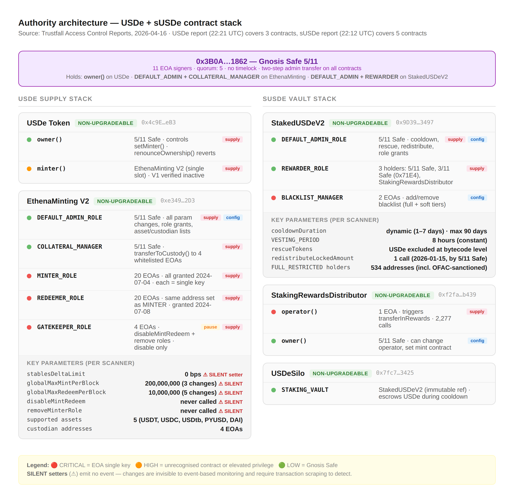
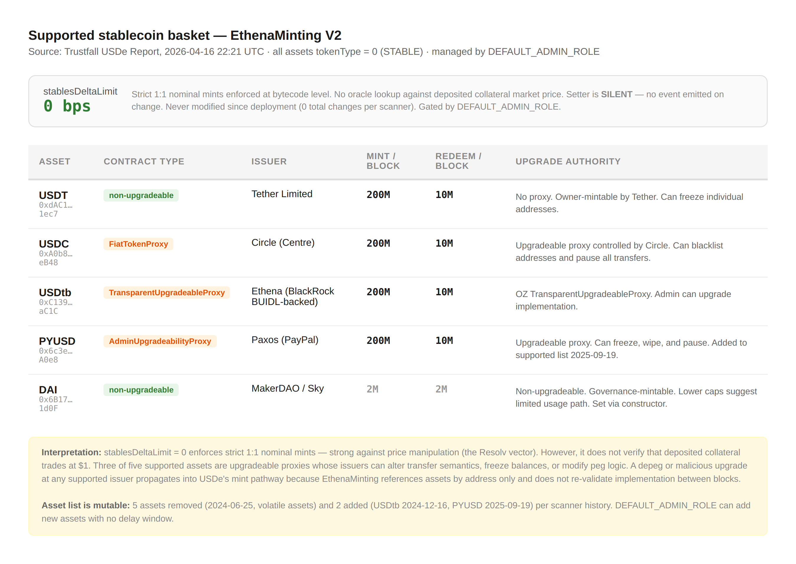
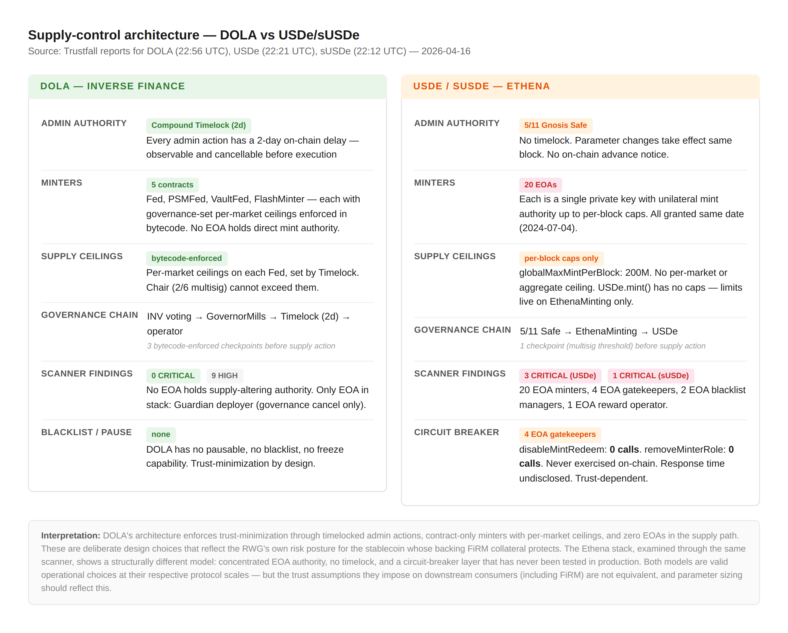
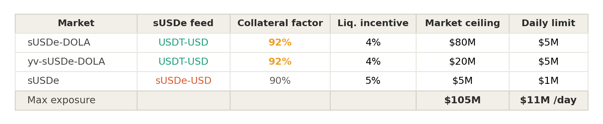
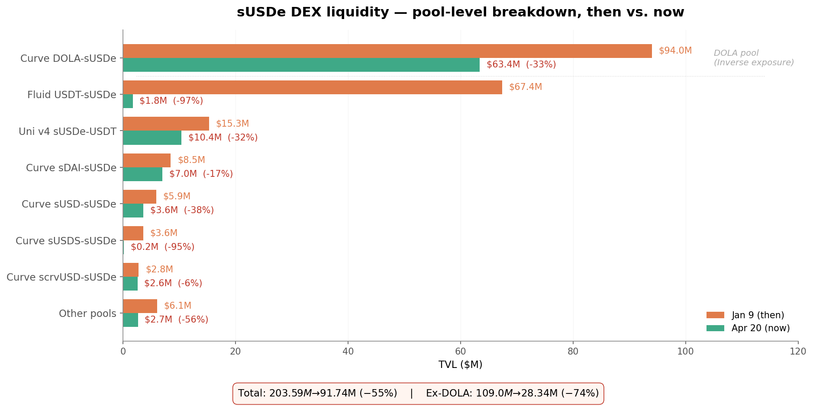
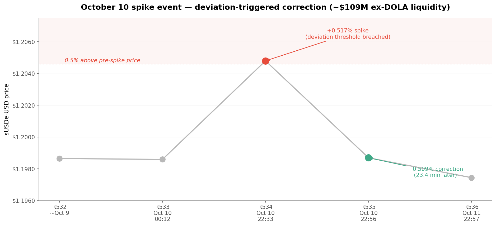

# Risk Assessment — sUSDe Collaterals on FiRM

> **Complete Risk Refresh Assessment — sUSDe Collaterals on FiRM**
> Prepared by the Inverse Finance Risk Working Group (RWG)

---

## Table of Contents

- [Briefing](#briefing)
  - [Top 5 Risk Vectors](#top-5-risk-vectors)
  - [Useful Links](#useful-links)
  - [Glossary](#glossary)
  - [Forward](#forward)
- [Protocol Analysis](#protocol-analysis)
  - [Overview](#overview)
  - [Attestations and Proof of Reserves](#attestations-and-proof-of-reserves)
- [Collateral Analysis](#collateral-analysis)
  - [Liquidity](#liquidity)
  - [Volatility](#volatility)
  - [Contracts](#contracts)
  - [Access Control + Impactful Variables & Functions](#access-control--impactful-variables--functions)
  - [Upgradable Proxy Implementations](#upgradable-proxy-implementations)
  - [Risk Summary](#risk-summary)
- [Competitive Analysis](#competitive-analysis)
  - [Contagion Mapping](#contagion-mapping)
- [Deployments & Design](#deployments--design)
  - [Valuation Methodology](#valuation-methodology)
- [Conclusion](#conclusion)
  - [The reaction-time problem](#the-reaction-time-problem)
  - [Recommended path](#recommended-path)
  - [Alternatives considered](#alternatives-considered)
  - [Closing](#closing)

---

## Briefing

### Top 5 Risk Vectors

**1. Live-feed reversion under current DEX liquidity**

FeedSwitch V2 was deployed in January 2026 against DEX TVL of $109M (ex-DOLA pool depth). That environment is now $28.34M — a 74% contraction. A reversion of the LP markets to live sUSDe-USD pricing would place up to $100M of FiRM collateral at 92% CF on that feed.

The feed is not independent of the liquidity that has contracted. Chainlink's sUSDe-USD price derives from the same DEX venues whose depth has fallen ~4×. This risk is distinct in that the feedswitch mechanism is FiRM's own configuration choice, executable in a single RWG Multisig transaction with no timelock. It is the most controllable variable on the risk surface — and therefore the one most consequential to get wrong.

*Source: [Deployments & Design → Valuation Methodology](#valuation-methodology)*

**2. Unexercised gatekeeper against a 20-EOA mint surface**

EthenaMinting V2 assigns `MINTER_ROLE` to 20 externally-owned addresses, each a single-key authority with no multisig coordination or on-chain delay. The only safeguard against sustained mint abuse is a layer of 4 `GATEKEEPER_ROLE` EOAs capable of disabling or rate-capping mint activity — a mechanism with zero on-chain calls recorded across the V2 contract's full deployment history. Its operational latency under live incident conditions is unknown.

The deeper concern is `stablesDeltaLimit = 0`, a SILENT setter that enforces nominal quantity parity between deposited stablecoins and minted USDe but not market-value parity. Three of the four supported stablecoins are upgradeable proxies. A compromised `MINTER_ROLE` key during a supported stablecoin depeg can extract the market-value differential silently — with the first observable signal to FiRM's monitoring infrastructure potentially being the oracle price move itself.

*Source: [Protocol Analysis → Access Control](#access-control--impactful-variables--functions); [Risk Summary](#risk-summary)*

**3. Season-transition demand rotation under ENA unlock pressure**

Season 6 launched March 26, 2026. The Ethena Foundation has not confirmed it as the final Season, but community expectation increasingly treats it as such, reflecting the anticipated transition to sENA fee-switch yield. That transition itself remains unscheduled: governance benchmarks were met in September 2025, but no activation vote has been called. Historical precedent across comparable post-points transitions shows 30–60% circulating supply contractions in the months following campaign endings.

Two variables compound the demand-rotation concern. Approximately half of total ENA supply remains unvested with linear unlocks extending through 2028 — sustained token inflation against a weakening yield proposition. Q1 2026 also saw recurring negative funding periods compressing sUSDe yield — a dynamic that threatens to draw on the reserve buffer if sustained. The dynamic cooldown activated in March 2026 improves tail-risk resilience, but governs Ethena's redemption pipeline — not DEX-channel exits, which are the mechanism driving every other vector on this list.

*Source: [Protocol Analysis → Overview](#overview)*

**4. Single-venue sUSDe concentration and shared-pool contagion**

External sUSDe lending supply across tracked protocols totals approximately $1.65B. Aave v3 Ethereum accounts for $1.647B of it — 99.7% concentration in a single venue. A 3% outflow from Aave's position (~$26M) approaches the entire current ex-DOLA pool depth. FiRM sits approximately 29× smaller by backing and 16× smaller by ceiling; it is not the marginal participant in this market.

Aave liquidations route through the same Curve and Fluid pools underpinning FiRM's oracle and every liquidation path documented in this assessment. Aave prices sUSDe on USDT feeds, so their liquidations don't fire on market price moves alone — but any governance action that converts latent exposure into active selling produces a correlated, compressed wave against the same $28.34M pool depth. FiRM has no lever here. The trigger sits at Aave; the mitigation is ceiling and CF conservatism.

*Source: [Competitive Analysis → Contagion Mapping](#contagion-mapping)*

**5. No-timelock admin authority with unobservable parameter changes**

The `DEFAULT_ADMIN_ROLE` at EthenaMinting V2 is a 5/11 Gnosis Safe at `0x3B0A`, which also holds `COLLATERAL_MANAGER_ROLE` and unilateral control over `transferToCustody()` to four whitelisted custodian EOAs. The three most operationally sensitive parameters — `stablesDeltaLimit`, `globalMaxMintPerBlock`, `globalMaxRedeemPerBlock` — are SILENT setters that emit no events on change. Detection requires active storage scraping. Contrasted with DOLA's 2-day Timelock and bytecode-enforced per-market supply caps, the control surface is permissive and time-undelayed above the layer of smart contract invariants.

The `BLACKLIST_MANAGER` and `redistributeLockedAmount()`, exercised once on January 15, 2026, confirm that administrative parties can move user balances under defined conditions. The `rescueTokens()` USDe carve-out is bytecode-enforced — the strongest structural constraint in the contract, and the lone one. Administrative risk is low-frequency; the absence of a timelock means the window between a compromise event and on-chain execution is measured in seconds. This does not compound daily operational exposure — it defines the tail.

*Source: [Risk Summary](#risk-summary); [Protocol Analysis → Access Control](#access-control--impactful-variables--functions)*

---

### Useful Links

**RWG Framework Outputs**

- USDe Trustfall — Access Control Report — <https://project-uul6h.vercel.app/reports/Web/USDe.html>
- sUSDe Trustfall — Access Control Report — <https://project-uul6h.vercel.app/reports/Web/StakedUSDeV2.html>

**Documentation**

- Ethena Docs — <https://docs.ethena.fi>
- Ethena Governance Forum — <https://gov.ethenafoundation.com>
- Ethena Risk Committee Forum — <https://gov.ethenafoundation.com/tag/risk-committee/7>
- Ethena Reserve Dashboard — <https://app.ethena.fi/dashboards/transparency>

**Contract Addresses**

| Contract | Address |
| --- | --- |
| USDe Token | [`0x4c9EDD5852cd905f086C759E8383e09bff1E68B3`](https://etherscan.io/address/0x4c9EDD5852cd905f086C759E8383e09bff1E68B3) |
| sUSDe Token | [`0x9d39a5de30e57443bff2a8307a4256c8797a3497`](https://etherscan.io/address/0x9d39a5de30e57443bff2a8307a4256c8797a3497) |
| EthenaMinting V2 (active) | [`0xe3490297a08d6fC8Da46Edb7B6142E4F461b62D3`](https://etherscan.io/address/0xe3490297a08d6fC8Da46Edb7B6142E4F461b62D3) |
| Protocol Admin Multisig (5/11 Gnosis Safe) | [`0x3B0AAf6e6fCd4a7cEEf8c92C32DFeA9E64dC1862`](https://etherscan.io/address/0x3B0AAf6e6fCd4a7cEEf8c92C32DFeA9E64dC1862) |

The Protocol Admin Multisig holds `owner()` on USDe and `DEFAULT_ADMIN_ROLE` and `COLLATERAL_MANAGER_ROLE` on EthenaMinting V2.

**Reserve Documentation**

- Audits — [Ethena Audit Summary](https://ethena-labs.gitbook.io/ethena-labs/resources/audits)
- Bug Bounty Program — [Immunefi Bug Bounty Program](https://immunefi.com/bug-bounty/ethena/)

---

### Glossary

- **EthenaMinting** — The dual-contract architecture through which all USDe is minted and redeemed. The active contract (V2) enforces per-block minting limits, a supported collateral whitelist, a custodian whitelist, and the `stablesDeltaLimit` parameter. Mint and redeem functions are restricted to `MINTER_ROLE` and `REDEEMER_ROLE` holders respectively.
- **Authorized Participant (AP)** — An institutional counterparty whitelisted in the EthenaMinting contract via the `addWhitelistedBenefactor()` function. APs are the only entities permitted to mint or redeem USDe through the contract. Retail users access USDe through secondary markets only.
- **MINTER_ROLE** — A role on EthenaMinting V2 granting the ability to call `mint()` and `mintWETH()`. Currently held by 20 EOA addresses, all granted on the same date (2024-07-04) and identifiable as Ethena's automated minting infrastructure. Each represents a single private key — compromise of any one key grants unilateral minting ability up to per-block limits.
- **REDEEMER_ROLE** — A role on EthenaMinting V2 granting the ability to call `redeem()`. The same 20 EOA addresses hold both `MINTER_ROLE` and `REDEEMER_ROLE`.
- **GATEKEEPER_ROLE** — A role on EthenaMinting V2 granting the ability to call `disableMintRedeem()`, `removeMinterRole()`, `removeRedeemerRole()`, and `removeCollateralManagerRole()`, and to remove minters, redeemers, and collateral managers. Held by 4 EOA addresses confirmed by Ethena to be automated bots running on segregated cloud infrastructure. These gatekeepers provide the primary circuit-breaker layer — a compromise scenario here could halt all minting and redemption system-wide.
- **DEFAULT_ADMIN_ROLE** — The top-tier administrative role on EthenaMinting V2. Held exclusively by the (`0x3B0A…1862`) 5/11 Gnosis Safe. Controls all role grants and revocations, per-block minting limits, the custodian list, the supported asset list, and the `stablesDeltaLimit` parameter. Compromise of this multisig represents the highest-impact attack surface in the Ethena access control structure.
- **stablesDeltaLimit** — A parameter on EthenaMinting V2 that sets the maximum allowed price deviation (in basis points) when minting USDe against stablecoin collateral. Currently set to 0 bps, meaning zero slippage is permitted and stablecoins must mint at strict 1:1. This parameter is the functional equivalent of the `maxSlippage` parameter exploited in the Resolv/USR incident. It is controlled exclusively by `DEFAULT_ADMIN_ROLE` (the 5/11 multisig).
- **Dynamic Cooldown** — A tiered unstaking delay mechanism for sUSDe activated by Ethena on March 13, 2026. The cooldown window scales from 1 to 7 days based on the proportion of sUSDe's backing held in liquid stablecoins, with defined thresholds designed to prevent redemption demand from outpacing the protocol's capacity to meet it. Directly relevant to FiRM's tail redemption risk model for sUSDe collateral.
- **DEX-State Oracle** — The current design of the Chainlink sUSDe-USD price feed (`0xFF3BC18...`), which derives its price entirely from on-chain DEX pool state (primarily the DOLA/sUSDe Curve pool). This means the oracle reflects actual market-clearing prices but is exposed to DEX liquidity conditions.
- **Season (Ethena)** — Ethena's incentive epoch structure. Points earned during a Season convert to ENA token allocations. Season 6 is the current season and launched at the end of March 2026 with an expected ~6-month duration. Post-Season 6, yield incentives are speculated to transition to sENA fee-switch revenue.
- **sENA** — Staked ENA; a potential successor incentive mechanism to the Season/points program. sENA holders are expected to receive a portion of Ethena protocol revenue, creating a demand model based on fundamental yield rather than token incentives.
- **Risk Committee (Ethena)** — Ethena's protocol risk governance body, recently contracted and now includes Llamarisk, Kairos and Blockworks Advisory as independent contributors. Responsible for monitoring reserve health, collateral parameters, and systemic risk to USDe backing.
- **FeedSwitch (FiRM context)** — The PWG-developed price feed deployed on the DOLA/sUSDe LP FiRM markets in January 2026. Default state = live DEX market price. Activated state = conservative USDT-equivalent ($1) pricing.

---

### Forward

This risk assessment has been prepared by the Inverse Finance RWG as a comprehensive refresh of USDe collateral markets on FiRM. It supersedes prior snapshot assessments and has been commissioned in response to a confluence of material changes: a ~74% contraction in independent sUSDe DEX liquidity since January 2026, the transition into Ethena's final incentive Season, and a re-examination of the FeedSwitch price feed from the DOLA/sUSDe LP markets following Resolv's USR exploit. Each of these developments individually would warrant updated analysis; taken together, they require a full re-evaluation before any parameter or oracle changes proceed.

sUSDe represents a distinctive position in the yield-bearing stablecoin landscape; one of the largest decentralized synthetic dollars by issuance, offering market-clearing yield through a delta-neutral perp hedging structure rather than traditional collateral backing. For FiRM borrowers and DOLA holders alike, sUSDe collateral carries a risk profile that differs from both fiat-backed stablecoins and conventional crypto collateral: its peg mechanism, redemption dynamics, and custody model all introduce considerations that are not captured by standard volatility-based parameterization.

The RWG's role remains strictly evaluative, focused on identifying risks and recommending appropriate safeguards. This assessment examines Ethena's current protocol architecture, access control structure, Q1 2026 performance, on-chain liquidity environment, oracle infrastructure, and audit coverage to provide comprehensive risk analysis for governance consideration.

---

## Protocol Analysis

### Overview

Ethena launched USDe in December 2023 as a synthetic dollar backed by delta-neutral positions — long yield-bearing spot assets (primarily liquid staked ETH and BTC) paired with equivalent notional short perpetual futures. The short leg cancels directional price exposure, leaving collateral value approximately stable in USD terms while capturing staking yield and funding rates. sUSDe is the staked wrapper that accrues this yield.

Ethena grew rapidly through 2024–2025 on the back of the Season incentive program, which allocated ENA points to liquidity providers in key venues — Pendle PTs and select LPs such as the DOLA/sUSDe Curve pool (funded through Inverse Finance's own bribe spend). [Season 6 launched on March 26, 2026](https://app.ethena.fi/overview) and is Ethena's current active Season. The Ethena Foundation has not confirmed it as the final Season, but external interpretation and community expectation increasingly treat it as such, reflecting the anticipated transition to sENA fee-switch yield as a sustainable successor mechanism. This too is speculated to be the case but not confirmed. The fee switch was [first proposed by Wintermute in November 2024](https://gov.ethenafoundation.com/t/wintermute-governance-proposal-for-ena-fee-switch/306) and approved in principle by Ethena governance. The Risk Committee subsequently [set success metrics](https://gov.ethenafoundation.com/t/ena-fee-switch-parameters/396) — which the Ethena Foundation confirmed USDe [met in September 2025](https://x.com/EthenaFndtn/status/1967592364744290455). Implementation has remained under Risk Committee review since. As of the assessment snapshot, no governance vote on activation has been scheduled. One publicly available modeling exercise by OAK Research (a former Risk Committee contributor) was [posted to the governance forum](https://gov.ethenafoundation.com/t/ethena-fee-switch-models-and-oak-researchs-recommendations/770) on March 16, 2026 but the post has not yet drawn forum responses, and the current Risk Committee has not publicly indicated its position.

This is an anticipated structural composition shift and the most material near-term variable for modeling sUSDe TVL retention. Incentive-driven TVL does not rotate frictionlessly; the extent to which fee-switch yield replaces points-driven LP depth depends on whether protocol revenue generates competitive APYs against alternatives. Historical precedent across other post-points stablecoin transitions (cUSDO, Usual, Resolv, Elixir) is not encouraging — circulating supply contractions of 30–60% in the months following points program conclusions have been typical.

The compression is already visible. sUSDe-paired DEX TVL excluding the DOLA/sUSDe pool has contracted approximately 74% from its January 2026 peak of ~$109M to ~$28M as of April 20, 2026. The same liquidity environment underpins the Chainlink sUSDe-USD feed and every FiRM liquidation path documented in this assessment; the number recurs throughout the Collateral Analysis, Competitive Analysis, and Deployments & Design sections as the denominator against which every other exposure is sized.

Two additional variables reinforce the demand-rotation concern:

- **ENA unlock schedule.** Approximately half of total ENA supply remains unvested as of April 2026, with continuous linear unlocks across Ecosystem Development, Core Contributor, and Investor allocations extending through 2028. The season ending transition is therefore occurring against a backdrop of sustained token inflation — a structural headwind for any governance token whose value proposition depends on yield attractiveness.
- **Funding-rate variability.** Q1 2026 saw recurring negative funding rate periods on the perpetuals positions underpinning Ethena's hedge. Sustained negative funding compresses sUSDe yield and draws on the reserve fund buffer. The protocol maintained USDe and sUSDe peg stability through these periods — a positive data point — but recurrence remains a monitoring priority, particularly if coincident with Season-transition outflows that further compress the revenue floor sENA yield depends on.

The most visible structural change to sUSDe's redemption mechanics in the 2026 window has been the activation of the [dynamic cooldown](https://gov.ethenafoundation.com/t/proposal-adopt-a-dynamic-cooldown-period-for-susde-unstaking/759/2) in March 2026. The unstaking window now scales from 1 to 7 days based on the proportion of sUSDe's backing held in liquid stablecoins, replacing the prior fixed 7-day cooldown. The dynamic floor is a meaningful improvement for sUSDe's normal-condition peg stability: a tighter cooldown shortens the USDe–sUSDe arbitrage cycle that whitelisted benefactors operate, which compresses sUSDe DEX deviations under normal operating conditions.

The cooldown's reach is bounded along two dimensions that matter for FiRM's risk surface.

The first is timing. Stablecoin failure events do not unfold on a multi-day clock. This year's reference points are consistent: Resolv's USR depeg unfolded within an approximately 1-day SLA window before redemption capacity was constrained; Elixir's deUSD's stress event resolved over a window of hours, fought through by redemption-arbitrage bots until the protocol elected to pause. A 1-day cooldown floor does not bound either of those timelines — it lengthens the interval between a holder recognizing impairment and being able to act on it through the legitimate redemption channel.

The second is the conditional nature of the arbitrage that produces the sUSDe–USDe correlation. The correlation under stress is generated by KYC-whitelisted benefactors arbitraging the discount: acquire discounted sUSDe on secondary, wait the cooldown, unstake, redeem 1:1 for USDC or USDT, recycle. The trade requires (a) the underlying backing to remain sound enough that the 1:1 redemption is honored at the end of the cycle, and (b) clear profit motive net of execution and reputational risk. Both conditions degrade together under genuine stress. KYC participants face their own information-scarce conditions, redemption channels can be paused or restricted at Ethena's discretion, and the profit-versus-risk calculus that sustains the arbitrage in normal periods is the first thing to deteriorate when impairment is suspected. sUSDe is structurally far removed from the source of any value impairment in the underlying reserve, and the correlation pathway is what bridges that distance — when the pathway fails, the system isolates rather than coheres, and the risk premium widens.

Ethena's Risk Committee has been expanded to include Llamarisk, Kairos and Blockworks Advisory as separately funded independent contributors, adding external governance observation to a reserve surface previously monitored primarily in-house. Combined with the four-party Proof of Reserves verification documented in the subsequent section, the reserve-transparency posture is materially stronger than it was at the RWG's initial sUSDe assessment.

**What this means for the assessment.** The sUSDe risk profile in April 2026 is not one where any single vector has deteriorated catastrophically. Instead, the demand-side environment has weakened simultaneously across multiple channels — DEX liquidity, supported-venue concentration, token unlock pressure, yield variability — while the protocol's structural defenses have meaningfully improved. FiRM's sizing decisions for sUSDe collateral must account for both vectors: the structural improvements compress tail probability, while the market-environment deterioration expands tail magnitude. The sections that follow work through each of these surfaces in turn, and the five findings summarized in the Briefing trace back to the same tension introduced here.

---

### Attestations and Proof of Reserves

**Transparency Infrastructure**

Ethena operates a real-time [Proof of Reserves transparency dashboard](https://app.ethena.fi/dashboards/transparency), updated daily, which publicly reports USDe's overcollateralization status and delta-neutrality confirmation across all reserve positions. This dashboard was a meaningful signal for the RWG at initial onboarding and has only strengthened since — it represents a level of public reserve disclosure that few synthetic dollar issuers match. The underlying PoR system was launched formally by Ethena Labs with on-chain proof of USDe backing, governance-approved methodology, and a commitment to continuous reporting.

**Multi-Party Independent Verification**

The most significant maturation in Ethena's reserve posture since the RWG's initial sUSDe assessment is the transition from self-reporting to independently verified attestations. As of the April 20, 2026 snapshot, four independent parties — HT Digital, Chaos Labs, LlamaRisk, and Chainlink — each confirming Overcollateralized and Delta-Neutral. These are genuinely separate organizations with distinct methodologies, not repackaged in-house reporting. The inclusion of Chainlink as a verifier adds an on-chain attestation dimension that the other auditors' off-chain reporting does not provide, and is directly relevant to how reserve health could be programmatically integrated into oracle infrastructure going forward.

**Risk Committee and Ongoing Monitoring**

The independent monitoring layer was formalized through Ethena's [Risk Committee grant program](https://gov.ethenafoundation.com/tag/risk-committee/7) commissions ongoing, separately funded risk contributors. The governance forum backing these grants is substantive — monthly updates, structured reserve analyses, and public deliberation on risk parameters. The existence of structured, recurring, independently produced reserve attestations meaningfully raises the bar for early detection of reserve deterioration before it propagates into USDe peg pressure. When weighted against the quantified technical risks in this assessment, Ethena's reserve transparency framework is one of the strongest mitigating factors in the overall picture.

---

## Collateral Analysis

### Liquidity

#### Mainnet Liquidity

The table below covers all material USDe and sUSDe DEX pools as of April 20, 2026. "Pairing Depth" reflects the USD value of the non-USDe/sUSDe asset in the pool — this is the primary exit liquidity metric. The DOLA side of the DOLA/sUSDe pool is excluded from independent exit liquidity totals since DOLA is protocol-issued and would be consumed in the same liquidation event it is meant to support.

#### sUSDe Mainnet Liquidity Snapshot

| LP | DEX | TVL ($M) | Pairing Depth ($M) |
| --- | --- | ---: | ---: |
| [sUSDe-DOLA](https://www.curve.finance/dex/ethereum/pools/0x744793b5110f6ca9cc7cdfe1ce16677c3eb192ef/deposit) | Curve | 63.40 | 54.21 |
| [sUSDe-sDAI](https://www.curve.finance/dex/ethereum/pools/0x167478921b907422f8e88b43c4af2b8bea278d3a/deposit) | Curve | 7.04 | 2.15 |
| [sUSDe-sUSD](https://www.curve.finance/dex/ethereum/pools/0x4b5e827f4c0a1042272a11857a355da1f4ceebae/deposit) | Curve | 3.64 | 3.46 |
| [sUSDe-scrvUSD](https://www.curve.finance/dex/ethereum/pools/0xd29f8980852c2c76fc3f6e96a7aa06e0bedcc1b1/deposit) | Curve | 2.62 | 0.98 |
| [sUSDe-USDT](https://fluid.io/stats/1/dex#36) | Fluid Dex | 1.77 | 0.85 |
| [sUSDe-reUSDe](https://www.curve.finance/dex/ethereum/pools/0x43b98eea5c689f0036918f590a4b55f22d853734/deposit) | Curve | 0.53 | 0.33 |
| [sUSDe-USDT](https://app.uniswap.org/explore/pools/ethereum/0xb20351bcf606dcc3525d2ed36760a86a5dec7423b77d41125bd4a416ba93448b) | Uni v4 | 0.98 | 0.23 |
| [sUSDe-reUSD](https://www.curve.finance/dex/ethereum/pools/0x5c2ab69eb2bf12a2f4572d178687bd4660512972/deposit) | Curve | 1.42 | 0.21 |
| [sUSDe-crvUSD](https://www.curve.finance/dex/ethereum/pools/0x57064f49ad7123c92560882a45518374ad982e85/deposit) | Curve | 0.66 | 0.21 |
| [sUSDe-USDT](https://app.uniswap.org/explore/pools/ethereum/0x7EB59373D63627be64b42406B108B602174B4CCC) | Uni v3 | 1.52 | 0.18 |
| [sUSDe-USDT](https://app.uniswap.org/explore/pools/ethereum/0xeac10ed910ed8b167bd5785954d53641705dceb46c4fd077f7c265bef455ffb8) | Uni v4 | 7.90 | 0.09 |
| [sUSDe-sUSDS](https://www.curve.finance/dex/ethereum/pools/0x3cef1afc0e8324b57293a6e7ce663781bbefbb79/deposit) | Curve | 0.19 | 0.06 |
| [sUSDe-USD3](https://www.curve.finance/dex/ethereum/pools/0x964573b560da1ce5b10dd09a4723c5ccbe9f9688/deposit) | Curve | 0.07 | 0.05 |
| **TOTAL** | | **91.74** | **63.01** |
| **TOTAL (excl. DOLA)** | | **28.34** | **8.80** |

> *DOLA side is not independent exit liquidity for FiRM liquidations. Excluding it, total third-party pairing depth across all venues is approximately $8.80M.*

#### USDe Mainnet Liquidity Snapshot

| LP | DEX | TVL ($M) | Pairing Depth ($M) |
| --- | --- | ---: | ---: |
| [USDe-FRAX](https://www.curve.finance/dex/ethereum/pools/0x5dc1bf6f1e983c0b21efb003c105133736fa0743/deposit) | Curve | 54.89 | 40.20 |
| [USDe-USDT](https://fluid.io/stats/1/dex#18) | Fluid Dex | 15.15 | 4.32 |
| [USDe-USDT](https://app.uniswap.org/explore/pools/ethereum/0x63bb22f47c7ede6578a25c873e77eb782ec8e4c19778e36ce64d37877b5bd1e7) | Uni v4 | 3.40 | 1.20 |
| [USDe-USDtb](https://fluid.io/stats/1/dex#36) | Fluid Dex | 1.77 | 0.85 |
| [USDe-USDC](https://app.uniswap.org/explore/pools/ethereum/0xE6D7EbB9f1a9519dc06D557e03C522d53520e76A) | Uni v3 | 2.20 | 0.56 |
| [USDe-USDC](https://www.curve.finance/dex/ethereum/pools/0x02950460e2b9529d0e00284a5fa2d7bdf3fa4d72/deposit) | Curve | 0.85 | 0.41 |
| [USDe-USDT](https://app.uniswap.org/explore/pools/ethereum/0xce93ea3914c62e0008348cf39fd006e130e7c503935fb01d154b971c8663f4fb) | Uni v4 | 1.10 | 0.27 |
| [USDe-crvUSD](https://www.curve.finance/dex/ethereum/pools/0xf55b0f6f2da5ffddb104b58a60f2862745960442/deposit) | Curve | 0.34 | 0.17 |
| [USDe-OUSD](https://www.curve.finance/dex/ethereum/pools/0xdbdc27b649239f9c5afdc92e57c2601a0ce71a89/deposit) | Curve | 0.15 | 0.12 |
| [USDe-USDT](https://app.uniswap.org/explore/pools/ethereum/0xaae9da4a878406eb1de54efac30e239fd56d54fb8051e59f6fee529bc9609b3b) | Uni v4 | 0.22 | 0.09 |
| [USDe-USDT](https://www.curve.finance/dex/ethereum/pools/0x5b03cccab7ba3010fa5cad23746cbf0794938e96/deposit) | Curve | 0.36 | 0.05 |
| **TOTAL** | | **80.43** | **48.24** |

#### CEX Presence

USDe is listed on several tier-1 centralized exchanges, benefiting from the strategic backing of their venture arms at Ethena's inception. Primary spot venues include Binance (Binance Labs investor), Bybit, OKX (OKX Ventures investor), Bitget, Gate.io, and MEXC. Common trading pairs are USDe/USDT and USDe/USDC. sUSDe on the other hand has no CEX presence given its primary function as an on-chain yield-accruing instrument.

#### Liquidity support mechanics and strategy

USDe and sUSDe on-chain liquidity has historically been driven by Ethena's Season incentive program, which allocated ENA points to liquidity providers in key pools — most significantly Pendle PT's and select LPs such as the DOLA/sUSDe Curve pool (via Inverse Finance's own bribe spend). This model created deep DEX liquidity that was tied to incentive continuity in the hopes of building long-lasting organic demand.

Season 6, launched in late March 2026, is suspected to be the final points season and will potentially transition to [sENA fee-switch yield](https://gov.ethenafoundation.com/t/wintermute-governance-proposal-for-ena-fee-switch/306) as the sustainable liquidity incentive model — stakers of ENA receive a share of protocol revenue rather than points convertible to tokens. Whether this creates equivalent LP depth is the open question. Fee-switch yield requires meaningful protocol revenue to generate competitive APYs; the combination of negative Q1 funding periods and a contracting sUSDe supply base creates uncertainty around that revenue floor going into the transition.

CEX liquidity for USDe, by contrast, is structurally more stable — exchange listings and market maker agreements are not directly tied to the Season program, and USDe's $5.3B total supply provides sufficient float for continued tier-1 exchange support.

---

### Volatility

#### KYC Whitelist

USDe is not a permissionless mint-and-redeem asset. The EthenaMinting V2 contract exposes three KYC-gated user roles — enumerated directly on-chain:

- `benefactor()` — **488 whitelisted addresses** (490 total grant events in history). These are the only addresses permitted to submit mint and redeem orders against EthenaMinting V2. Retail users interact with USDe exclusively through secondary markets.
- `beneficiary()` — 15 addresses. Destinations for minted USDe or redeemed collateral.
- `delegatedSigner()` — 15 addresses. Authorized to sign mint/redeem orders on behalf of benefactors.

All three whitelists are gated by `DEFAULT_ADMIN_ROLE` (the `0x3B0A…1862` 5/11 Safe) via `addWhitelistedBenefactor()` and `removeWhitelistedBenefactor()`.

The benefactor whitelist is the mechanism through which Ethena's peg defense actually operates. sUSDe holders cannot redeem directly into stablecoins — they must first unstake sUSDe to USDe (subject to the dynamic cooldown, currently 1–7 days), then redeem USDe at the contract. Retail cannot perform the second step. Only whitelisted benefactors can.

When sUSDe trades at a discount to its exchange rate against USDe on DEXes — the condition under which FiRM liquidations begin to take losses beyond the liquidation incentive — the peg defense is an arbitrage cycle available only to benefactors: acquire discounted sUSDe on secondary markets, wait out the cooldown, unstake to USDe, redeem USDe 1:1 for USDC or USDT through EthenaMinting V2, and recycle. Their activity compresses the sUSDe/USDe discount and is the primary mechanism moving an off-peg sUSDe price back toward its backing value during stress. Benefactor capacity and willingness to take this trade is therefore a direct input to sUSDe's peg resilience under redemption pressure.

The whitelist is not a fixed set. `DEFAULT_ADMIN_ROLE` can add or remove benefactors at any time, with no timelock and no event-based monitoring constraint. Peg-defense arbitrage depends on the whitelist remaining open and operational — an unscheduled restriction of benefactors, whether by governance action, compliance event, or multisig compromise, would remove the primary arbitrage pathway keeping sUSDe priced against its backing. This is not a likely scenario under Ethena's stated practices, but it is a structural dependency that sits outside bytecode enforcement and downstream of the same 5/11 Safe that controls every other admin function in the stack.

Both mint and redeem paths route through EthenaMinting V2 and require a whitelisted benefactor as the counterparty.

*Mint path.* A whitelisted benefactor deposits supported stablecoin collateral (USDT, USDC, USDtb, PYUSD, or DAI) and requests USDe in exchange. The order is submitted through Ethena's RFQ API, where off-chain pricing and the 200M-per-block API cap are applied. A `MINTER_ROLE` holder (one of 20 Ethena-operated EOAs) signs the order. EthenaMinting V2 validates the signature, enforces `stablesDeltaLimit = 0` (strict 1:1 against stablecoin collateral), checks the per-asset `maxMintPerBlock`, and calls `USDe.mint(beneficiary, amount)`. The USDe contract, whose `minter()` slot points to EthenaMinting V2, creates the tokens.

*Redeem path.* A whitelisted benefactor returns USDe and requests collateral. The RFQ API applies the 10M-per-block redeem cap. A `REDEEMER_ROLE` holder (same 20 EOAs) signs the order. EthenaMinting V2 validates, enforces the delta limit, checks `maxRedeemPerBlock` for the requested asset, burns the returned USDe, and releases collateral from the contract's holdings to the benefactor. Collateral held at custody — outside EthenaMinting V2 — is only movable via `transferToCustody()` in reverse, gated by `COLLATERAL_MANAGER_ROLE` (the 5/11 Safe).

The mint and redeem functions are `onlyRole(MINTER_ROLE)` and `onlyRole(REDEEMER_ROLE)` respectively, and orders must name a whitelisted benefactor. Retail holders never interact with the contract directly for mint or redeem — they buy and sell USDe on DEXes or CEXes, where price is a function of secondary-market liquidity rather than the protocol's 1:1 redemption rate.

---

### Contracts

The USDe and sUSDe contract stack comprises seven verified contracts across two Trustfall access control reports: the [USDe report](https://inverse-public-files-inverse-tools.vercel.app/vercel-report-directory/reports/Web/USDe.html) covers USDe, EthenaMinting V2, and the 0x3B0A Gnosis Safe; the [sUSDe report](https://inverse-public-files-inverse-tools.vercel.app/vercel-report-directory/reports/Web/StakedUSDeV2.html) covers StakedUSDeV2, USDeSilo, StakingRewardsDistributor, and two Gnosis Safes (the same 5/11 at 0x3B0A and a lower-threshold 3/11 at 0x71E4). Both reports were generated on 2026-04-19 with no scan integrity issues detected.

On-chain contract state is the highest source of truth. The Trustfall scanner ([Documentation](https://inverse-public-files-inverse-tools.vercel.app/vercel-report-directory/index.html)) is an RWG-developed tool that enables repeatable on-chain validation on demand — given a single contract address, it traces the full privilege graph recursively: reading current state via storage reads, replaying complete event history from deployment, cross-referencing the two for discrepancies, and resolving the dependency chain down to terminal Gnosis Safe signers. Trustfall operates as a Claude Code skill, deploying two AI agents — one for pre-scan protocol research and one for post-scan report verification — that recursively iterate the discovery and classification cycle. It is built to answer the question most relevant to FiRM collateral: how easily can an asset's authority chain be compromised to invalidate collateral integrity? The linked reports are the RWG's auditable record of on-chain state at the time of scan; every finding below can be independently re-verified against the contracts themselves. A full public writeup on the Trustfall scanner will follow separately.

---

### Access Control + Impactful Variables & Functions

The full authority inventory is documented at role-holder granularity in the linked Trustfall reports, which reflect on-chain state as of 2026-04-19. This section confines itself to interpretation of that data, separating what is bytecode-enforced from what is trust-dependent.

**On-chain authority architecture.** The scanner resolves the stack's authority into three structural layers.

At the top sits a single 5/11 Gnosis Safe (`0x3B0A…1862`), which holds `owner()` on USDe, `DEFAULT_ADMIN_ROLE` and `COLLATERAL_MANAGER_ROLE` on EthenaMinting V2, and `DEFAULT_ADMIN_ROLE` on StakedUSDeV2. Every parameter with the ability to change protocol economics resolves to this signer set. The scanner confirms no timelock on any admin function; changes take effect in the same block the multisig transaction executes. The scanner also records that `renounceOwnership()` on USDe is overridden to always revert — ownership of the USDe token is permanent by design.

At the operational layer sit the `MINTER_ROLE` and `REDEEMER_ROLE` holders on EthenaMinting V2 — 20 EOAs each, identical address set across both roles, all granted the same dates in July 2024 per the scanner's role-grant history. Each is a single private key with unilateral authority within per-block caps. The scanner flags all 20 as 🔴 CRITICAL attention. The scanner's protocol context notes these are "operational bots, not human signers."

At the circuit-breaker layer sit 4 `GATEKEEPER_ROLE` EOAs, also flagged 🔴 CRITICAL by the scanner. Gatekeepers can call `disableMintRedeem()`, `removeMinterRole()`, `removeRedeemerRole()`, and `removeCollateralManagerRole()`. The scanner confirms their authority is strictly negative — they cannot grant any role, modify parameters, or add custodians. The scanner records that every gatekeeper-accessible function has zero total calls on-chain:

- `disableMintRedeem()` — 0 calls (DORMANT, SILENT)
- `removeMinterRole()` — 0 calls (DORMANT, SILENT)
- `removeRedeemerRole()` — 0 calls (DORMANT, SILENT)
- `removeCollateralManagerRole()` — 0 calls (DORMANT, SILENT)

The circuit-breaker layer has never been exercised in production since the V2 contract's deployment.

**On-chain parameter state (per scanner).** `stablesDeltaLimit = 0` bps enforces strict 1:1 nominal mints against stablecoin collateral. The scanner flags this setter as SILENT (no event emitted on change) and records 0 total modifications since deployment. `globalMaxMintPerBlock` is set at 200M (3 changes, last 2025-07-25) — the scanner flags this setter as SILENT. `globalMaxRedeemPerBlock` is 10M (5 changes, last 2025-08-05) — also flagged SILENT. The three most economically impactful parameters on EthenaMinting V2 — `stablesDeltaLimit`, `globalMaxMintPerBlock`, and `globalMaxRedeemPerBlock` — all emit no event on change; modifications are invisible to event-based monitoring and recoverable only via transaction scraping or direct storage reads.

The supported asset list is five stablecoins — USDT, USDC, USDtb, PYUSD, DAI — all `tokenType=0` (STABLE); three were set via constructor (USDT, USDC, DAI) and two were added later (USDtb 2024-12-16, PYUSD 2025-09-19). DAI carries lower per-asset caps (2M mint / 2M redeem) compared to 200M/10M for the other four. Five volatile assets were removed on 2024-06-25. The custodian whitelist consists of 4 on-chain EOAs.

**USDe supply gating (per scanner).** USDe uses a single-slot `minter()` rather than a role set. The scanner shows this slot currently points to EthenaMinting V2, with the previous holder (EthenaMinting V1 at `0x2CC4…Afc3`) verified inactive via `hasRole` returning false. The USDe `mint()` function itself has no caps — the scanner's protocol context explicitly states: "If minter is changed to a contract/EOA without caps, unlimited minting is possible."

**sUSDe controls (per scanner).** StakedUSDeV2 admin authority can modify `cooldownDuration` up to the 90-day `MAX_COOLDOWN_DURATION` constant. `REWARDER_ROLE` has three holders per the scanner: the 5/11 Safe, a separate 3/11 Safe (`0x71E4…3A87`) with the same 11 signers but a lower quorum, and the StakingRewardsDistributor contract. The StakingRewardsDistributor's `operator()` is a single EOA flagged 🔴 CRITICAL by the scanner, with 2,277 `transferInRewards` calls recorded — this is the active automated reward distribution path. `BLACKLIST_MANAGER_ROLE` is held by 3 entities: the 5/11 Safe and 2 EOAs. The second EOA was granted on 2026-01-13, two days before the single recorded `redistributeLockedAmount()` call on 2026-01-15. On-chain inspection confirms `rescueTokens()` is scoped at the bytecode level to exclude USDe. `redistributeLockedAmount()` has been called once (2026-01-15, by the 5/11 Safe), redistributing a restricted address's balance to the Safe itself.

**Off-chain controls disclosed by Ethena (trust-dependent).** The following have been disclosed to the RWG and cannot be verified from scanner output or contract state:

- The gatekeeper EOAs are automated bots running on private cloud infrastructure segregated from Ethena Labs' infrastructure and from each other (disclosed April 13, 2026). Gatekeeper response time under an active exploit has not been disclosed. The scanner's on-chain record provides no corroboration: with zero calls to any gatekeeper function since deployment, the circuit-breaker's operational readiness and response latency remain entirely trust-dependent claims. The mechanism has not been tested in a live incident, and the RWG cannot verify that the automated systems would perform as described under exploit conditions.
- An off-chain RFQ service enforces a 200M mint / 10M redeem cap per block at the API boundary (disclosed April 15, 2026). This binds only traffic flowing through the Ethena API and does not protect against direct-to-contract mints by a compromised `MINTER_ROLE` holder.
- Operational security for the 5/11 multisig comprises m-of-n multisig, cold hardware wallets, device segregation, geographical segregation, EDR tooling, and documented procedures (disclosed April 13, 2026).

---

### Upgradable Proxy Implementations

On-chain inspection confirms that every contract in both report scopes is non-upgradeable — no EIP-1967 implementation slot, no transparent or UUPS proxy wrapper, no beacon reference. The Trustfall reports record this as `Proxy Status: ✅ No` for each contract. The Gnosis Safe contracts at (`0x3B0A…1862`) and 0x71E4 are technically ERC-1967 proxies, but the scanner notes their implementations expose no upgrade function (`Proxy — immutable`). The StakingRewardsDistributor's immutable references (`mintContract()`, `USDE_TOKEN()`, `STAKING_VAULT()`) and StakedUSDeV2's immutable reference (`silo()`) are confirmed by the scanner as non-reassignable.

The trade-off is that bug remediation is impossible in-place. Combined with the absence of timelocks on any parameter change in the stack, non-upgradeability shifts mitigation weight onto operational controls. Non-upgradeability is a positive structural feature; it does not substitute for the absent reaction window on parameter changes.

---

### Risk Summary

#### USDe contract risk surface, by authority level

Three on-chain scenarios require 5/11 multisig compromise. A compromised threshold can reassign the USDe minter slot to an arbitrary address, bypassing every downstream limit — the scanner's protocol context explicitly flags this as the highest-impact function on USDe. It can modify EthenaMinting V2 parameters — raising `stablesDeltaLimit`, expanding per-block limits, adding adversarially priced assets, or adding hostile custodians. Or it can simultaneously add a hostile custodian and execute `transferToCustody()`, since the scanner confirms both `DEFAULT_ADMIN_ROLE` and `COLLATERAL_MANAGER_ROLE` are held by the same signer set.

One on-chain scenario requires a single EOA compromise — `MINTER_ROLE`. This is the vector with the most direct parallel to the Resolv USR exploit. Ethena's structural defense is `stablesDeltaLimit = 0`, confirmed DORMANT and bytecode-enforced per the scanner: the contract rejects any mint other than strict 1:1 against deposited stablecoins.

`stablesDeltaLimit = 0` is a nominal-quantity check, not a market-value check. It enforces that 100 USDC deposits produce exactly 100 USDe; it does not verify that the deposited USDC is worth $100. This creates a conditional extraction scenario: a compromised `MINTER_ROLE` holder operating during a supported-stablecoin depeg can mint USDe at the required 1:1 nominal rate against market-priced depegged collateral and extract the difference. The per-asset 200M block cap enumerated by the scanner constrains single-block exposure. No authority escalation is required beyond the single compromised EOA.

The same conditional failure applies to malicious or error-introducing upgrades of a supported stablecoin. The scanner's supported assets list names the five current assets by their on-chain contract types: USDC (FiatTokenProxy), USDtb (TransparentUpgradeableProxy), PYUSD (AdminUpgradeabilityProxy), USDT (TetherToken, non-upgradeable but owner-mintable), and DAI (Dai, non-upgradeable, governance-mintable). EthenaMinting V2 references supported stablecoins by address only and does not re-validate implementation behavior between blocks. A malicious upgrade at any proxy-pattern issuer — or unauthorized issuance from an owner-mintable contract — would propagate into USDe's mint pathway. The 5/11 multisig can remove an asset via `removeSupportedAsset()`, but the scanner's change history shows 5 removals all executed in a single transaction on 2024-06-25 — reactive, not preventive.

#### Supported stablecoin integrity risk

`stablesDeltaLimit = 0` is therefore strong against price manipulation and conditional against value extraction. USDe's backing integrity inherits the integrity of every supported stablecoin Ethena accepts at mint. Two reactive mitigations exist: the 5/11 multisig can remove a depegged asset via `removeSupportedAsset()`, and the gatekeeper layer can halt all minting via `disableMintRedeem()`. Both are bytecode-verified as available. Neither is quantified in terms of response latency. A compromised `MINTER_ROLE` holder can mint up to 200M USDe per block against a depegged non-DAI asset; 12-second block intervals compare unfavorably against multisig assembly times, which are typically measured in minutes at best. The gatekeeper automation is designed to be faster but has zero on-chain calls across the V2 contract's deployment history and no disclosed response-time performance metrics. The mitigation stack is structurally real and bytecode-enforced but operationally untested at the speed the extraction vector can operate.

#### sUSDe contract risk surface

The scanner confirms sUSDe's non-upgradeable architecture eliminates the class of risk where vault accounting could be silently altered. The residual on-chain surface is narrower. A compromised admin could raise `cooldownDuration` to the 90-day hard cap, freezing unstaking at the contract level. The blacklist sweep vector — `BLACKLIST_MANAGER_ROLE` held by the 5/11 Safe and 2 EOAs can place addresses into FULL_RESTRICTED, after which the admin can `redistributeLockedAmount()` — has been exercised once per scanner history (2026-01-15). The second EOA holder was granted the role on 2026-01-13, two days before the single recorded confiscation call. The `rescueTokens()` USDe carve-out, verified on-chain, is the strongest bytecode-enforced design choice protecting sUSDe's underlying asset from admin discretion.

#### Concentration of Control

Every high-impact on-chain authority in the stack resolves to the same (`0x3B0A…1862`) 5/11 Gnosis Safe. The scanner's quorum history for this Safe shows an initial decrease from 5 to 2 (2023-11-14), followed by incremental increases back to 5 (reaching the current threshold by 2024-01-17). No other signer set has meaningful authority at the admin layer. The asymmetry between admin and gatekeeper authority is enumerated in the scanner: gatekeepers can only disable what the admin has enabled.

The sUSDe reward path introduces a second Gnosis Safe (`0x71E4…3A87`) at a lower 3/10 quorum with an overlapping but not identical signer set. This Safe holds `REWARDER_ROLE` on StakedUSDeV2 and can call `transferInRewards()` directly. The lower quorum reflects the operational frequency of reward distribution but means a compromise of 3 of the 11 signers grants write access to the sUSDe vault's reward injection path.

#### Overall Impact

At the contract level, USDe and sUSDe expose a concentrated authority surface with no on-chain timelock and a mix of bytecode-enforced and trust-dependent guardrails. The bytecode-enforced guardrails — `stablesDeltaLimit = 0`, the single-minter slot on USDe with `renounceOwnership()` reverts, the 90-day cooldown cap on StakedUSDeV2, the USDe carve-out in `rescueTokens()`, and the non-upgradeable architecture across the stack — are all verified on-chain and should be weighted accordingly. The trust-dependent controls — the gatekeeper infrastructure, the off-chain RFQ caps, the multisig signer operational security — reduce risk but cannot be verified on-chain and should not be counted as equivalent to bytecode enforcement.

The gatekeeper mechanism warrants specific emphasis in this context. The scanner records zero on-chain calls to any gatekeeper function — `disableMintRedeem()`, `removeMinterRole()`, `removeRedeemerRole()`, `removeCollateralManagerRole()` — across EthenaMinting V2's entire deployment history. Ethena has disclosed to the RWG that these are automated bots on segregated cloud infrastructure, but has not disclosed expected response time under exploit conditions. A circuit-breaker that has never fired in production is an untested safeguard. Its inclusion in the risk model should reflect that it is a trust-dependent claim with no on-chain performance data, not a verified control.

The RWG applies a different standard to its own stablecoin infrastructure. The [DOLA Trustfall report](https://project-uul6h.vercel.app/reports/Web/DOLA.html) — generated by the same scanner on the same date — provides a structural reference point for the trust assumptions FiRM collateral inherits.

The structural differences surfaced by running the same scanner against both stacks are not a judgment on Ethena's operational choices — they are an observation about the trust assumptions each architecture imposes on downstream consumers. DOLA's architecture routes every governance action through a 2-day Compound Timelock, uses contract-only minters with per-market ceilings enforced in bytecode, and has zero EOAs in any supply-authority chain. The scanner surfaces one CRITICAL-attention observation — an EOA on `deployer()` of the Guardian contract that can propose a governance-cancel via `allowCancel()`, but execution requires a separate signature from the policy multisig. The scanner's heuristic flags the EOA on as CRITICAL and does not distinguish the two-key dependencies from single-key compromise; no DOLA supply-altering path is reachable through this role. These are deliberate design choices that reflect Inverse Finance's posture toward trust-minimization for the stablecoin whose backing FiRM collateral protects. When the same scanner examines the collateral being posted against that backing, the difference in trust surface is quantifiable and should be reflected in parameter sizing.

The specific contract-level finding that warrants weight in parameter sizing is the conditional exposure created by `stablesDeltaLimit = 0` operating as a nominal-quantity check against a basket of five stablecoins — three of which are upgradeable proxies, one of which is owner-mintable — combined with an untested circuit-breaker layer whose response time has not been disclosed, and the SILENT setter flags on the three most economically impactful parameters. This is the vector that does not require multisig compromise, can be triggered by a single EOA key event, and whose reactive countermeasures have no on-chain performance history.

---

## Competitive Analysis

The competing sUSDe lending market of consequence is Aave v3. Across all three of Aave's active deployments — Ethereum, Plasma, and Mantle — Aave holds effectively the entirety of external sUSDe and PT-sUSDe lending supply. Every other venue (Sparklend, Euler v2, Fluid DEX's lending-adjacent structure, smaller isolated markets) contributes immaterial share by comparison.

The table is split into two exposure groups. Each transmits risk to FiRM through a different channel, and at a different speed:

- **Direct sUSDe supply** is the asset FiRM itself holds as collateral. Holders and liquidators can reach FiRM's exit liquidity pools in a single block; the 1–7 day sUSDe-to-USDe cooldown applies only to Ethena's redemption pipeline, not to DEX sales. DEX exits are the dominant path under stress, and the path Aave liquidations take. This is the fast contagion channel.
- **PT-sUSDe supply** is a sUSDe-derivative wrapper with fixed maturity dates. Before maturity, exit is through Pendle's secondary market at a discount-to-par. At maturity, PT unwraps 1:1 to sUSDe, which can then hit sUSDe DEX pools. This is a scheduled, date-driven channel rather than a discretionary one.

#### Aave sUSDe Supply (primary contagion channel)

| Deployment | Asset | Supply TVL |
| --- | --- | ---: |
| Aave v3 Ethereum | sUSDe | $880,063,374 |
| Aave v3 Plasma | sUSDe | $421,798,088 |
| Aave v3 Mantle | sUSDe | $345,275,188 |
| **Total** | | **$1,647,136,650** |

#### Aave PT-sUSDe Supply (maturity-gated channel)

| Deployment | Asset | Supply TVL | Maturity |
| --- | --- | ---: | --- |
| Aave v3 Ethereum | PT-sUSDe-7MAY2026 | $382,097,926 | 7 May 2026 |
| Aave v3 Plasma | PT-sUSDe-18JUN2026 | $301,349,901 | 18 Jun 2026 |
| **Total** | | **$683,447,827** | |

#### Aave sUSDe Oracle Approach

| Deployment | Asset | Oracle Approach |
| --- | --- | --- |
| Aave v3 Ethereum | sUSDe | USDT |
| Aave v3 Plasma | sUSDe | USDT |
| Aave v3 Mantle | sUSDe | USDT |

---

### Contagion Mapping

The dominant contagion channel for FiRM is a liquidity cascade through the sUSDe DEX pools that FiRM's liquidation mechanism depends on. Aave's behavior is the near-entirety of that transmission surface, and the two exposure groups above transmit pressure to those pools at materially different speeds.

**Direct sUSDe — the fast channel.** Aave's sUSDe supply totals $1.65B across three deployments. An Aave governance decision, parameter change, oracle migration, or risk-off action — with Ethena's own protocol behaving normally — can produce large, correlated sUSDe outflows that route through the same Curve and Fluid pools FiRM liquidators depend on.

The cooldown does not slow this channel. The 1–7 day sUSDe-to-USDe cooldown applies only if holders choose to redeem through Ethena. Under stress, the dominant exit is a DEX sale, which bypasses the cooldown entirely. Liquidators take the sUSDe and sell it on-chain in the same block. External pressure reaches FiRM's exit liquidity pools without any protocol-level delay.

**Exit liquidity against Aave supply.** The sUSDe DEX pools do not scale with aggregate supply; they are currently $28.34M in independent pool depth (ex-DOLA), down ~74% from $109M in January 2026. The Aave-sUSDe-to-exit-liquidity ratio is approximately **58×**: $1.65B of Aave sUSDe chasing $28M of independent absorbing capacity. A 3% outflow from Aave's Ethereum sUSDe position — $26M — is roughly the entire current ex-DOLA pool depth in isolation.

**FiRM's relative exposure.** FiRM's current sUSDe collateral backing is approximately $56M across three markets, with a ceiling-level maximum exposure of $105M. Aave sUSDe supply is **~29× FiRM's current backing**, or **~16× FiRM's ceiling exposure**. FiRM is not the marginal participant in this market — it is a minor one, structurally downstream of Aave's behavior.

**PT-sUSDe — the scheduled channel.** A second, date-driven channel runs through the $683M of Aave PT-sUSDe supply. At maturity, PT positions unwrap 1:1 to sUSDe and can then hit the same DEX pools. The near-term concentration is significant: PT-sUSDe-7MAY2026 ($382M, Aave Ethereum) and PT-sUSDe-18JUN2026 ($301M, Aave Plasma) together represent $683M of scheduled sUSDe redemption demand within roughly 60 days — more than **24× current ex-DOLA exit liquidity**. Whether this converts to DEX exit pressure depends on whether PT holders roll into new positions, hold the underlying sUSDe, or exit outright, but the schedule is fixed.

**Oracle configuration context.** FiRM's LP markets currently price sUSDe via the FeedSwitch, which references USDT-equivalent pricing with the live sUSDe-USD feed held in standby. Considering Aave is also USDT-equivalent feeds across all three deployments, FiRM and Aave are symmetrically insulated from sUSDe market-price movements. In this configuration, a sUSDe DEX discount triggers no liquidations at either venue, and contagion through ordinary liquidation mechanics is muted by shared oracle blindness.

This symmetry is not a stable property. Four scenarios can emerge from combinations of FiRM and Aave oracle state:

| FiRM | Aave | Resulting dynamic |
| --- | --- | --- |
| FeedSwitch (USDT) | Hardcoded/USDT | Current state. Muted cross-protocol liquidation pressure; contagion would require a non-oracle trigger. |
| Live sUSDe-USD | Hardcoded/USDT | FiRM liquidations fire against real sUSDe prices; Aave liquidations do not. FiRM absorbs sUSDe DEX pressure alone. |
| FeedSwitch (USDT) | Live sUSDe-USD | Aave liquidations drain shared exit pools against real prices; FiRM positions remain solvent on paper while exit liquidity degrades. |
| Live sUSDe-USD | Live sUSDe-USD | Correlated liquidation pressure against $28M of pool depth, $1.65B of Aave sUSDe supply. The protocol that migrates second absorbs the cascade from the first's liquidations if sequenced. |

Any migration between hardcoded and live feeds at either venue changes the liquidation-transmission posture; the current symmetric configuration is the most favorable of four possible states and is not guaranteed to persist.

---

## Deployments & Design

At maximum utilization, FiRM sUSDe markets carry $105M in potential collateral exposure. Under the active FeedSwitch configuration, the two LP markets (sUSDe-DOLA, yv-sUSDe-DOLA) are valued via USDT-based pricing and this ratio does not directly affect their valuation. The standalone sUSDe market ($5M ceiling) is already using live sUSDe-USD market pricing, meaning its collateral valuation currently depends on the DEX liquidity environment described below.

The LP markets carry a 92% collateral factor — the highest across all three sUSDe markets — with a 4% liquidation incentive, leaving a narrow margin between maximum borrow and liquidation. The standalone sUSDe market is set more conservatively at 90% CF with a 5% liquidation incentive. A reversion of the LP markets to live sUSDe-USD pricing would move up to $100M in higher-CF exposure from passive reliance on the sUSDe-USD feed (standby under FeedSwitch) to active dependence — meaning collateral valuation across all three sUSDe markets ($105M combined) would be directly determined by the DEX liquidity environment the feed sources from, currently $28.34M in independent pool depth.

---

### Valuation Methodology

[FeedSwitch V2](https://www.inverse.finance/governance/proposals/mills/344) was deployed alongside the sUSDe LP market parameter updates in January 2026. At the time, sUSDe's on-chain liquidity environment was healthy but unstaking mechanics created meaningful uncertainty around the protocol's ability to defend peg under redemption stress. The FeedSwitch was designed as a temporary guardian-controlled mechanism that could fall back to conservative USDe-equivalent pricing in the event of a sUSDe depeg or liquidity dislocation, providing a circuit breaker while the RWG worked toward a fully automated, PoR-oracle-driven fallback solution.

Two conditions were central to FeedSwitch's original justification. First, that the mechanism was temporary and would eventually be replaced by a trustless, automated fallback grounded in proof-of-reserves data. Second, that in the interim period, the guardian's ability to activate the conservative feed would serve as a meaningful protective tool.

#### Price Feed Solution

**FeedSwitch V2 Contract:** [`0x3326a10A83B77fAae29aedBB8AAEB18E5872624D`](https://etherscan.io/address/0x3326a10A83B77fAae29aedBB8AAEB18E5872624D#code)

FeedSwitch V2 is a feed switch mechanism successfully deployed for the sUSDe LPT markets on FiRM. The implementation has the following capabilities:

| Feature | Specification |
| --- | --- |
| Primary Feed (active) | Stable pricing via USDT Chainlink feed (USDe = USDT assumption) |
| Fallback feed (standby) | Market-derived pricing (Chainlink sUSDe-USD DEX-state methodology) |
| Guardian | RWG Multisig |
| Timelock | Configurable by governance; initially set to 0 (immediate switching) |
| Current status | Primary feed active — collateral valued at USDT-equivalent pricing |

#### Chainlink sUSDe-USD Feed Performance — Then vs. Now

The sUSDe-USD Chainlink price feed (`0xFF3BC18cCBd5999CE63E788A1c250a88626aD099`) uses a DEX-state pricing methodology, deriving its price exclusively from on-chain DEX liquidity pools. This methodology makes feed behavior inseparable from the depth and activity of the pools it sources from. Any decision to transition from the current FeedSwitch USDT-based pricing back to live sUSDe-USD market pricing means FiRM collateral valuation will once again depend on the state of these pools.

FeedSwitch V2 was deployed in January 2026, moving sUSDe LP markets to conservative USDT-based pricing. RWG liquidity snapshots taken at the time of deployment (January 9) and at present (April 20) reveal a materially different on-chain environment than the one the FeedSwitch was designed around.

**Then — January 2026 (FeedSwitch deployment)**

At the time the FeedSwitch was implemented, sUSDe DEX liquidity presented a reasonable — if uncertain — foundation for live market pricing:

- sUSDe DEX TVL (total): **$203.59M**
- sUSDe DEX TVL (ex-DOLA): **$109.0M**
- sUSDe pairing asset depth: **$130.0M**

The feed analysis covering this period (January 9 – April 7, 88 rounds) confirms the oracle was operationally healthy throughout: the heartbeat fired consistently at ~24-hour intervals, yield-accrual pricing tracked correctly from $1.2154 to $1.2252, and no staleness or missed updates were observed. Zero deviation-triggered updates occurred across the entire window, with no hop exceeding 0.1%.

However, these metrics reflect the environment they were captured in — not feed resilience. With DEX liquidity contracting and trading volumes declining throughout Q1, the feed had progressively less to react to. A DEX-state oracle reading quiet, thin pools and reporting minimal deviation is reflecting inactivity, not demonstrating stability.

**Now — April 2026 (current state)**

The on-chain liquidity environment that a live sUSDe-USD feed would source from has contracted materially since January:

- sUSDe DEX TVL (total): **$91.74M (−55%)**
- sUSDe DEX TVL (ex-DOLA): **$28.34M (−74%)**
- sUSDe pairing asset depth: **$63.01M (−52%)**

A reversion to live sUSDe-USD pricing today means FiRM collateral valuation would depend on roughly one-quarter of the independent pool depth that existed when the FeedSwitch was originally deployed.

**Stress reference — October 2025**

The most recent period where the sUSDe-USD feed was exposed to meaningful price discovery stress was October 2025, when sUSDe DEX liquidity (ex-DOLA) stood at approximately $109M — comparable to the January snapshot. On October 10, a +0.517% spike breached the 0.5% deviation threshold. The deviation-triggered correction fired 23.4 minutes later, reverting the price to within $0.00006 of the pre-spike value. The correction mechanism performed as designed.

That stress test validated feed behavior against ~$109M in independent pool depth. The current pool depth of $28M has never been stress-tested. A comparable volume event against today's liquidity would hit an environment with roughly 4× less capacity to absorb it — a worse scenario than October, not an equivalent one.

#### Risk Summary (Valuation)

The sUSDe-USD feed is operationally healthy: heartbeat cadence is consistent, yield-accrual pricing tracks correctly, and no staleness issues exist. These are baseline hygiene checks. They do not address the question of how the feed would behave under stressed conditions against the current liquidity picture, which has contracted 74% (ex-DOLA) since the FeedSwitch was deployed.

Chainlink classifies the sUSDe-USD feed as "Medium Market Risk" — not Low — on its [data feed page](https://data.chain.link/feeds/ethereum/mainnet/susde-usd). Chainlink's own documentation notes that developers are solely responsible for monitoring and mitigating market integrity risks, and that assets with low liquidity are the most vulnerable to market manipulation. This classification is consistent with the RWG's assessment: the feed is operationally sound but the underlying liquidity environment it sources from has contracted materially since the FeedSwitch was deployed, and no stress data exists for the current liquidity regime.

A decision to revert to live sUSDe-USD pricing should account for the fact that the DEX-state environment the feed would source from is materially thinner than it was in January, and that no stress data exists at current depth. For ongoing monitoring, feed noise metrics should be tracked against sUSDe DEX liquidity depth — particularly the ex-DOLA figure — to contextualize any future stability assessments and detect deterioration before it manifests as oracle risk.

---

## Conclusion

The risk profile this assessment documents is not defined by a single point of failure. It is defined by a compression of negative variables that has been building across multiple surfaces since the 2025 liquidity peak. FiRM sits in a market where a single external venue, Aave v3, holds 58× the sUSDe exposure that FiRM's exit pools are sized for — a 3% outflow from Aave's Ethereum position alone equates to roughly the entire on-chain liquidity depth (ex-DOLA pools) FiRM's liquidations depend on. sUSDe remains a structurally sound product with meaningful improvements to its reserve transparency, redemption mechanics, and PoR verification layer. The concern is not sUSDe's design — it is the gap between the conditions under which FiRM's current parameterization was calibrated and the conditions under which it now operates.

Approximately 88% of FiRM's active collateral exposure is concentrated in sUSDe-denominated markets. This concentration is a reasonable consequence of sUSDe's performance as a collateral asset and the LP structures built around it. It also means that the five risk vectors documented above — DEX liquidity contraction, FeedSwitch reliance, demand rotation, Aave contagion, and administrative architecture — are not additive nuisances. They are compounding variables against a single dominant exposure.

### The reaction-time problem

The central structural finding of this assessment is that FiRM's two highest-impact risk scenarios operate at a speed the FeedSwitch cannot match: a 200M-per-block mint extraction during a supported stablecoin depeg, and a correlated sUSDe dump from lending-venue exploitation or user-level exploit against $28M of independent exit liquidity. Circulating sUSDe supply exceeds on-chain exit liquidity by a wide multiple. Any event that converts latent external exposure into forced selling will hit the same pools FiRM's liquidation path depends on, in the same block the event begins. In both scenarios, sUSDe volumes far exceeding on-chain pairing depth can be dumped in fast succession and completely destroy the peg before any guardian can react.

The FeedSwitch was deployed as a temporary guardian-controlled buffer pending a trustless, PoR-driven automated fallback. That fallback has not materialized, and the current environment makes the interim posture progressively less defensible. Maintaining the FeedSwitch requires a named guardian to monitor, judge, and execute faster than a stress event deteriorates — a reactive model whose correctness is required exactly when the conditions for exercising judgment are most adverse. The guardian's awareness is imperfect, their response time is finite, and their judgment must be correct under precisely the rapidly developing, information-scarce, high-stakes conditions where it is most difficult to exercise. Even if exercised perfectly, guardian activation is still a reaction to an underlying problem already in motion.

The RWG further notes that the Inverse Finance Foundation is not positioned to secure access to a KYC-gated whitelist on sUSDe. In a legal recovery scenario following an exploit or governance failure at Ethena, the absence of whitelist inclusion forecloses two things: direct participation in the peg-defense arbitrage mechanism, and the legal recourse pathway that structured access would otherwise enable. This is a structural limitation of FiRM's relationship to Ethena's permissioned redemption infrastructure, and it informs the degree of conservatism appropriate at the ceiling and collateral factor level independently of any oracle configuration decision.

### Recommended path

The RWG recommends returning FiRM's sUSDe-DOLA LP markets to live on-chain price-feed valuation through a phased transition, sequenced to respect the predictability principles of fixed-rate lending and to align with the anticipated Season 6 wind-down. The end state is valuation hooked to on-chain price feeds at all times, at ceiling and collateral factor levels consistent with the actual liquidity environment rather than the environment FeedSwitch V2 was originally calibrated against.

**Immediate actions.** Three commitments take effect on acceptance of this assessment, independent of the staged parameter changes below:

*Naked sUSDe market offboarding.* The standalone sUSDe market (with 0 borrowers) is offboarded immediately, consolidating remaining sUSDe collateral exposure into the FeedSwitch-protected LP markets and reducing total notional ceiling from $105M to $100M. This removes a simultaneous multi-market transition problem and focuses the transition plan on the two markets where the FeedSwitch actually operates.

*Continued Fed contraction and FiRM collateral rebalancing.* Fed market contraction has been an active RWG lever throughout Q1 2026 and will remain so through the transition window. FiRM currently carries approximately $57M in DOLA borrows against sUSDe — a level the RWG views as a reasonable notional ceiling target if the liquidity environment does not improve by Stage 2. The parametric market ceilings will be managed to track borrow utilization rather than allow headroom to reopen during the transition window.

With sUSDe-denominated markets representing approximately 88% of FiRM's active collateral, reducing concentration risk is a parallel priority to the parameter transitions above. The RWG will maintain current sUSDe exposure at or below the notional ceiling through the correcting phases while encouraging borrow growth in structurally distinct collateral markets — notably the DOLA-sUSDS LP market — to promote a healthier collateral distribution over time. Diversification of DOLA's collateral base reduces the single-asset exposure this assessment has surfaced as FiRM's dominant structural risk surface, and positions DOLA's backing profile toward the trust-minimization posture this assessment references for the stablecoin itself.

*Monitoring infrastructure upgrades.* The RWG currently operates a two-layer Ethena monitoring stack: an automated real-time monitor polling EthenaMinting V2 every five minutes for balance state, rate-of-change, imbalance, redemption volume, and acceleration metrics — with Discord alerting and uptime heartbeats — and a weekly Ethena overwatch process consisting of two independent human-review checklists covering reserve fund state, attestation cadence, funding reports, risk-forum activity, mint/redeem contract state, and sUSDe on-chain liquidity concentration. The checklists are completed and shared with the team weekly and are the primary channel for tracking the ongoing liquidity degradation this assessment documents. Building on this existing infrastructure, the RWG commits to the following upgrades:

1. The automated monitor will be extended with paired large-mint alerting to sit alongside its current redemption-side coverage. The existing alerting layer is predominantly outflow-focused; the highest-impact extraction vector this assessment identifies — large 1:1 mints against depegged stablecoin collateral enabled by `stablesDeltaLimit = 0` — operates on the inflow side and is not currently monitored with equivalent granularity. Symmetric mint-side thresholds close this gap.
   The monitor will be further extended with active storage-scrape monitoring of the three SILENT setters on EthenaMinting V2 — `stablesDeltaLimit`, `globalMaxMintPerBlock`, and `globalMaxRedeemPerBlock`. These are the highest-economic-impact parameters in the stack and emit no events on change; event-based monitoring cannot detect modifications. Active storage reads every monitoring cycle are the only reliable detection path.
2. The weekly overwatch checklists will be extended to explicitly track the liquidity acceleration trigger defined in this assessment (sUSDe ex-DOLA DEX TVL over the preceding one-week window) and the Aave sUSDe oracle configuration state across the Ethereum, Plasma, and Mantle v3 deployments. Observing both signals through the existing checklist cadence means the acceleration triggers are monitored through an already-operational channel rather than requiring new infrastructure.

Alongside the tooling upgrades, the RWG commits to continued structured outreach to Ethena on reduced max-mint-per-block caps, gatekeeper operational procedures, and exchange-rate validation at mint time — topics on which outreach is already in progress.

**Stage 1 — First collateral factor reduction and ceiling alignment (now through late May 2026).** A 0.5% collateral factor reduction on the sUSDe-DOLA LP markets from 92% to 91.5%, paired with a ceiling reduction that brings each market in line with current borrow utilization: sUSDe-DOLA to 50M and yv-sUSDe-DOLA to 5M. The existing 4% liquidation incentive is preserved. During this window, the RWG conducts structured engagement with Ethena and Ethena risk contributors on Season 6 status, sENA fee-switch activation timing, and forward guidance on the DEX-liquidity trajectory, alongside direct borrower outreach.

**Stage 2 — Second collateral factor reduction (≈30 days after Stage 1).** A second 0.5% collateral factor reduction to a target 91% CF on the sUSDe-DOLA LP markets, landing roughly thirty days after Stage 1 executes. The existing 4% liquidation incentive is preserved. The 91% CF / 4% LI configuration was selected deliberately: when the collateral factor was raised to 92% earlier in the FeedSwitch deployment cycle, the liquidation incentive was concurrently reduced from 5% to 4%, maintaining a large buffer between shortfall and insolvency. Position sizes in the sUSDe-DOLA LP markets are routinely in the six-to-eight-figure range, where a 4% incentive against 100% liquidation factor produces absolute-dollar returns sufficient to sustain competitive liquidator participation even at the reduced rate. Stage 1 ceiling levels carry forward unchanged into Stage 2; ceiling reassessment is the function of Stage 3.

**Stage 3 — Data-driven ceiling reassessment and FeedSwitch removal (no later than the Season 6 midpoint, ≈June 26, 2026).** Stage 3 executes two changes in a single governance action: a data-driven reassessment of safe market capacity producing recommended new market ceilings for the sUSDe-DOLA LP markets, and reversion to live sUSDe-USD pricing with the FeedSwitch removed entirely. The Season midpoint serves as the outer bound rather than the execution target: it provides a window of observed liquidity, borrow, and feed-noise data under Stage 1 and Stage 2 parameterization, enough time for Ethena's Season transition signals to crystallize, and sufficient runway before Season 6 concludes for any further adjustments to be made from a position of information rather than urgency. An earlier proposal target is available to the RWG if the liquidity picture and transition signals support it.

The ceiling reassessment is data-driven by design. Rather than carrying the Stage 1 ceilings forward by default, the RWG will use the observed liquidity environment, exit-pool depth trajectory, Aave oracle posture, borrow utilization, and feed performance during Stages 1 and 2 to determine whether the Stage 1 ceilings remain appropriate, should be raised to reflect a stabilized environment, or should be lowered further to reflect continued contraction. The recommendation is communicated transparently in the Stage 3 governance proposal alongside the FeedSwitch removal action.

Two paths are available for disposition of the FeedSwitch mechanism itself, and the RWG presents both for governance consideration:

*Option A — Revert to the pre-FeedSwitch price feed solution.* The live market-pricing configuration that operated prior to FeedSwitch V2 carries approximately two years of production Lindy and a verified liquidation history. This option removes the FeedSwitch contract from the trust surface entirely and eliminates a standing mechanism whose only action is to switch away from the valuation model the transition plan is designed to restore.

*Option B — Call and Retain the FeedSwitch integration with the guardian role burned or reassigned to governance.* This preserves the switch contract but removes fast-path activation. Any future reversion would require governance approval through the standard timelock path, structurally aligning activation speed with the deliberation such a decision warrants.

The RWG recommends Option A as the primary path. Option B is offered as a fallback if a specific operational constraint makes full reversion impractical at the time of the proposal.

**Acceleration triggers.** The staged timeline above assumes conditions remain broadly within the range this assessment documents. The RWG pre-commits to timeline acceleration — compression of the intervals between Stage 1, Stage 2, and Stage 3 — under either of the following conditions:

*Liquidity trigger.* sUSDe DEX TVL (ex-DOLA) sustained at $10M or below over a continuous one-week observation window. This represents a further ~65% contraction from the current $28.34M and would constitute a step-change in the liquidity environment materially beyond anything the current parameterization was calibrated against.

*Oracle-migration trigger.* A confirmed migration of Aave's sUSDe oracle (any of the Ethereum, Plasma, or Mantle v3 deployments) from the current USDT-equivalent configuration to live market pricing. This event converts the currently symmetric FiRM-Aave oracle posture into an asymmetric one in which $1.65B of Aave sUSDe supply becomes actively liquidatable against the same exit pools FiRM depends on — a structural shift the transition plan must respond to immediately rather than on the Season 6 calendar.

Either trigger activates an expedited governance process to compress the remaining stages of the plan.

### Alternatives considered

The RWG considered three alternative paths and rejected each:

*Aggressive single-step adjustment* — simultaneous ceiling reduction, collateral factor reduction, and FeedSwitch reversion in a single governance action — would deliver the target risk posture most quickly but at the cost of forced liquidations against borrowers who are not actively monitoring governance, and reputational damage to FiRM's positioning as a predictable fixed-rate lending venue. Fixed-rate lending should be stable in its parameters; while some parameter movement is unavoidable in the current circumstance, compressing it into a single action is not.

*Immediate FeedSwitch reversion without parameter changes* would restore live pricing but leaves the LP markets exposed to the contracted liquidity environment at an unchanged collateral factor. This is the most compressed risk window of the options considered and is not defensible given the current exit-liquidity picture.

*No action* — preserving current parameters and the FeedSwitch posture indefinitely — would implicitly accept that the risk premium has shifted materially since January 2026 without corresponding parameter adjustments. The RWG considers this irresponsible given the documented liquidity contraction, the concentration of FiRM's exposure in sUSDe-denominated markets, and the reaction-time limitations of the FeedSwitch as a long-term control.

### Closing

This assessment is offered as a direct source for DAO governance interpretation. The RWG is available for questions, clarifications, and technical deep-dives at any level of detail requested, and intends to bring the immediate actions and Stage 1 proposal forward for Governor Mills consideration as soon as governance timing permits.
