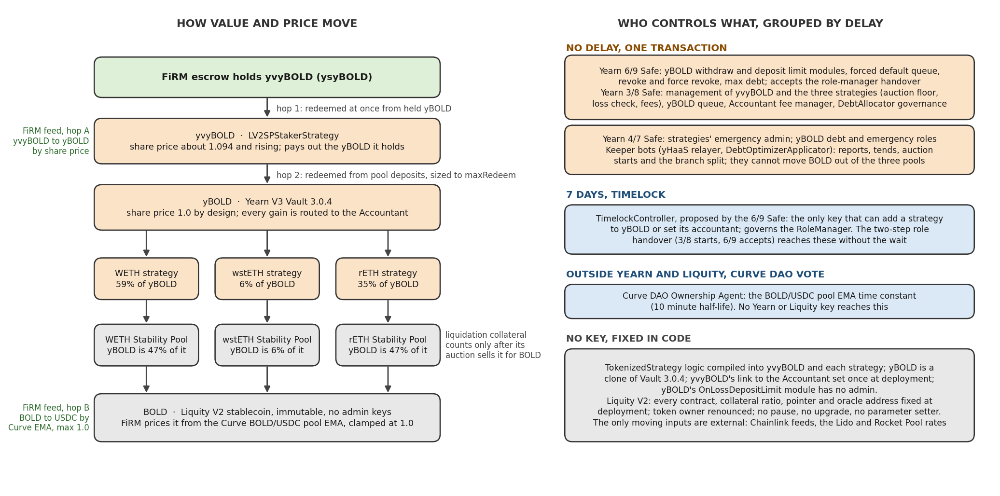

# FiRM Collateral Pre-Screening Assessment

**yvyBOLD: Staked Yearn BOLD on Liquity V2**

Inverse Finance Risk Working Group, September 22, 2026

## Contents

- [Protocol Overview](#protocol-overview)
- [Liquidity](#liquidity)
  - [DEX Liquidity](#dex-liquidity)
  - [Redemption Liquidity](#redemption-liquidity)
  - [DeFi Integrations](#defi-integrations)
- [Audits and Bug Bounty](#audits-and-bug-bounty)
- [Access Control Scanner Findings (2026-09-14)](#access-control-scanner-findings-2026-09-14)
  - [Pricing Authority](#pricing-authority)
  - [Upgrade and Supply Authority](#upgrade-and-supply-authority)
  - [Redemption Halt Authority](#redemption-halt-authority)
  - [Effective Authority (nominal vs effective)](#effective-authority-nominal-vs-effective)
  - [Market Feed Independence](#market-feed-independence)
  - [Monitoring Surface](#monitoring-surface)
- [Framework Findings and Remediation](#framework-findings-and-remediation)
- [Sources](#sources)

> [!TIP]
> **PROVISIONAL VERDICT: PROCEED TO FULL ASSESSMENT**
>
> yvyBOLD is a Yearn V3 staking wrapper over a Yearn V3 vault whose strategies deposit BOLD into Liquity V2's Stability Pools. The base layer is the cleanest access control profile the RWG has reviewed to date: Liquity V2 has no owner, no upgrade path, no pause and no settable parameter. The Yearn layer is Yearn's standard V3 topology, which the RWG accepts under its standing Yearn vault risk acceptance. Both layers carry deep audit records and live bug bounties, both clear the maturity standard, and no criterion fails the asset.
>
> Three structural concerns cap market sizing rather than disqualify:
>
> **1. The FiRM price is two hops.** The market hop rests on one Curve BOLD/USDC pool (11.8M USD, of which 3.4M USDC; 10 minute EMA half-life), so manipulation cost scales with a single pool's stable side. The vault hop is a share price that can only fall once Yearn management permits a loss report, so after a large Stability Pool liquidation the booked price can overstate value until the collateral auctions clear.
>
> **2. Exit is redemption-gated at two hops.** There is no direct DEX venue for yvyBOLD or yBOLD. A liquidator redeems yvyBOLD into yBOLD at once, then yBOLD into BOLD from the strategies' pool deposits (6.41M BOLD withdrawable at pin, 4.07M at the twelve-month low). Yearn's V3 levers can pause that second hop in one transaction; the exit shape belongs in the daily borrow limit and supply ceiling.
>
> **3. Liquity's immutability cuts both ways.** Every branch reads the same Chainlink ETH/USD feed and a stale read shuts branches permanently, the wstETH branch (55% of BOLD debt) inherits Lido's exchange rate unchecked, and yBOLD holds roughly 47% of two branches' Stability Pools, on a split that a Yearn keeper bot moves to follow yield. None of this is actionable by FiRM or Yearn; it is a sizing input.
>
> **Recommended disposition:** advance to a full risk assessment with no remediation asks to Yearn or Liquity. Size any listing against the Curve pool's USDC side and yvyBOLD's redeemable BOLD, not against BOLD supply.

---

## Protocol Overview

**The base layer.** Liquity V2 is a permissionless, immutable CDP protocol issuing BOLD against three collateral branches (WETH, wstETH and rETH), each with its own TroveManager, Stability Pool and PriceFeed. Borrowers set their own interest rate, which is both the cost of the loan and their position in the redemption queue. Peg defense is redemption at face value with a fee that floors at 0.5%.

Liquidations are absorbed first by the branch's Stability Pool, whose depositors receive the seized collateral at a discount plus 75% of borrower interest. The system was deployed once and cannot change; the only moving inputs are external (Chainlink feeds and the Lido and Rocket Pool exchange rates). A branch shuts permanently if its feed goes stale or its collateral ratio breaches the shutdown ratio, after which holders keep an exit through urgentRedemption at a 2% bonus. At pin the three branches carried 34.4M BOLD of debt (WETH 33%, wstETH 55%, rETH 12%) at collateral ratios above 225%.

**The Yearn layer.** yBOLD is an unmodified Yearn V3 vault that lends its BOLD to three strategies, one per branch. Its Accountant takes 100% of every reported gain as new yBOLD shares, so yBOLD stays at exactly 1.0 and an unstaked holder earns nothing. The split across the three branches is set by Yearn's DebtAllocator, whose targets a keeper bot resets every few days to follow Stability Pool yield with no rule reading branch debt or health; the split may reach 100% in a single branch, has ranged from 0 to 87% in wstETH, and at pin favored WETH and rETH.

yvyBOLD (ysyBOLD or st-yBOLD in Yearn's documentation) is the staked tier. It holds yBOLD, claims the accumulated fee shares on its own reports, keeps 10% as Yearn's fee, and unlocks the rest to holders over 3 days. Its share price was about 1.094 and rising at pin. Liquidation collateral earned by the strategies is sold back into BOLD through Dutch auctions that only a keeper or management can start, and it is not counted as strategy assets until sold.

**History.** Liquity V2 first launched in January 2025, disclosed a Stability Pool bug in February 2025 that users exited without loss, and relaunched on May 19, 2025 after a five-week audit competition and re-audits. The BOLD scanned here is the relaunched token. yBOLD and yvyBOLD launched in early June 2025.

| Attribute | Detail |
| :-- | :-- |
| **Issuer** | Yearn Finance (vault layer) over Liquity V2 (BOLD issuance). |
| **Asset under evaluation** | yvyBOLD, `0x23346B04a7f55b8760E5860AA5A77383D63491cD`. Yearn TokenizedStrategy wrapper over yBOLD (Yearn V3 vault) over BOLD. No repointable logic at any layer. |
| **Scan surface** | yvyBOLD: 15 contracts, 79 role slots, 1 EOA role holder. BOLD: 20 contracts, 168 role slots, 0 EOA role holders. Rescan deltas clean on both. |
| **Admin / upgrade authority** | Yearn: 3/8, 4/7 and 6/9 Safes, a 7 day timelock for strategy addition, keeper bots. Liquity: none. |
| **Mainnet age (Lindy)** | yvyBOLD 15.5 months; Liquity V2 relaunch 16.0 months. Liquity V1 unexploited since 2021; Yearn V3 code since 2023. |
| **Supply / backing** | yvyBOLD holds roughly 6.1M yBOLD (share price about 1.094, so roughly 5.6M shares), nearly all of yBOLD's supply. yBOLD is backed 1:1 by roughly 6.4M BOLD deposited across the three Stability Pools (59% WETH, 6% wstETH, 35% rETH), all withdrawable at pin with nothing awaiting auction. Backing is fully on-chain; Stability Pool deposits carry liquidation collateral between auction cycles. |
| **Aggregate exit liquidity** | No DEX venue for yvyBOLD; exit by redemption. BOLD DEX depth roughly 17.0M USD, of which Curve BOLD/USDC 11.8M. BOLD redeems for collateral at face value. |
| **Oracle / NAV pipeline (FiRM side)** | yvyBOLD to yBOLD by share price, BOLD to USDC by the Curve BOLD/USDC EMA (10 minute half-life), clamped at 1.0. BOLD read roughly 0.998 USD at pin. |
| **Redemption** | yvyBOLD to yBOLD at once; yBOLD to BOLD from pool deposits, sized to maxRedeem, collateral awaiting auction excluded; BOLD to collateral through Liquity at face value. |
| **Governance token** | YFI holds no vault role; LQTY directs incentives only and has no authority over BOLD. |
| **Permissioning** | All user paths are permissionless on both layers. No blocklist, freeze or pausability on any token in the stack. |

## Liquidity

A liquidator holding yvyBOLD passes through BOLD to reach a stable asset: yvyBOLD redeems into yBOLD at once, yBOLD redeems into BOLD from what the three strategies can pay, and the BOLD is sold. yvyBOLD itself has no live trading venue, so the exit is the DEX depth of BOLD, the redemption capacity that reaches it, and the integrators that price the asset along the way. Figures are from the RWG's on-chain studies of September 19, 2026.

### DEX Liquidity

| Venue / Pool | TVL | Notes |
| :-- | :-- | :-- |
| Curve BOLD/USDC | $11.8M | Primary venue and the EMA source for the FiRM feed; USDC side $3.4M; roughly $4.9M weekly volume. |
| Uniswap v4 BOLD/USDC | $2.3M | 96% reachable within 1% of spot; $2.0M weekly volume. |
| Uniswap v3 BOLD/USDC | $1.4M | 51% reachable within 1%; two LP owners. |
| **BOLD DEX total** | **$17.0M** | Six venues; three pools under $1M each ($1.4M combined) are not itemized. Against 36.5M BOLD supply; about $3.0M reachable outside the Curve pool. |

**Composition and shape.** Every venue is BOLD-heavy, so the number that absorbs selling is the stable side of each pool: $3.4M on the primary pool today, $2.0M at its February low. Outside the Curve pool, $3.7M of the $5.2M sits in the two Uniswap BOLD/USDC pools, and about $3.0M of it is reachable within 1% of spot.

**Persistence.** The Curve pool has ranged from $4.5M to $12.9M over the past year and is near the top of that range today.

### Redemption Liquidity

Both redemptions pay at face value with no slippage; the first cannot be short, and the second is bounded by what the strategies can withdraw from the Stability Pools. Redemption ends in BOLD, not a stable, so this capacity converts the wrapper into its base asset and the DEX table above decides what that BOLD is worth.

| Hop | Capacity at pin | Constraint |
| :-- | :-- | :-- |
| yvyBOLD to yBOLD | 6.4M yBOLD, all of yvyBOLD's holding | None; yvyBOLD pays out yBOLD it already holds. |
| yBOLD to BOLD | 6.41M BOLD withdrawable; 4.07M at the 12 month low | Collateral awaiting auction is excluded; a redemption larger than the strategies can pay reverts rather than fills in part; Yearn's withdraw limit module and forced default queue can stop this hop in one transaction (never used). |
| BOLD to branch collateral (Liquity redemption) | Up to the open branches' unbacked debt, 17.7M BOLD | Pays ETH and liquid-staking collateral, not a stable; the fee rises with size, so the bid is 0.963 at 1.11M and 0.926 at 2.44M BOLD. |

Across the vault's life there was never a moment when yvyBOLD held a claim and could redeem nothing; coverage of its own claim fell below 95% for two and a half hours in total, at worst to 87.9% during a wstETH liquidation in October 2025 that cleared in two hours.

### DeFi Integrations

The integrations that matter for a listing are the ones that price yvyBOLD or yBOLD, because they set what a liquidator can do with the collateral besides redeem it, and what price sources FiRM's feed would be correlated with. Two are live; no other protocol lists yvyBOLD today.

| Protocol | Market | Status at pin | Price source | Notes |
| :-- | :-- | :-- | :-- | :-- |
| Flex (flexmeow.com) | ysyBOLD/USDC, borrow USDC against yvyBOLD | 211k / 9.4k idle | [Price Oracle contract](https://etherscan.io/address/0x405568114Ee8058d0ca1Bbe95DA1f929279BaE65) | Fixed-rate, borrower-set rates with redemptions in the Liquity V2 pattern; immutable, no admin keys; redeemed collateral sold by Dutch auction; bad debt socialized to lenders after protocol upfront fees. The only live lender against yvyBOLD. |
| Liquity V2 Stability Pools | yBOLD's own deposits | 47% / 6% / 47% of the three pools | n/a | yBOLD is systemically important to Liquity; a large unwind removes half of two branches' first-loss buffer. |

**Pricing reads by integrators.** Flex is the only protocol that lends against yvyBOLD today, so it is the only source of external liquidation and redemption history, and its oracle is the one to check: if it reads the vault share prices and a Curve EMA in the same shape as FiRM's proposed feed, a dislocation in that pool moves both markets at once, and Flex's auctions would be selling yvyBOLD into the same BOLD depth FiRM's liquidators need.

## Audits and Bug Bounty

**Audit history.** Liquity documents 14 audit engagements across Dedaub, Coinspect, Recon and ChainSecurity plus formal verification, followed by the patched codebase, a five-week Cantina audit competition with over 800 researchers, and re-audits before the May 2025 relaunch. The bug that forced the relaunch was in scope for the pre-launch audits and found after launch, which is why the relaunch record is the more relevant evidence. The Yearn layer inherits the standing audits of Yearn's V3 vault and TokenizedStrategy base, and the yBOLD contracts were reviewed in a Sherlock audit contest in May 2025.

| Engagement | Date | Report | Scope |
| :-- | :-- | :-- | :-- |
| Dedaub Core Protocol Audits I and II | Aug and Nov 2024 | [Report I (Aug 2024)](https://dedaub.com/audits/liquity/liquity-v2-aug-28-2024/) [Report II (Nov 2024)](https://dedaub.com/audits/liquity/liquity-v2-second-audit-nov-11-2024/) | Liquity V2 core. |
| Coinspect Bold Core; V2 Governance | Dec 2024; Jan 2025 | [Bold Core (Dec 2024, PDF)](https://www.coinspect.com/doc/Coinspect%20-%20Smart%20Contract%20Audit%20-%20Liquity%20-%20Bold%20-%20v241231.pdf) [Bold Governance (Jan 2025, PDF)](https://www.coinspect.com/doc/Coinspect%20-%20Smart%20Contract%20Audit%20-%20Liquity%20-%20Bold%20Governance%20-%20v250120.pdf) | Core and the LQTY governance module. |
| Cantina audit competition | Mar to Apr 2025 | [Cantina audit competition (Mar to Apr 2025)](https://cantina.xyz/portfolio/fca4f98a-7d24-49f1-9a3b-80e5e65b2b30) | Patched codebase, 800+ researchers. |
| Dedaub fixes review; ChainSecurity re-audit | May 2025 | [Dedaub Cantina fixes review (May 2025)](https://dedaub.com/audits/liquity/liquity-v2-cantina-fixes-review-may-13-2025/) [ChainSecurity Code Assessment](https://www.chainsecurity.com/security-audit/liquity-bold-smart-contracts) | Pre-relaunch verification. |
| Sherlock yBOLD contest | May 2025 | [Sherlock yBOLD contest (May 2025)](https://audits.sherlock.xyz/contests/977) [Accepted risks in the repo](https://github.com/sherlock-audit/2025-05-yearn-ybold) | Vault configuration, Strategy, Staker, Accountant; 14,500 USDC pool. |

**Bug bounty.** Both layers run live programs: Liquity on Cantina since July 2025 with a 125,000 BOLD maximum for critical findings, Yearn on Immunefi with a 200,000 USD maximum and on Sherlock. Both clear the framework baseline; confirming that the yBOLD contracts are enumerated in Yearn's scope is an internal follow-up.

## Access Control Scanner Findings (2026-09-14)

Ground truth is the Trustfall reports for yvyBOLD (scan of September 14) and BOLD (scan of September 10). The Liquity layer is immutable and contributes no key, so the findings concern the Yearn layer and the external inputs Liquity reads. The RWG's standing position is that Yearn vault administration is accepted risk; FiRM already holds Yearn V2 collateral administered by the same Safes. The figure carries the authority map; the prose covers only what the figure cannot.

*The yvyBOLD stack and its authority map, built from the Trustfall data. Left: how value and the FiRM price move through the two Yearn wrappers into Liquity's Stability Pools, with the two redemption hops and the two feed hops marked. Right: every key grouped by the delay it acts under. Orange marks a Safe or bot that acts at once, blue a key behind a delay, grey what is fixed in code, green FiRM's position.*

### Pricing Authority

**Market hop.** The Curve BOLD/USDC EMA is the price source, and its only setter is the pool's time constant, held by the Curve DAO. No Yearn or Liquity key reaches it.

**Vault hop.** yvyBOLD's share price moves only when a report lands: upward on profit, downward only when a loss report is allowed through. Every strategy runs a health check with the loss limit at zero, so a report showing a loss reverts until the 3/8 Safe raises the limit or skips one check. The consequence for a lender is a lag rather than a lever: a Stability Pool loss reaches the share price only once management lets it, and holders who exit first receive full value. yBOLD's share price is fixed at 1.0 by construction and falls only when a loss is booked, which is the check on FiRM's 1:1 assumption.

### Upgrade and Supply Authority

**Code.** Nothing in the stack can be pointed at new logic. Each token has a single mint chokepoint: yvyBOLD by depositing yBOLD, yBOLD by depositing BOLD, and BOLD by a Trove drawing debt, with BOLD's mint and burn roster frozen at deployment.

**Composition.** The practical Yearn levers are composition rather than code. Adding a strategy to yBOLD or replacing its Accountant waits 7 days behind the timelock, though the two Safes can reach those roles without the wait through the RoleManager's two-step handover. A replaced Accountant could charge more than the gain and dilute every yBOLD holder, since the vault does not cap the fee. The branch split is a keeper-bot lever with no delay; it decides which branch's losses yvyBOLD carries but cannot move BOLD outside the three pools. Standard in Yearn's RoleManager and V3 vault.

### Redemption Halt Authority

**Hop one** cannot be halted, since yvyBOLD pays out yBOLD it already holds.

**Hop two** is where the V3-specific levers live, and this is the material difference from FiRM's Yearn V2 collateral. The 6/9 Safe can set a withdraw limit module that caps or refuses exits, either Safe can force an empty default queue that leaves yBOLD nothing to pay out, and the 6/9 Safe or the timelock can force-revoke a strategy and book its whole debt as a loss (about 59% of yBOLD for the WETH strategy today). None is set today and each is standard on every Yearn V3 vault; the RWG accepts them as administration and lists them as tripwires.

**Keepers and branches.** Turning liquidation collateral back into withdrawable BOLD depends on Yearn's keeper bots, since only a keeper or management can start an auction. On the Liquity side a shut branch stops earning but its Stability Pool deposits stay withdrawable.

### Effective Authority (nominal vs effective)

On the Liquity layer there is no authority of either kind. On the Yearn layer the fastest single-actor path to yvyBOLD's economics is the 3/8 Safe (management of yvyBOLD and the strategies, fee manager of yBOLD's Accountant, governance of the DebtAllocator), with the 6/9 Safe holding the exit levers and the timelock's proposer seat. Every role sits with a Safe, a contract or a keeper bot; the one EOA in the role surface holds an executor seat with no supply or exit capability, and the keeper bots can move BOLD between the three pools but not out of them. This is the topology the RWG already accepts on its other Yearn markets.

### Market Feed Independence

**The FiRM feed.** FiRM would consume no Yearn or Liquity oracle, and the 1.0 clamp means the feed can only price BOLD at or below the market. The dependency runs through market structure: one pool of roughly 11.8M USD is the entire price surface, so the cost of bending the EMA scales with that pool's depth, and the 10 minute half-life that makes it expensive to manipulate also makes it slow to accept a genuine collapse.

**Beneath the feed.** BOLD's solvency reads three Chainlink feeds owned by Chainlink's 4/9 Safe with no delay. All three branches read the same ETH/USD aggregator, a stale read shuts every branch permanently, and the wstETH branch multiplies its stETH price by Lido's exchange rate with no bound, no staleness check and no cross-check. FiRM already accepts ordinary Chainlink feed risk on its other stablecoin collateral; what is Liquity-specific is that there is no escape hatch and no admin, so a temporary oracle outage becomes a permanent branch shutdown with an exit only through urgentRedemption at a frozen price.

### Monitoring Surface

Should this proceed toward listing, the weekly Risk Observer Checklist additions are: on yBOLD, the withdraw limit module (must stay unset), the forced default queue flag (must stay false), the accountant pointer, any pending role-manager handover, the share price (1.0 unless a loss is booked) and strategy revocations; on the strategies, the loss limit and health check flags, the auction floor, collateral to claim or in auction, and the allocation split across branches; on Liquity, each branch's shutdown time and price source (both must read zero), Stability Pool size and yBOLD's share of it; on the feed, Curve BOLD/USDC TVL against a minimum-TVL threshold and the standard heartbeat and variance alert. Nearly all of these are already live-read and diffed in the Trustfall tripwire tables.

## Framework Findings and Remediation

Statuses: PASS, FLAG (concern that shapes parameters or sizing), EARLY (insufficient history), FAIL (disqualifying until remediated). Remediation entries are concrete asks to the Yearn or Liquity teams or internal follow-ups; rows with no ask carry a dash.

| Criterion | Status | Assessment | Remediation |
| :-- | :-- | :-- | :-- |
| **1a. Oracle Integrity** | 🟠 **FLAG** | Two-hop pipeline is sound and independent of both protocols. The market hop rests on one Curve pool (roughly 11.8M USD, 10 minute EMA half-life); the vault hop cannot book a loss until Yearn management permits it, so the price can lag a real Stability Pool loss. | Internal: define a minimum source-pool TVL threshold; add the loss-limit flag, collateral in auction and yBOLD share price to the weekly checklist. |
| **1b. Pricing Authority** | 🟢 **PASS** | No Yearn or Liquity key reaches the Curve EMA. Share prices move only on reports and only downward through a permitted loss. Yearn-standard, accepted. | - |
| **2. Upgradability / Effective Authority** | 🟢 **PASS** | No repointable logic anywhere. Liquity has no authority at all. Yearn's V3 topology is the same administration the RWG accepts on FiRM's existing Yearn markets. | - |
| **3a. Security Audits** | 🟢 **PASS** | Liquity: 14 engagements, formal verification, an audit competition and re-audits before relaunch. Yearn: V3 base audits plus the yBOLD Sherlock contest. | - |
| **3b. Bug Bounty** | 🟢 **PASS** | Liquity on Cantina (125,000 BOLD maximum); Yearn on Immunefi (200,000 USD maximum) and Sherlock. | Internal: confirm the yBOLD contracts sit in Yearn's Immunefi scope. |
| **4. Scope Stability** | 🟢 **PASS** | Rescan delta clean on both reports. Liquity's contract set cannot change; Yearn's has been stable since deployment. | Internal: weekly rescan continues. |
| **5. Mint / Redemption Halt** | 🟠 **FLAG** | Hop one cannot be halted. Hop two can be stopped instantly by Yearn's V3 exit levers, none set today, accepted as administration. Collateral auctions depend on Yearn keepers. Liquity branch shutdown leaves pool deposits withdrawable. | Internal: carry the redemption-gated exit into the daily borrow limit and supply ceiling; tripwires per Monitoring Surface. No ask to Yearn. |
| **6. On-chain Liquidity** | 🟠 **FLAG** | No direct venue; exit is redemption at two hops, the second bounded by roughly 6.41M BOLD withdrawable at pin. BOLD's own DEX depth is roughly 17.0M USD and growing, with protocol redemption behind it. | Internal: size against Curve BOLD/USDC TVL and Stability Pool withdrawable BOLD. |
| **7. Protocol Maturity (Lindy)** | 🟢 **PASS** | yvyBOLD 15.5 months; Liquity V2 relaunch 16.0 months, V1 since 2021. | - |
| **8. On-chain Track Record** | 🟢 **PASS** | yBOLD has booked no loss through 16 months of liquidation cycles. No exploit on Liquity V1 or the relaunched V2; the legacy deployment was retired before its bug could be exploited. | - |
| **9. Governance / Decentralization** | 🟢 **PASS** | Liquity governance-free by design. Yearn multisig-run with a 7 day timelock on strategy addition, accepted. | - |
| **10. Docs vs On-Chain** | 🟢 **PASS** | Load-bearing claims hold. Minor: Yearn's documentation says allocation is re-evaluated every 30 minutes while targets reset at a median gap of 5 days, and "no oracles" overstates it since auction floors read Liquity's collateral price. Cosmetic. | - |
| **11. Freeze / Blocklist** | 🟢 **PASS** | None on BOLD, yBOLD or yvyBOLD. The unset withdraw limit module is the only holder-specific mechanism, covered under row 5. | - |
| **12. Permissioning Profile** | 🟢 **PASS** | All user paths permissionless. One EOA role holder on the Yearn side (executor seat), zero on Liquity. | - |
| **13. Backing / Attestation** | 🟢 **PASS** | yvyBOLD is backed by yBOLD, which is backed 1:1 by BOLD in the Stability Pools, all withdrawable at pin; BOLD is overcollateralized on-chain CDP debt at branch ratios above 225%. The branch split, and so the liquidation exposure, follows yield and is set by a keeper bot that may concentrate up to 100% in one branch. | Internal: model backing at full concentration in a single branch, which the allocator permits, rather than at the current split; the split itself is a monitoring item. |

**Disposition mechanics.** A pre-screening does not assign parameters. No row fails, and the three FLAG rows shape sizing at the full assessment stage without producing an ask to Yearn or Liquity. The recommended path is to advance to a full risk assessment, define the minimum-TVL threshold and the loss-gate tripwires internally, and keep both assets on weekly Trustfall rescan.

## Sources

PRIMARY: Trustfall Access Control Report, [Staked yBOLD (ysyBOLD)](https://rwg-access-control-reports.vercel.app/reports/collateral/ysyBOLD.html), scan 2026-09-14 05:01 UTC, block 25973411; profile values verified at block 25970490 (RWG internal).

PRIMARY: Trustfall Access Control Report, [BOLD Stablecoin (BOLD)](https://rwg-access-control-reports.vercel.app/reports/collateral/BOLD.html), scan 2026-09-10 17:47 UTC, block 25948560 (RWG internal).
