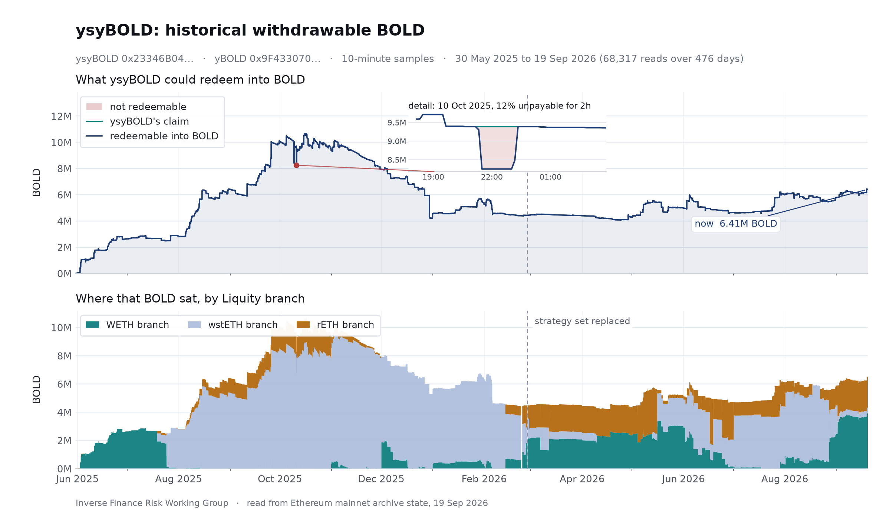
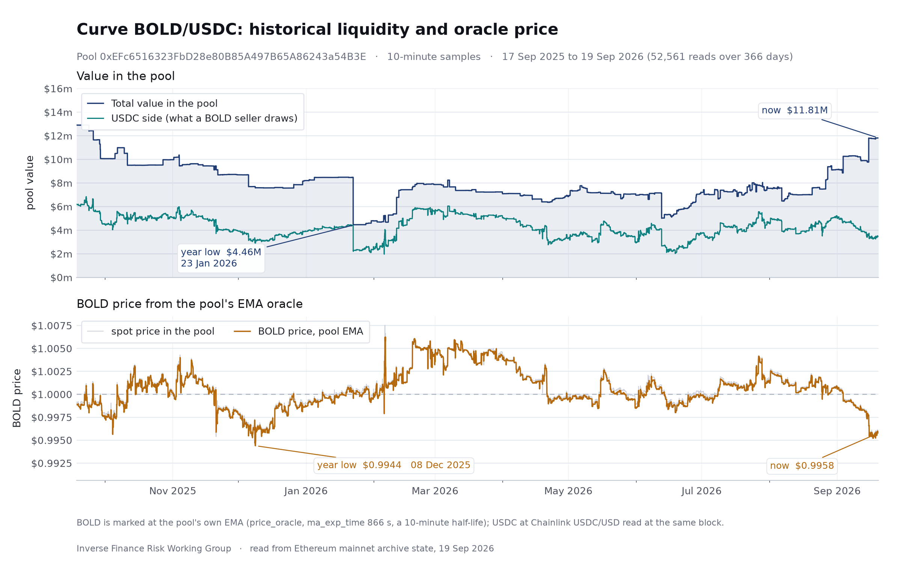
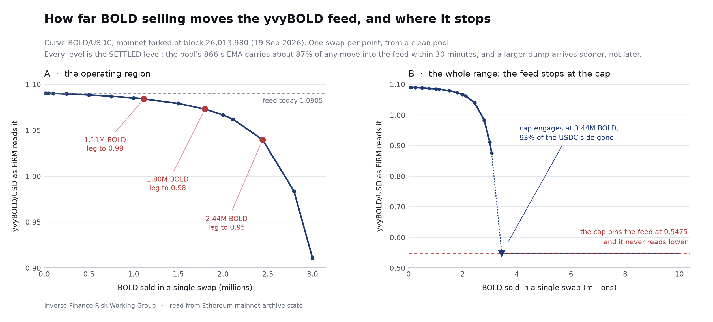

# FiRM Collateral Risk Assessment

## yvyBOLD (Staked Yearn BOLD) Collateral on FiRM

Inverse Finance Risk Working Group, October 5, 2026 (on-chain studies pinned September 19, 2026)

## Contents

**Briefing**
- [Forward](#forward)
- [Risk Vectors](#risk-vectors)
- [Useful Links](#useful-links)
- [Glossary](#glossary)

**Protocol Analysis**
- [Overview](#overview)
- [Audits and Bug Bounties](#audits-and-bug-bounties)

**Collateral Risk Analysis**
- [Liquidity](#liquidity)
- [Volatility](#volatility)
  - [Reading the Chart](#reading-the-chart)
  - [Feed Depth: How Far Selling Moves It](#feed-depth-how-far-selling-moves-it)
  - [Loss Transmission and the Auction Lag](#loss-transmission-and-the-auction-lag)
  - [Allocation and Branch Concentration](#allocation-and-branch-concentration)
  - [Branch Shutdown and the Shared Trigger](#branch-shutdown-and-the-shared-trigger)
  - [Risk Summary](#risk-summary)
- [Contracts](#contracts)
  - [Decentralization](#decentralization)
  - [Access Control + Impactful Variables & Functions](#access-control--impactful-variables--functions)
  - [Upgradable Proxy Implementations](#upgradable-proxy-implementations)
  - [Risk Summary](#risk-summary-1)

**FiRM Deployments & Design**
- [Price Feed](#price-feed)
- [Escrow](#escrow)

**Conclusion**
- [Parameter Recommendations](#parameter-recommendations)

---

# Briefing

## Forward

This risk assessment has been prepared by the Inverse Finance Risk Working Group at the request of internal stakeholders interested in integrating yvyBOLD as FiRM collateral. While the RWG has conducted thorough analysis and will provide parameter recommendations, this document should not be interpreted as the RWG advocating for or against the integration of this asset. Our role is strictly evaluative, focused on identifying risks and appropriate safeguards rather than promoting specific growth initiatives.

yvyBOLD is a third-party wrapper stack over an immutable base. The asset FiRM would hold is a Yearn V3 staking share; beneath it sits a Yearn V3 vault, beneath that Liquity V2's Stability Pools, and beneath those the BOLD stablecoin and the collateral Troves that back it. FiRM already holds Yearn V2 collateral administered by the same Safes that run this stack, and the V3 levers that the V2 collateral does not carry are named in this document so that each can be monitored.

This assessment follows the FiRM Collateral Pre-Screening of September 19, 2026, which returned a provisional verdict of proceed to full assessment: no framework criterion failed, three rows were flagged as shaping sizing rather than disqualifying (the two-hop price pipeline, the redemption-gated exit, and on-chain liquidity), and no remediation asks were made to Yearn or Liquity. Four on-chain studies were conducted for this assessment and are cited where used: a one-year history of the Curve BOLD/USDC pool that the FiRM feed would read, a depth simulation of how far selling moves that feed, a full-life history of how much BOLD yvyBOLD could actually redeem, and a census of every other BOLD venue on Ethereum. Four contract-level claims were verified from deployed source on September 23, 2026 and are stated as verified where they appear.

The document narrows from the base upward. Protocol Analysis covers Liquity V2 and the Yearn stack together. Collateral Risk Analysis then works the exit liquidity, the price behavior and the contract authority of the stack, and FiRM Deployments & Design and the Conclusion turn to what FiRM would be taking on if the share were listed.

## Risk Vectors

1. **One pool sets the price, and the exit runs through it twice removed.** yvyBOLD has no trading venue of its own, so a liquidator redeems into yBOLD, redeems that into whatever BOLD the three Stability Pool strategies can pay, and sells the BOLD. Today 6.41M BOLD is redeemable at the second hop against a twelve-month floor of 4.07M, and the third hop is one Curve pool with $3.44M on its USDC side, where 1.11M BOLD sold in a single transaction settles the feed's BOLD leg at 0.99 and 2.44M settles it at 0.95. Liquity's redemption does not backstop those sizes, since the bid is a curve in size and pays 0.963 on a 1.11M redemption and 0.926 on a 2.44M one, falling away at exactly the sizes that move the feed. Outside the primary pool about $3.0M is reachable within 1% of spot, $2.24M of it in a single Uniswap v4 pool, and two of the five secondary venues are fully gauge-staked with no CRV weight behind one of them, so their persistence is not established. Flex prices the same asset off the same pool and the same two share prices, holding its BOLD leg at 0.99 until an admin lifts the floor, at which point its liquidations arrive together into a USDC side FiRM has already drawn on. The vector binds the supply ceiling, the daily borrow limit and the liquidation incentive, and it is the reason sizing rests on what one FiRM liquidation episode would have to sell rather than on headline depth.

2. **Past 93% of the pool's USDC side the feed stops tracking the pool, and the wind-down settles what it reports there without creating a way out.** StableSwap-NG records each price as the lesser of spot and 2.0 before it enters the EMA, and because this pool prices USDC in BOLD while the feed takes the reciprocal, that ceiling is a floor: 0.50 USDC per BOLD, 0.5475 on the assembled feed, engaging once about 3.44M BOLD has been sold, at which point the true marginal price is near 0.12. No Curve or Liquity key can change it and an upper clamp does not remove it. ChainlinkCurveWindDownFeed addresses what the feed reports below that level by decaying the price to a terminal unit and returning a zero timestamp that blocks new borrowing while liquidations continue, triggered at an EMA of 1.9, which is 0.5263 on the BOLD leg and sits 5.3% above the floor so that the feed is still honest when the trigger becomes eligible. What the mechanism does not do is create exit liquidity, since the trigger fires when the pool is already nine tenths drained and a liquidator still unwinds through the two redemptions into that same pool. Ahead of the trigger sits a window the feed does not govern: reaching an EMA of 1.9 from the pin state requires closing 90% of the distance to the cap, which at an ma_exp_time of 866 seconds takes about 33 minutes even with the recorded input pinned at the cap, and borrowing stays open against a feed walking down from near par for that whole window. Four deployment settings remain open, one of which is load-bearing: the staleness check must be enabled on the market or the borrow-blocking property fails silently. The vector binds the collateral factor and the daily borrow limit, and the borrow limit rather than the feed is what bounds exposure through a fast repricing.

3. **The vault leg can report a value the collateral would not fetch.** A Stability Pool liquidation burns part of a strategy's deposit and pays it seized collateral that counts for nothing until a Dutch auction sells it back into BOLD, and the loss gate holds every report until the sale completes, so FiRM reads the booked share price rather than the realizable one through that window. The mechanism has run end to end once, on October 10, 2025, when about 1.14M BOLD of deposit was burned against 278 wstETH that was unredeemable for one hour and fifty-one minutes before the auction cleared above the burn; across the vault's life the strategies held unsold collateral for about a week in total and each lot cleared within hours. That record is the record of a healthy oracle and of keepers running, and neither is guaranteed: no one but a keeper or management can start an auction, keepers stop above a 200 gwei gas cap, and when a branch feed is off its primary source the auction opens at 230 times Liquity's price and takes about eighteen hours to reach a floor fixed at the start rather than 39 minutes. The share price is read live from chain state and cannot be stale in form, so the lag is not detectable from the feed's own timestamps and has to be monitored on the loss-gate and auction side. The vector binds the collateral factor, and the assessment carries the mechanism rather than the benign outcome to date into sizing.

4. **Yearn administration can stop the exit or move the collateral's value, and four of the levers emit nothing.** The withdraw limit module and the forced empty queue can each halt yBOLD redemption in one transaction from a Yearn Safe, which leaves a liquidator holding yBOLD of full value and no liquidity until Yearn releases it. On the value side, force revoking a strategy books its whole debt as a loss, about 61% of yBOLD in the WETH branch today, a replaced Accountant can charge more than the gain and push yBOLD below 1.0, and removing the deposit limit module lets new deposits dilute a recovery. The timelock holds only the yBOLD roles and only since April 1, 2026, and the role-manager handover, 3/8 to release and 6/9 to accept, reaches the timelocked levers without the seven day wait, so the delay reads as a convention rather than a track record. The loss limit, the health check flag, the auction floor and the keeper gas cap are all reachable from the 3/8 Safe and emit no events at all, the health check re-arming on the next report with no transaction to observe, so those four are visible only by polling state. None of these has been exercised on this vault, which is why they shape the collateral factor, the supply ceiling and the weekly tripwires rather than the verdict.

5. **Branch exposure is set by a bot within bounds FiRM cannot narrow, and the shutdown trigger is shared across all three.** A keeper resets each strategy's target share on a median gap of five days with pauses of up to 29, the targets follow Stability Pool yield and read nothing about branch debt or health, and they may place up to 100% of yBOLD in one branch; the wstETH target alone has ranged from 0 to 87% in a branch carrying 55% of Liquity's debt. Concentration changes what a loss looks like, and no branch is safe by default: WETH runs the tightest minimum ratio at 110% with 47 pool offsets on record against 12 on wstETH, rETH reads a 48 hour staleness window on RETH/ETH with a canonical rate a 2-of-3 council can freeze silently, and wstETH multiplies its price by Lido's rate with no cross-check and no staleness check. yBOLD is roughly half of the WETH and rETH pools, so a cascade on either lands on yvyBOLD in that proportion and a large unwind would remove half of those branches' first-loss buffer. Beneath all three sits one Chainlink ETH/USD aggregator read on every fetch, so a single stale read shuts every branch at once and permanently with no admin able to restore them, and each branch's canonical fallback stores the lower of the new product and the last stored price on every public call, so the price can only ratchet down. All three feeds are on primary today and the ratchet has never fired. Because FiRM's parameters are fixed at deployment and cannot track a split that moves every five days, the parameter model assumes full concentration in whichever branch carries the worst loss profile and treats today's split as a point inside that bound.

## Useful Links

**RWG Framework Outputs**

Trustfall Access Control Reports, [Staked yBOLD (ysyBOLD)](https://rwg-access-control-reports.vercel.app/reports/collateral/ysyBOLD.html) and [BOLD Stablecoin (BOLD)](https://rwg-access-control-reports.vercel.app/reports/collateral/BOLD.html)

FiRM Collateral Pre-Screening Assessment, [yvyBOLD (September 19, 2026)](https://github.com/InverseFinance/Risk-Assessments/blob/main/yvyBOLD/FiRM_Prescreening_yvyBOLD_Yearn.md)

RWG Battlestation, [yvyBOLD KPI Dashboard](https://docs.google.com/spreadsheets/d/1E7HWOIEHNMrkmxJw4Jelatv0kmpYg4w0P-iJ-9QTkGs/edit?gid=747541048#gid=747541048)

Assessment repository, [InverseFinance/Risk-Assessments](https://github.com/InverseFinance/Risk-Assessments)

**Key Contracts**

yvyBOLD (ysyBOLD), [0x23346B04...D63491cD](https://etherscan.io/address/0x23346B04a7f55b8760E5860AA5A77383D63491cD); yBOLD, [0x9F433070...EEdd8A3d8](https://etherscan.io/address/0x9F4330700a36B29952869fac9b33f45EEdd8A3d8); BOLD, [0x6440f144...54beB01D](https://etherscan.io/address/0x6440f144b7e50D6a8439336510312d2F54beB01D); Curve BOLD/USDC pool (feed source), [0xEFc65163...43a54B3E](https://etherscan.io/address/0xefc6516323fbd28e80b85a497b65a86243a54b3e)

## Glossary

| Term | Meaning |
|---|---|
| BOLD | Liquity V2's stablecoin, minted by Troves against WETH, wstETH or rETH and redeemable at face value for branch collateral |
| Branch, Trove | A branch is one collateral type's self-contained Liquity stack; a Trove is a borrowing position in it, with a user-set interest rate that also sets its redemption order |
| Stability Pool | The per-branch BOLD deposit that absorbs liquidations, receiving seized collateral at a discount plus 75% of branch interest |
| Branch shutdown | Permanent halt of a branch on oracle failure or breach of the shutdown collateral ratio; deposits stay withdrawable and holders keep urgentRedemption at a 2% bonus against the post-shutdown price |
| yBOLD | Yearn V3 vault over BOLD lending to three Stability Pool strategies; share price held at 1.0 with every gain routed to the Accountant |
| yvyBOLD (ysyBOLD, st-yBOLD) | The staked tier holding yBOLD and accruing the Accountant's fee shares; the asset proposed for listing |
| Accountant | The Yearn fee contract that takes 100% of each yBOLD report's gain as new shares and pays them to yvyBOLD |
| Loss limit and health check | The per-strategy report gate; at a loss limit of zero any loss report reverts until management raises it or skips one check |
| Dutch auction | The per-strategy sale of liquidation collateral back into BOLD, started only by a keeper or management, floored at 95% of Liquity's collateral price |
| EMA | The Curve pool's exponential moving average price; the BOLD/USDC pool's 866 second time constant gives a 10 minute half-life |
| Flex | A fixed-rate lending protocol in the Liquity V2 pattern; its ysyBOLD/USDC market is the only live lender against yvyBOLD |
| PPO | FiRM's Pessimistic Price Oracle. Caps borrowing power at the collateral's two-day low; does not constrain a liquidation executed during a live dislocation |

# Protocol Analysis

## Overview

This Overview is the document's one inventory of the stack's mechanics; the sections that follow measure them rather than re-explain them.

**The base layer (immutable).** Liquity V2 is a permissionless CDP protocol issuing BOLD against three collateral branches, WETH, wstETH and rETH, each a self-contained stack with its own TroveManager, Stability Pool and PriceFeed. A borrower opens a Trove, deposits collateral and draws at least 2,000 BOLD above the branch minimum ratio: 110% on WETH, 120% on the two liquid-staking branches. The system was deployed once and never changes: no owner, no upgrade path, no pause and no settable parameter anywhere in scope, and the token's owner renounced during setup, so the set of contracts that may mint or burn BOLD was frozen on day one.

**Borrower-set rates (structural).** Each borrower picks an annual rate between 0.5% and 250% and may change it at any time. The rate is both the cost of the loan and the borrower's position in the redemption queue, since redemptions hit the lowest-rate Troves first. Interest is minted as new BOLD and split 75% to the branch's Stability Pool and 25% to an InterestRouter funding LQTY-voted incentives, which is Liquity V2's only governance surface and holds no authority over minting, burning, pausing or upgrading.

**Peg defense runs on one mechanic (redemption).** Anyone may hand BOLD to the CollateralRegistry and receive an equal dollar value of collateral from the lowest-rate Troves, for a fee that floors at 0.5% and rises with size and recent volume. It pulls BOLD back toward a dollar from below and does nothing above par, so it is a bid rather than a peg, and one that weakens with size. A branch whose Stability Pool covers its whole debt drops out of the redemption route; today that is rETH at 112% cover, so redemption pressure concentrates on WETH and wstETH.

**Solvency runs on three (structural).** Permissionless liquidation into the branch's Stability Pool, which burns BOLD equal to the bad debt and hands depositors the seized collateral at a discount; redistribution onto the branch's other Troves only if the pool is exhausted; and branch shutdown, permanent and one-way, if the feed stops returning a fresh positive answer or the branch ratio falls below 110% (WETH) or 120% (liquid-staking). After shutdown, borrowing stops and ordinary redemption no longer routes there, but BOLD keeps a claim on the collateral through urgentRedemption at a 2% bonus against the price the feed returns.

**Pricing the branches (external inputs).** Every branch reads Chainlink ETH/USD on every fetch. The wstETH branch multiplies Chainlink STETH/USD by Lido's exchange rate with no cross-check; the rETH branch takes the lower of Chainlink RETH/ETH times ETH/USD and Rocket Pool's canonical rate, and the higher of the two on redemptions when they sit within 2%. Every oracle pointer is a constructor immutable, so what can still move sits outside Liquity: the Chainlink aggregators behind their proxies and the two staking protocols' rates.

**The Yearn layer (standard V3).** yBOLD is an unmodified Yearn V3 vault that lends its BOLD to three strategies, one per branch, each depositing into that branch's Stability Pool. Its Accountant takes 100% of every reported gain as new yBOLD shares, so yBOLD stays at exactly 1.0 and an unstaked holder earns nothing. yvyBOLD (ysyBOLD or st-yBOLD in Yearn's documentation) is the staked tier: it holds yBOLD, claims the accumulated fee shares on its own reports, keeps 10% as Yearn's fee and unlocks the rest over 3 days. Its share price has risen from 1.0 to about 1.095. The asset proposed for FiRM sits two wrappers above the stablecoin that backs it, and its own asset() is yBOLD, not BOLD.

**Exits (the two redemptions).** yvyBOLD redeems into yBOLD at once, from yBOLD it already holds. yBOLD redeems into BOLD from the strategies' pool deposits, and a redemption larger than they can pay reverts rather than filling in part. yvyBOLD has no trading venue of its own, so these two redemptions, then a sale of BOLD, are the only way out.

**Allocation (keeper-driven).** A keeper bot resets each strategy's target share every few days (a median gap of 5 days since February 2026, with pauses of up to 29). The targets follow Stability Pool yield, may place up to 100% of yBOLD in one branch, and read nothing about branch debt or health.

**Collateral auctions and the loss gate (Yearn-specific).** A liquidation burns part of a strategy's pool deposit and pays it the seized collateral, which counts for nothing until a Dutch auction sells it back into BOLD. An auction starts only on a keeper or management tend, opens at 115% of the lot's value at Liquity's price, steps down 0.5% a minute, and ends at a floor of 95% fixed at the start. Every strategy and yvyBOLD itself runs a health check with the loss limit at zero, so a report showing a loss reverts until the 3/8 Safe raises the limit or skips one check; in practice reports wait until the collateral has sold. After a booked loss, the Accountant takes no fee until yBOLD is back at 1.0, and the deposit limit module keeps new deposits out until it is.

**History.** Liquity V2 launched in January 2025, disclosed a Stability Pool bug in February that users exited without loss, and relaunched on May 19, 2025 after a five-week audit competition and re-audits; the BOLD assessed here is the relaunched token. yBOLD and yvyBOLD launched in early June 2025, and the strategy set was replaced once, on February 27, 2026.

## Audits and Bug Bounties

**Liquity V2.** Liquity documents fourteen engagements across four firms plus formal verification, and the roster is published with every report on its [technical docs page](https://docs.liquity.org/v2-documentation/technical-docs-and-audits):

- **Dedaub, August and November 2024.** Core Protocol Audit Reports [I](https://dedaub.com/audits/liquity/liquity-v2-aug-28-2024/) and [II](https://dedaub.com/audits/liquity/liquity-v2-second-audit-nov-11-2024/), the second after findings from both Dedaub and ChainSecurity had been addressed.
- **ChainSecurity, August 2024 to May 2025.** A rolling [code assessment](https://www.chainsecurity.com/security-audit/liquity-bold-smart-contracts) across several audits of the core contracts.
- **Recon, October 2024.** Invariant testing and [security review](https://github.com/GalloDaSballo/bold-review) of the core.
- **Certora, December 2024.** [Formal verification](https://certora.cdn.prismic.io/certora/Z1tLJJbqstJ98b8J_LiquityVerificationReport.pdf) of core properties.
- **Coinspect, December 2024 and January 2025.** [Bold Core](https://www.coinspect.com/doc/Coinspect%20-%20Smart%20Contract%20Audit%20-%20Liquity%20-%20Bold%20-%20v241231.pdf) and Bold Governance audits; the core report identified the single-oracle redemption halt that the deployed design still carries.
- **Cantina competition, March to April 2025, and re-audits.** After the February 2025 Stability Pool bug, the patched codebase went through a five-week [public competition](https://cantina.xyz/portfolio/fca4f98a-7d24-49f1-9a3b-80e5e65b2b30) with over 800 researchers, then a [Dedaub review](https://dedaub.com/audits/liquity/liquity-v2-cantina-fixes-review-may-13-2025/) of the competition fixes and a ChainSecurity re-audit before the May 19, 2025 relaunch.

The bug that forced the relaunch was in scope for the pre-launch audits and found after launch, which is the honest limit of any audit roster and the reason the relaunch record, competition plus re-audits on the exact deployed code, is the more relevant evidence. Sixteen of the seventeen core contracts reproduce byte-for-byte from the tagged deployment commit.

**Yearn.** yvyBOLD inherits the standing audits of the code it is built from. The V3 vault ([ChainSecurity v3.0.0](https://github.com/yearn/yearn-security/tree/master/audits/20230504_ChainSecurity_Yearn_V3), [yAudit v3.0.1](https://github.com/yearn/yearn-security/tree/master/audits/20230728_YAcademy_Yearn_V3.0.1), [StateMind v3.0.2](https://github.com/yearn/yearn-security/tree/master/audits/20240301_Statemind_Yearn_V3.0.2), [yAudit v3.1.0](https://github.com/yearn/yearn-security/tree/master/audits/20260601_yAudit_Yearn_V3.1.0)) and the [TokenizedStrategy base](https://reports.chainsecurity.com/Yearn/ChainSecurity_Yearn_TokenizedStrategy_Audit.pdf) that yvyBOLD and the three strategies compile in were audited before deployment; ChainSecurity reported no critical or high findings on either. The yBOLD-specific contracts, the vault configuration, the Stability Pool strategy, the staker and the Accountant, went through a [Sherlock audit contest](https://audits.sherlock.xyz/contests/977) in May 2025 with a 14,500 USDC pool; the contest README lists three accepted risks (the auction start price buffer, tend timing, and the protocol fee).

**Bug bounties.** Both layers run live programs. Liquity's is hosted on [Cantina](https://cantina.xyz/bounties/7aa23a2b-7e8b-4b88-a9bb-713dc102a11a) since July 2025 with a maximum reward of 125,000 BOLD for critical findings on the core repository and KYC required. Yearn runs a standing program on [Immunefi](https://immunefi.com/bounty/yearnfinance/) with a 200,000 USD maximum and a second on [Sherlock](https://audits.sherlock.xyz/bug-bounties/30). Both clear the framework baseline of an active bounty proportional to TVL. Whether the yBOLD strategy and staker contracts are enumerated in Yearn's Immunefi scope remains to be confirmed.

# Collateral Risk Analysis

## Liquidity

A liquidator holding yvyBOLD passes through BOLD to reach a stable asset: yvyBOLD redeems into yBOLD at once, yBOLD redeems into BOLD from what the three strategies can pay, and the BOLD is sold. yvyBOLD itself has no live trading venue, so the exit liquidity is the second hop's redeemable BOLD and the third hop's BOLD market, measured below.

**Redeemable BOLD.** Across the vault's whole life there was never a moment when yvyBOLD held a claim and could redeem nothing. Over the last twelve months the floor was 4.07M BOLD, on April 24, 2026, so at every sample a liquidator could have redeemed at least that much in one transaction; today it is 6.41M. Every period in which less than 4M was available falls in the vault's first months, when it simply held less, so the binding constraint historically has been the vault's size, not its liquidity.



*ysyBOLD's historical withdrawable BOLD, 10-minute samples from May 30, 2025 to September 19, 2026. Top: the teal line is ysyBOLD's claim, the BOLD it was owed, and the navy line is what it could actually redeem; they sit on top of each other almost always, and where they separate the gap is shaded red. The one separation visible at this scale, October 10, 2025, is magnified in the inset. The dashed vertical line is the strategy-set replacement of February 27, 2026. Bottom: which Liquity branch the redeemable BOLD sat in.*

| Withdrawable BOLD behind yvyBOLD | BOLD | Notes |
|---|---|---|
| Now (September 19, 2026) | 6.41M | Roughly 3.9M WETH, 0.4M wstETH, 2.2M rETH |
| Median, whole history | 5.03M | |
| Low, last 12 months | 4.07M | April 24, 2026 |
| High | 10.65M | October 16, 2025, nearly all in the wstETH branch |
| Time any size up to 4M was unavailable, last 12 months | none | Full history: 2.6 days below 0.1M, all in the fund-up months |

Measured as the share of yvyBOLD's own claim that was redeemable, coverage sat below 99.9% for 4.9 days of the 476 and below 95% for two and a half hours in total; even at the worst moment, 8.25M BOLD was redeemable against a 9.39M claim. That episode is examined under Volatility.

**BOLD's own market.** Six venues on Ethereum mainnet hold more than dust, and the same six clear any threshold between $30,000 and $390,000 (the census selected on the token address, since five further pools hold impostor tokens that merely carry the name). The Curve BOLD/USDC pool is the FiRM feed's source and is examined under Volatility; the other five total $5.19M. Liquity redemption sits behind all of them for BOLD but not for yvyBOLD, and what it pays at size is measured under Feed Depth.

| Venue / Pool | TVL | Composition | Within 1% of spot | Notes |
|---|---|---|---|---|
| Curve BOLD/USDC (feed source) | $11.81M | 71% BOLD / 29% USDC | full range | USDC side $3.44M; roughly $4.9M weekly volume |
| Uniswap v4 BOLD/USDC, 0.05% | $2.34M | 71% BOLD / 29% USDC | $2.24M (96%) | The deepest usable venue outside Curve; 520 positions, no hook; $2.0M 7 day volume |
| Uniswap v3 BOLD/USDC, 0.05% | $1.41M | 60% BOLD / 40% USDC | $0.73M (51%) | Two LP owners across four ranges; $0.56M 7 day volume |
| Curve BOLD/LUSD | $0.63M | 73% BOLD / 27% LUSD | full range | 98.7% gauge-staked, but the gauge's CRV weight is zero; $47k 7 day volume |
| Curve BOLD/avUSD | $0.42M | 70% BOLD / 30% avUSD | full range | 100% gauge-staked, three LP holders; $55k 7 day volume |
| Uniswap v4 ETH/BOLD, 0.30% | $0.39M | 77% BOLD / 23% ETH | $21k (5%) | Headline TVL is 18 times the reachable depth |
| **Total outside Curve BOLD/USDC** | **$5.19M** | BOLD side about $3.55M | about $3.0M | $2.24M of the reachable depth is one pool |
| **Total including it** | **$16.99M** | | | Against roughly 36.5M BOLD supply |

**Composition and shape.** BOLD's DEX depth is roughly half of its supply on paper, but every venue is BOLD-heavy, between 60% and 77%, so the number that absorbs selling is the stable side of each pool, not its total. Outside the primary pool, $3.75M of the $5.19M sits in the two Uniswap BOLD/USDC pools, and by the within-1% measure the reachable depth outside Curve is about $3.0M, of which $2.24M is a single v4 pool. Two of the five secondary venues are not sticky: the Curve BOLD/LUSD and BOLD/avUSD pools are 98.7% and 100% staked in their gauges, and the BOLD/LUSD gauge pays no CRV at all, so whatever holds that $630k there could leave without notice.

**Persistence.** The redeemable BOLD series ran 2.6M to 10.7M across the vault's life and has grown steadily since April 2026; the primary pool's history is read under Reading the Chart. The secondary venues are a single read at pin, their persistence is not established, and the two gauge-staked pools should be assumed transient.

**DeFi integrations.** Two protocols hold or price yvyBOLD in ways that bear on a FiRM market.

| Protocol | Market | Status at pin | Price source | Notes |
|---|---|---|---|---|
| Flex (flexmeow.com) | ysyBOLD/USDC, borrow USDC against yvyBOLD | Live; roughly $0.2M of lender deposits | [Its own oracle](https://etherscan.io/address/0x405568114Ee8058d0ca1Bbe95DA1f929279BaE65): the same two share prices and the same Curve BOLD/USDC EMA as FiRM's feed, USDC at par, BOLD capped at 1.01 and floored at 0.99 until an admin lifts the floor | Fixed-rate, borrower-set rates with redemptions; redeemed or liquidated ysyBOLD sold by Dutch auction; bad debt socialized to lenders. The only live lender against yvyBOLD and the only source of external liquidation history |
| Liquity V2 Stability Pools | yBOLD's own deposits | 47% / 6% / 47% of the three pools | n/a | yBOLD is systemically important to Liquity; a large unwind removes half of two branches' first-loss buffer |

No other protocol lists yvyBOLD: the two Pendle markets expired in November 2025 and May 2026, and BOLD's small Euler market prices BOLD, not the wrapper. BOLD's deployments on Base, Arbitrum, Optimism, Scroll and Avalanche are outside the scanned scope and supportive only. What Flex's oracle means for a FiRM liquidation is argued under Feed Depth.

## Volatility

The FiRM price has two moving legs that dislocate for different reasons: the market leg, BOLD in USDC from one Curve pool's EMA, moves when the pool is pushed; the vault leg, yvyBOLD's share price, moves only on reports, and downward only when management lets a loss through. This section takes the market leg's history and depth first, then the vault leg, then the branch exposure beneath both.

### Reading the Chart

The Curve BOLD/USDC pool study covers 366 days to September 19, 2026, sampled at the EMA's own 10 minute half-life so that no move the EMA registered is hidden between reads.



*Curve BOLD/USDC, 10-minute samples over 366 days. Top: total pool value (dark) and the USDC side alone (teal), which is what a BOLD seller draws down. Bottom: the EMA FiRM would read (amber) over the pool's spot price (pale), with $1.00 dashed.*

**The price leg has been quiet.** The EMA's year low was $0.9944 on December 8, 2025, its high $1.0062 in February 2026, and its median $1.0003. It sat below $0.999 for 22% of the year and below $0.9975 for 6.6%, and never printed below $0.99; the weakest print in the pool's life is $0.9909, in June 2025. Today's $0.9958 is among the five weakest days of the year. The EMA tracks spot closely: the gap was zero at the median, 2.6 basis points at the 99th percentile and 27.7 at its widest.

**The value leg is where the range sits.** The pool lived in a $4.5M to $12.9M band with a typical day near $7.6M, after $11.4M to $21.1M through mid-2025. The floor arrived in late January 2026 and held about two weeks, with the USDC side at $1.96M in early February; the two lows coincide with the pool's BOLD-heaviest stretch and its weakest prices. Today's $11.8M is the 98th percentile of the year by total value but the 20th by its USDC side ($3.44M against a year median of $4.23M), because the pool grew by adding BOLD. The price has never left a narrow band around par; the depth beneath it has varied by a factor of three within a year.

### Feed Depth: How Far Selling Moves It

The depth study replicates the FiRM feed's math from deployed code, forks mainnet at the September 19 pin, executes one BOLD sale per size from a clean pool, advances chain time until the EMA settles, and reads the feed. Every threshold was found by bisection with real swaps, and the same curve was run at the February 5, 2026 state, the year's low for exit liquidity, at the same amplification and fee so that depth is the only variable.



*How far BOLD selling moves the yvyBOLD feed, and where it stops. Panel A is the operating region, with the sales that settle the BOLD leg at 0.99, 0.98 and 0.95 marked. Panel B is the whole range, ending where the pool's own price cap pins the feed at 0.5475.*

| BOLD leg settles at | BOLD sold, September 19, 2026 pool | BOLD sold, February 5, 2026 pool (year low USDC) |
|---|---|---|
| 0.99 | 1.11M | 0.93M |
| 0.98 | 1.80M | 1.23M |
| 0.97 | 2.11M | 1.38M |
| 0.95 | 2.44M | 1.52M |
| 0.90 | 2.79M | 1.68M |
| 0.80 | 3.07M | 1.80M |
| Pool price cap binds; feed floors | 3.44M (93% of USDC side gone); feed 0.5475 | 1.97M (95% gone); feed 0.5250 |

**The sell curve.** Today, 1.11M BOLD sold in one transaction settles the feed's BOLD leg at 0.99 and 2.44M settles it at 0.95, with the knee between 2M and 3M; in the year's worst exit state the same levels cost 0.93M and 1.52M. A settled level is the pool's marginal price after the sale, not the price the seller received (the 2.44M sale realized 0.984 on average), and since the feed marks collateral at the marginal price, the settled column is the one that matters to a lender. For scale, yvyBOLD's redeemable BOLD is 6.41M, 2.6 times the 0.95 sale; what FiRM controls is the collateral its own liquidations would sell in one episode, which the supply ceiling bounds.

**Speed.** Half of any move reaches the feed within 10 minutes, 87% within 30, 98% within an hour and all of it within two. Because the feed reads the inverted leg, a large adverse move arrives faster than a small one; the sale that breaks the feed is also the one that arrives soonest.

**What the curve leaves out.** Nothing trades after the initial swap, so every settled level is a no-arbitrage bound: the level the feed reaches if no one steps in. That is the right figure for a sustained repricing, the credit-event case in which arbitrage absents itself, and it overstates a transient sale that gets bought back. For a transient sale the question is how long the feed stays down, and BOLD's arbitrage is thin at these sizes: the other venues hold about $1.2M of USDC within 1% of spot, Liquity redemption pays less than the post-sale market at every size on the curve (below), and the one unthrottled path, borrowers repaying Trove debt with discounted BOLD, is discretionary and weakens exactly when BOLD is impaired. The year's quiet record is consistent with arbitrage handling the sales that occurred, but none approached these sizes, so it is evidence of quiet flow rather than of arbitrage capacity.

**The redemption bid, measured.** Liquity's redemption is the structural bid beneath the pool, and it is weaker than the 0.995 intuition on two counts. The live bid uses the decayed base rate and stood at 0.99315 at pin, 26 basis points below the mark, with the 0.5% fee floor putting an absolute floor at 0.995. And the bid is a curve in size: redeeming 250k BOLD pays 0.986, redeeming 1.11M (the sale that settles the feed at 0.99) pays 0.963, and redeeming 2.44M (the 0.95 sale) pays 0.926. The redemption alternative falls away at exactly the sizes that move the feed.

**The pool's own price cap floors the feed.** StableSwap-NG records each price as the lesser of spot and 2.0 before it enters the EMA. Because this pool prices USDC in BOLD and the feed takes the reciprocal, that ceiling becomes a floor under BOLD at 0.50 and under the feed at 0.5475, engaging once about 3.44M BOLD has been sold and 93% of the USDC side is gone (the same fraction in every state measured). Past it the oracle stops describing the pool: at 4.0M sold the true marginal price was $0.12 while the oracle reported $0.50. A feed that overstates collateral fourfold produces no liquidation rather than a bad one, since no liquidator buys at a price the pool cannot support, so the position becomes bad debt that the feed keeps supporting. The floor rises with the two share prices, no Curve or Liquity key can change it, and it is an artifact of coin order: with USDC as the pool's first coin the same cap would be a harmless ceiling, so any sibling pool proposed as a feed source must be checked for coin order first.

**Two third parties sit on the same pool.** The pool's amplification, fee and EMA time constant are gated on the Curve factory admin behind a DAO vote, and the amplification was ramped from 100 to 300 in January 2026, so the curvature of this feed can change without reference to Inverse and has precedent for doing so. And Flex, the one other lender against yvyBOLD, prices it from the same EMA and the same two share prices, so any push that moves FiRM's feed moves Flex's, and Flex's liquidations then sell ysyBOLD to buyers who unwind through the same USDC side FiRM's liquidators need. Flex's oracle holds its BOLD leg at 0.99 until an admin sets depeg mode, so below 0.99 FiRM liquidates while Flex's price stands still; when the floor is lifted, Flex's price steps to the market in one transaction and its liquidations arrive together, into a pool FiRM has already drawn on. The correlation is staged rather than simultaneous. Flex is small enough today that the second stage would not move the pool; the point is structural and scales with Flex's size, which belongs on the monitoring surface.

### Loss Transmission and the Auction Lag

The route by which a Stability Pool loss reaches yvyBOLD's share price is set out in the Overview: seized collateral counts for nothing until a keeper-started auction sells it, and the loss gate holds every report until then. The one visible gap on the Liquidity figure, October 10, 2025, is the mechanism running end to end: a wstETH liquidation burned about 1.14M BOLD of the strategy's deposit and paid it 278 wstETH, which was unredeemable for one hour and fifty-one minutes until the auction sold it for more than the pool had burned. Every other episode in the 476-day series is rounding-scale; across the vault's life the strategies held unsold collateral for about a week in total, and each lot cleared within hours.

Four readings follow.

**The lag is keeper behavior, not a guarantee.** Keepers stop auctions above a gas cap of 200 gwei and no one else can start one; if keepers stopped, the BOLD in the pools would stay withdrawable while seized collateral sat unsold and the branch split froze where it was last set.

**The record is the record of a healthy oracle.** Whenever a branch feed is off its primary source, the auction opens at 230 times Liquity's price instead of 115% and the geometric 0.5% step takes about eighteen hours to reach the floor rather than 39 minutes; the floor is fixed at the start from the same feed reading, and the step that would cross it ends the auction, so the lot is never sold at the floor (verified from deployed source). The two-hour lag is the good case, not the bound.

**The lag protects late exiters at the vault's expense.** A holder who redeems during the gap receives full value; any shortfall on the sale lands on those who remain.

**FiRM reads the booked price, not the realized one.** In the window between a large liquidation and its auction the collateral can be marked above what it would fetch. The assessment carries the mechanism, not the benign outcome to date, into sizing.

### Allocation and Branch Concentration

The allocator's targets follow yield, and the month-end splits show how far they move. Through late 2025 nearly all of yBOLD sat in the wstETH branch, 8.2M of 9.4M in October; by April 2026 the wstETH strategy held nothing; today the split is roughly 61% WETH, 6% wstETH and 34% rETH, and the wstETH target has ranged from 0 to 87% in a branch carrying 55% of Liquity's debt.

Where the exposure sits changes what a loss looks like, and no branch is safe by default. yBOLD is roughly half of the WETH and rETH Stability Pools, so a liquidation cascade on either lands on yvyBOLD in that proportion, and a large yvyBOLD unwind would remove half of those branches' first-loss buffer. The WETH branch has the tightest minimum ratio at 110% and the most liquidations on record, 47 pool offsets against 12 on wstETH. The rETH branch reads the loosest oracle in the system, RETH/ETH with a 48 hour staleness window rated very high market risk by Chainlink, and its canonical rate can be frozen silently by a 2-of-3 council multisig. The wstETH branch multiplies its price by Lido's rate with no cross-check and no staleness check.

FiRM's parameters are fixed at deployment and change only by governance vote, so they cannot track a split a bot resets every five days. The split is a monitoring item, not a sizing input: the parameter model assumes full concentration in whichever branch carries the worst loss profile, which the allocator permits, and treats today's split as a point inside that bound.

### Branch Shutdown and the Shared Trigger

**What a shutdown does to yvyBOLD.** A shut branch stops earning, but its Stability Pool deposits stay withdrawable, so the BOLD a strategy holds there remains redeemable through hop two. What freezes is collateral awaiting auction and the price it can be sold at: after shutdown the branch price is frozen or falls, the auction floor is set against it, and urgentRedemption pays a 2% bonus against the same value. That bonus is consumed by a 1.96% adverse move in the collateral, which a 24 hour freeze has exceeded about a fifth of the time in BOLD's own history; urgentRedemption floors BOLD, but it does not defend par.

**The fallback only moves down.** None of the three feeds has a way back to its primary source (verified from deployed source). When a liquid-staking branch's own Chainlink oracle fails while ETH/USD still answers, the feed switches to ETH/USD times the staking protocol's canonical rate and, on every call from either fetch function, stores the lower of that product and the last stored price: the price keeps following the market downward and records every dip, and the minimum only blocks the way back up. Both fetch functions are public, so the write can be triggered by anyone at any block for the cost of gas. If ETH/USD or the rate provider then fails, the feed freezes at its last price; the WETH feed has no canonical mode and freezes at once. Everything that reads the branch price after a shutdown, liquidations, the urgentRedemption bonus and the strategies' auction opening and floor, then reads a number that can only fall. All three feeds are on primary today and the ratchet has never fired; every consequence here is conditional on a primary-oracle failure.

**The shared trigger.** Shutdown is per branch in law and system-wide in practice, because all three feeds read the same Chainlink ETH/USD aggregator on every fetch. A stale read there shuts all three branches at once, permanently, with no admin able to restore them. FiRM's other stablecoin collateral already reads Chainlink; what is Liquity-specific is that a temporary outage becomes a permanent loss of the branch, and that every liquidation and redemption inside the tolerance window executes on the stale price before the shutdown bites.

### Risk Summary

1. **One pool sets the price, and about 1.1M BOLD of selling marks it down 1%.** The market leg is a single Curve pool whose USDC side is $3.44M today and was $1.96M at the year's low; with no arbitrage, 1.11M BOLD sold settles the leg at 0.99 and 2.44M at 0.95 (0.93M and 1.52M on the February pool), half of the move arriving within 10 minutes. Neither the other venues nor the redemption bid catches a sale of that size, and the one other lender prices off the same pool with a floor that turns its liquidations into a later wave. The supply ceiling is sized so that the collateral FiRM would liquidate in one episode stays inside these thresholds on the February pool.
2. **Past 93% of the USDC side the feed stops telling the truth.** The pool's price cap floors the feed at 0.5475 once about 3.44M BOLD has been sold, and beyond it the oracle overstates collateral fourfold, producing bad debt that the feed keeps supporting rather than a liquidation. No Curve or Liquity key can change it; a FiRM-side guard is the only remedy.
3. **The vault leg can lag a real loss.** The share price falls only when a loss report is let through, and seized collateral is not payable until auctioned. The gap has been two hours on the record; it is keeper-dependent, its settings emit no events, it stretches to eighteen hours in a degraded-oracle state against a floor that only falls, and FiRM marks collateral at the booked price throughout.
4. **Branch exposure is dynamic and bounded at 100%.** The allocator follows yield with no health input and has swung yBOLD from nearly all wstETH to none in six months, and each branch carries a distinctive oracle or liquidation hazard. Parameters are set against full concentration in the worst branch; the live split is monitored.

## Contracts

The access control picture below is grounded in two Trustfall scans: yvyBOLD on September 14, 2026, covering 15 contracts, 79 role slots and 140 privileged functions across the Yearn stack, and BOLD on September 10, 2026, covering 20 contracts, 168 role slots and 92 privileged functions across the three branches, the token and the registry. Both rescans were clean, with no change to roles, parameters, contracts or findings. The Liquity layer resolves zero EOA role holders and zero critical roles; the Yearn layer resolves one EOA in the role surface and one critical observation cluster, the eleven parameter levers the report itemizes.


*The yvyBOLD stack and its authority map, built from the Trustfall data. Left: how value and the FiRM price move through the two Yearn wrappers into Liquity's Stability Pools, with the two redemption hops and the two feed hops marked. Right: every key grouped by the delay it acts under. Orange marks a Safe or bot that acts at once, blue a key behind a delay, grey what is fixed in code, green FiRM's position.*

### Decentralization

Authority over the stack runs in two tiers on the Yearn side and none on the Liquity side, as the figure shows. The slow path is a 7 day [TimelockController](https://etherscan.io/address/0x88Ba032be87d5EF1fbE87336B7090767F367BF73), proposed only by the [6/9 Safe](https://etherscan.io/address/0xFEB4acf3df3cDEA7399794D0869ef76A6EfAff52), which holds the add-strategy and accountant roles directly on yBOLD. The fast path is the [3/8 Safe](https://etherscan.io/address/0x16388463d60FFE0661Cf7F1f31a7D658aC790ff7) as management of yvyBOLD and the strategies, the 6/9 Safe holding yBOLD's exit levers, a [4/7 Safe](https://etherscan.io/address/0xe5e2Baf96198c56380dDD5E992D7d1ADa0e989c0) as emergency admin, and keeper bots that run reports, tends, auctions and the branch split but cannot move BOLD outside the three pools or take it. This is Yearn's standard topology, governance deliberately not behind a timelock so that live vaults can be fixed without notice, and FiRM's existing Yearn V2 collateral is run by the same 3/8 and 6/9 Safes.

The realized history is unremarkable: seven configuration changes since deployment, none touching an exit lever, all itemized with transaction hashes in the [Trustfall report](https://rwg-access-control-reports.vercel.app/reports/collateral/ysyBOLD.html). Three of its facts qualify the topology above. The timelock has held its yBOLD roles only since April 1, 2026, when the role-manager seat returned from a fleet-wide migration; before that the 6/9 Safe held every yBOLD role with no delay, so the 7 day gate is five months old. The 3/8 Safe's threshold has been three since September 2021, but five of its eight signers were seated on May 21, 2026, so the current set is four months old. And the one EOA in the role surface holds the executor seat on a Yearn timelock helper, executed the two changes to yvyBOLD's profit unlock time, and can neither mint nor block an exit.

### Access Control + Impactful Variables & Functions

**What is fixed.** Most of the stack cannot be changed by anyone. yvyBOLD and the three strategies compile Yearn's TokenizedStrategy logic in as a bytecode constant; yBOLD is a minimal-proxy clone of Vault 3.0.4; yvyBOLD's link to the Accountant was set once at deployment; the performance fee is capped in code at 50%; and the auction's degraded-oracle multiplier is a constant with no setter. On the Liquity side every contract, ratio, pointer and oracle address was fixed at deployment: the collateral ratios (110% minimum on WETH, 120% on the liquid-staking branches), the 2,000 BOLD minimum debt, the 75/25 interest split, the 0.5% redemption fee floor, the 2% urgent redemption bonus, and the oracle staleness windows (24 hours on ETH/USD and STETH/USD, 48 hours on RETH/ETH, none on the two canonical staking rates).

**What can move.** Every lever that can move sits on the Yearn side or outside the stack entirely. The Trustfall report enumerates all eleven Yearn-side levers with their thresholds and current values; the table keeps the ones that change what a lender holds, grouped by what they move.

| Lever | Authority and delay | What it moves |
|---|---|---|
| Withdraw limit module; forced empty queue (`set_withdraw_limit_module`, `set_use_default_queue`) | 6/9 Safe; either Safe. No delay | Stops yBOLD redemption, the second hop of the exit. Never used |
| Deposit limit module (`set_deposit_limit_module`) | DEPOSIT_LIMIT_MANAGER: 6/9 and 3/8 Safes. No delay; pointer last set August 24, 2025 | Which deposits yBOLD accepts. The current module closes deposits whenever yBOLD is below 1.0, so a loss recovers to existing holders; removing or replacing it lets new deposits dilute that recovery. Cannot touch exits |
| Force revoke a strategy (`force_revoke_strategy`) | 6/9 Safe now, or the timelock in 7 days | Books that strategy's debt as a loss, about 61% of yBOLD for WETH today |
| Auction floor and tend settings (`setMinAuctionPriceBps`, `setMaxGasPriceToTend`) | 3/8 Safe. No delay | How fast, and how cheaply, seized collateral turns back into BOLD; floor 95% and gas cap 200 gwei today |
| Replace the Accountant (`set_accountant`) | Timelock, 7 days on paper since April 2026; the two-Safe handover (3/8 releases, 6/9 accepts) reaches it at once | Uncapped fee on every gain; yvyBOLD's yield stops until reset |
| Loss limit and health check (`setLossLimitRatio`, `setDoHealthCheck`) | 3/8 Safe. No delay | When a Stability Pool loss reaches the share price: a lag, not a lever |
| Allocation targets (`setStrategyDebtRatio`) | Keeper bot; 3/8 Safe can remove it. No delay | Which branch's liquidations yvyBOLD carries, up to 100% in one; cannot take BOLD |
| Curve pool amplification, fee and EMA time constant; Chainlink USDC/USD (`ramp_A`, `set_ma_exp_time`; aggregator repoint) | Curve factory admin behind a DAO vote; Chainlink, no delay | The shape and the inputs of the FiRM feed's market leg, all outside the stack |
| Chainlink branch feeds; Lido and Rocket Pool rates | Chainlink 4/9 Safe, no delay; Lido committee daily; Rocket Pool council in one block | Every Trove's price, outside both protocols; argued under Volatility |
| Flex oracle depeg mode (`set_depeg_mode`) | Flex admin address, no delay | Whether the other lender's price follows BOLD below 0.99; outside the stack, argued under Feed Depth |

The first five rows are Yearn V3's own controls and the material difference from FiRM's Yearn V2 collateral, which has no withdraw limit module, no deposit limit module, and whose fees are capped by the vault. None has been exercised on yBOLD and all are standard on every V3 vault; each is a tripwire on the weekly checklist.

Four of these levers emit no event when changed: the loss limit, the health check flag, the auction floor and the keeper gas cap (verified from deployed source: the strategy, its health-check base and its strategy base declare no events at all). A change to any of them is invisible in logs and reachable only by polling state, which is how the Trustfall rescan tracks them, so the tripwires on the loss gate and the auction settings hold at the rescan cadence, weekly today, and not at block latency; a change made and reversed inside one cycle would not be seen. The health check flag is weaker still: it re-arms itself on the next report with no transaction and no event, so a turn-off can be reconstructed from calldata but the turn-back-on cannot. All four sit with the 3/8 Safe, which is also the position that can release yBOLD's role-manager seat; the loss limit is 0 today, and since 0 is the conservative setting, a silent raise is the risk direction.

### Upgradable Proxy Implementations

Nothing in the stack can be pointed at new logic, so no admin can change the rules under a lender and equally no defect can be patched in place, only migrated away from: a new strategy behind the 7 day timelock on the Yearn side, nothing at all on the Liquity side. The third-party contracts the stack reads are outside that guarantee: the three Chainlink aggregator proxies, Lido's stETH (an Aragon app proxy whose base has been replaced six times), and Rocket Pool's registry, whose balances contract has been re-pointed twice, once underneath a live BOLD branch.

### Risk Summary

The residual risks in this section are Yearn administration, standard on every V3 vault, and none has been exercised on this vault; they are recorded by what they do to a FiRM position, so that the Conclusion can weigh them and the monitoring surface is complete.

1. **Levers that stop the exit.** The withdraw limit module and the forced empty queue can each stop yBOLD redemption in one transaction from a Yearn Safe. A liquidator holding yvyBOLD would then hold yBOLD it cannot yet redeem: the position keeps its value, but its liquidity waits on Yearn. Neither has been set in the vault's life; they drive the daily borrow limit and supply ceiling, and each is a weekly tripwire.
2. **Levers that move the collateral's value.** Three levers can lower what FiRM's feed reads, since the vault leg is the product of the two share prices. Force revoke books a strategy's whole debt as a loss, about 61% of yBOLD for WETH today (6/9 Safe at once, or the timelock in 7 days). A replaced Accountant can charge more than the gain and push yBOLD below 1.0 (the timelock's 7 day delay, which dates from April 1, 2026). Removing the deposit limit module lets new deposits dilute a recovery after a booked loss (either Safe, at once). The role-manager handover, 3/8 to release and 6/9 to accept, reaches the timelocked levers without the wait, and the timelock's five-month history means its delay should be read as a convention rather than a track record. All three resolve into the collateral factor and the same weekly tripwires.

# FiRM Deployments & Design

## Price Feed

FiRM prices yvyBOLD in USD through two share-price conversions, one market read and one Chainlink read, with the market leg clamped so that BOLD is never valued above par:

```
yvyBOLD/USD = yvyBOLD share price × yBOLD share price × min(BOLD in USDC from the Curve BOLD/USDC EMA × Chainlink USDC/USD, 1.00)
```

The arrangement is assembled from four contracts, each holding one step of that expression, with the market leg served by ChainlinkCurveWindDownFeed, a variant of FiRM's deployed ChainlinkCurveFeed that adds an explicit wind-down path for the case where the Curve EMA's internal cap stops the feed tracking further downside. The existing ChainlinkCurveFeed is unchanged and remains in use for coin-1 pricing. The market to be deployed reads the top of the stack, and the layers below it are reached only through the feed() reference each one holds:

| Layer | Contract | Address | Returns |
|---|---|---|---|
| 1 | ERC4626Feed | [0x8ab5c471046e91fca8c3dcda5ff97d84f9308662](https://etherscan.io/address/0x8ab5c471046e91fca8c3dcda5ff97d84f9308662) | Clamped BOLD/USD using the yBOLD vault rate using the ysyBOLD vault rate |
| 2 | ERC4626Feed | [0xf847b7cfadd07b9e4a5e4a5e5fa6af7f8ea9fe9a](https://etherscan.io/address/0xf847b7cfadd07b9e4a5e4a5e5fa6af7f8ea9fe9a) | Clamped BOLD/USD using the yBOLD vault rate |
| 3 | ClampedPriceFeed | [0xc313aca6a79057b4290cd0f17c24ad2942f2e043](https://etherscan.io/address/0xc313aca6a79057b4290cd0f17c24ad2942f2e043) | Clamped BOLD/USD |
| 4 | ChainlinkCurveWindDownFeed | [0xefb013ba5ec3a07f2056254e7545e89c78107cdd](https://etherscan.io/address/0xefb013ba5ec3a07f2056254e7545e89c78107cdd) | BOLD/USD |

All four report 18 decimals and all four were deployed on October 5, 2026 within three thousand blocks of one another. The reference leg sits one step further down, in the ChainlinkBasePriceFeed at [0x1022ea0a280d3a935988a5d481b047800bbfbfd9](https://etherscan.io/address/0x1022ea0a280d3a935988a5d481b047800bbfbfd9), which wraps the Chainlink USDC/USD proxy and holds the feed's only heartbeat. The assembled reading reconciles exactly: the clamp layer multiplied by the yBOLD and ysyBOLD share prices reproduces the top-level answer to the last significant digit, which confirms that the layers are wired in the intended order and that no conversion is applied twice. The table below records the inputs at pin and the mutable surface of each.

| # | Component | Value at pin (September 19, 2026) | Mutable surface |
|---|---|---|---|
| 1 | Curve BOLD/USDC `price_oracle(0)` | 1.00409 USDC in BOLD; BOLD in USDC is its reciprocal, 0.99593 | Market; amplification, fee and `ma_exp_time` (866s) held by the Curve factory admin; no timestamp |
| 2 | Chainlink USDC/USD | 0.999847 (12.6 hours old at pin; 86,400s heartbeat) | Chainlink aggregator behind its proxy; the feed's one timestamped input; heartbeat and fallback settable by the owner of ChainlinkBasePriceFeed; deviation threshold is off-chain configuration |
| 3 | Clamp at 1.00 | not binding (0.99577 after the USDC leg, 42 basis points below the cap) | None; the cap is a constructor immutable on a contract that carries no owner and no setter |
| 4 | yBOLD share price | 1.000000 | Yearn reporting; falls only on a booked loss |
| 5 | yvyBOLD share price | 1.095127 | Yearn reporting; falls only on a permitted loss report |
| 6 | Assembled feed | 1.0905 | |

**Orientation.** For a StableSwap-NG pool, `price_oracle(0)` is the EMA price of coins[1] denominated in coins[0], so on this pool it reads USDC priced in BOLD, and BOLD in USDC is the reciprocal. Read the other way round, the feed would report a premium on exactly the days BOLD trades at a discount. The inversion is confirmed in the deployed code: ChainlinkCurveFeed at a target index of zero returns the USD leg divided by price_oracle, which reproduces the pin exactly (0.999847 / 1.00409 = 0.99577), and ChainlinkCurveWindDownFeed takes both the target index and the reference oracle index as constructor arguments, each of which reads zero on the deployed contract and neither of which can be changed afterwards. Flex's deployed oracle for the same asset inverts the same way and asserts the coin order in its constructor. The depth study's two independent checks agree, and the arithmetic reconciliation of the four layers at a single block agrees with both.

**Mutability.** The market leg has no owner, no setter and no upgrade path; every configuration value is a constructor immutable, and the one privileged function is the wind-down stop described below. The clamp layer is in the same position, holding three immutables and exposing no write function at all. The Chainlink USDC/USD leg sits behind ChainlinkBasePriceFeed, which carries an owner and a settable heartbeat plus a fallback aggregator, and that owner is the Inverse Timelock, so a heartbeat or fallback change is a governance action rather than a multisig one. Everything else the feed reads is held outside FiRM: the pool's amplification, fee and time constant by the Curve factory admin, the USDC/USD aggregator by Chainlink, and the two share prices by Yearn's reporting.

**The clamp and the floor.** BOLD has no mechanism above par, and its premium has run as high as 0.6% for weeks, so 1.00 is its correct ceiling: the clamp discards that side while passing a peg break through at full depth. It is a ceiling only; the market leg sat 42 basis points below it at pin and every sale moves it further away. The two share-price legs are left unbounded by design, since yvyBOLD is a claim on a growing pile of yBOLD and legitimately exceeds 1.0. Beneath the feed sits an involuntary floor that the clamp does not touch and cannot: StableSwap-NG records each price as the lesser of spot and 2.0 before it enters the EMA, and because this pool prices USDC in BOLD while the feed takes the reciprocal, that ceiling becomes a floor. The floor is relative to the reference asset and the conversions applied to it, not a fixed dollar figure: it is half a USDC per BOLD, which at pin is 0.49992 USD on the BOLD leg and 0.5475 on the assembled feed, and it rises with the two share prices. An upper USD clamp does not remove it, and no Curve or Liquity key can change it. It is an artifact of coin order, so any sibling pool proposed as a feed source must be checked for coin order first.

**The wind-down path.** ChainlinkCurveWindDownFeed carries an explicit exit from the floor region, and it operates in two stages that are worth keeping separate because they have different trigger conditions and different consequences. The first stage needs no transaction: from the moment the EMA reaches 1.9, which is 0.5263 USDC per BOLD and about 0.576 on the assembled feed at the pin share prices, the feed returns an updatedAt of zero while continuing to report the live price. That zero propagates through the clamp layer and both vault legs to the top of the stack, so wherever a non-zero staleness threshold is configured on the market, new borrowing stops at the trigger itself rather than at anyone's discretion. The second stage is the decay, and it does require a transaction. Once the EMA is at or above 1.9, any caller may invoke startWindDown(), which records the live price and the timestamp, after which the reported price falls linearly from the recorded level to a terminal of one hundred raw feed units, which is 1e-16 USD and effectively zero, over 86,400 seconds, holding at the terminal afterwards. Liquidations continue to read the decaying price throughout. The intent is an orderly wind-down of the market rather than a pause: borrowing stops as soon as the pool reaches the trigger level and outstanding positions are then marked down until they clear. The caller of startWindDown() receives the feed's DOLA balance as an incentive. RWG holds stopWindDown(), restricted to an address fixed at deployment, which clears the recorded state and restores live pricing so that borrowing can resume under normal checks. A recovery in the EMA does not restore live pricing on its own; a started wind-down continues to decay until it is stopped, so the stop is the only route back.

**Where the trigger sits.** The trigger fires at an EMA of 1.9 inclusive, 5% before the pool's cap at 2.0, so both the borrow block and the decay become available while the feed is still tracking the pool rather than after it has frozen; the cap is the level the design exists to keep the feed from reaching. Below 1.9 the feed reports a live timestamp and startWindDown() reverts with TriggerNotReached(), and the transition at the boundary is a step rather than a ramp: at an EMA of 1.8999 the feed still carries a live timestamp, and at 1.9 it carries zero.

**The lag before the trigger is reachable.** The trigger reads the EMA, not spot, and the same smoothing that protects it from manipulation also delays it. Reaching 1.9 from the pin state requires closing 90% of the distance to the cap, which at an ma_exp_time of 866 seconds takes about 33 minutes even with the recorded input pinned at 2.0 continuously, and the cap means no amount of further selling shortens that. Through those 33 minutes borrowing remains open and the feed walks down from near par toward 0.5263, so in a fast collapse the feed overstates collateral for the whole window and no part of the wind-down is available inside it. That window sits before the trigger and outside what any configuration of this feed governs, which is why the daily borrow limit rather than the feed is the control that bounds exposure during a fast repricing. What the design does remove is a second delay that would otherwise have followed the first, since the borrow block no longer waits on a caller, an incentive or a keeper once the trigger is reached.

**What the wind-down settles, and what it does not.** It settles what the feed reports below the floor. A feed that would otherwise report 0.5475 against a true marginal price near 0.12 instead marks the position down and stops new borrowing, so the market no longer supports debt it cannot back, and the outcome is bad debt correctly measured rather than bad debt the oracle conceals. It does not create exit liquidity. By construction the trigger fires when the pool is already nine tenths drained, and a liquidator holding seized yvyBOLD still unwinds through the two redemptions and then into that same pool, so clearance is not guaranteed and positions must still be economically viable to liquidate. Sizing therefore rests on the realizable exit figures rather than on the wind-down, which changes what FiRM reports about a distressed position and not what the position can be sold for.

**Observability.** The deployed contract carries two events, each emitted with one indexed argument, and recovery is the one of the two whose signature is recoverable from the bytecode, WindDownStopped(address), which records the caller. The activation event is present at topic 0x60afdf871911646137b8c93453147f8b1ca9228b7cb19997bdfe969283de27bc; its name and argument types are not recoverable from the bytecode alone. Logs are in any case not the primary route, because the state is public and more informative than either event: windDownStartedAt() and windDownStartPrice() report whether a decay is running and from where, and canStartWindDown() reports whether the trigger has been reached, which is also the condition under which the feed is already returning a zero timestamp. Monitoring should read that flag directly rather than wait for a log, and should track the EMA's distance from 1.9 as the leading indicator for the trigger becoming reachable. That is a deliberate contrast with the four Yearn levers itemized under Access Control, which emit nothing at all and are reachable only by polling.

**Deployed Settings.** Every value the feed needs is fixed and readable on chain. The decay runs for 86,400 seconds, which governs only liquidation pressure since borrowing stops at the trigger regardless of it, and a day is long enough for RWG to observe a trigger and stop it before the decay does real damage while still marking a genuinely impaired position inside a single monitoring cycle. The terminal price is one hundred raw units rather than zero, which keeps the feed returning a positive answer that downstream consumers can divide by. The stop is held by the RWG multisig at [0xe3ed95e130ad9e15643f5a5f232a3dae980784cd](https://etherscan.io/address/0xe3ed95e130ad9e15643f5a5f232a3dae980784cd), a Safe whose threshold is one of four signers, so a stop can be executed by any single signer without assembling a quorum, which is the right trade for a function whose only effect is to restore normal pricing. Two items sit on the FiRM side rather than the feed's. The staleness threshold on this market must be set to a non-zero value, because a threshold of zero disables the comparison instead of tightening it and the borrow block then fails silently; the same check is owed to every market sharing this reference leg. And the feed's DOLA balance is currently zero, so the startWindDown() incentive is unfunded, which does not affect the borrow block but does mean the decay will not begin unless RWG or a watching party calls it.

**Residual risks.** Stopping a wind-down does not clear the FiRM Oracle's recorded daily lows, so the pessimistic price keeps reflecting the decay until those readings expire, and recovery from a false trigger is therefore not immediate; positions remain liquidatable through that tail. This is documented behaviour rather than an oversight, and it is accepted on the understanding that the trigger is hard to reach by accident. Funding the caller incentive while the EMA still sits at or above 1.9 hands it to whoever restarts the wind-down and undoes the stop in the same block, so the reward should be placed only once the EMA is back below the trigger, and the present balance of zero is the safe state to hold between now and then. Deliberately driving the EMA to 1.9 is possible in principle and uneconomic in practice: it requires holding the pool at or beyond the cap for roughly half an hour after selling upwards of 3M BOLD, against arbitrage that can buy the discounted BOLD and redeem it through Liquity at 0.926 on a 2.44M redemption, and the cost of that exceeds any liquidation incentive extractable at the ceiling contemplated here by orders of magnitude. The sizing rule that follows is simply that the ceiling must stay small enough for that to remain true. Finally, the mechanism carries no persistence window, and it does not need one, because the EMA's 866-second smoothing is the persistence test: a spot wick lasting one block moves the EMA by well under 2% of the gap and cannot make the trigger eligible.

**Staleness.** The two share prices are read live from chain state and cannot be stale. The Curve EMA can: it is written only when the pool is traded, returns its last settled value indefinitely otherwise, and carries no timestamp a consumer can test, so any staleness guard on the market leg has to be built on the FiRM side. The Chainlink USDC/USD leg is the only timestamped input and carries the feed's sole heartbeat, which is set to 86,400 seconds against an aggregator whose own heartbeat is also 86,400 seconds, leaving no buffer for a late round. A fallback is configured on the base feed, so the consequence of a boundary-straddling read is a reroute rather than a revert, and the fallback is a Curve TriCrypto2 cross priced off Chainlink ETH/USD, which currently prints about 26 basis points above the main feed. The deviation threshold on the aggregator is off-chain configuration and should be confirmed on the feed's own page alongside any heartbeat review. A stale USDC leg does not block wind-down activation, which requires only a readable positive price, so the mechanism survives the case where BOLD's collapse coincides with stress on the reference feed. Two further legs can be stale in substance without being stale in form: the yvyBOLD share price after a large liquidation whose collateral has not yet auctioned, and the Curve EMA in the two hours after a push. Neither is detectable from the feed's own timestamps, which is why the loss-gate and source-pool tripwires under Monitoring Surface exist.

## Escrow

yvyBOLD auto-compounds, so no yield venue needs to sit between FiRM and the collateral, and the expected escrow is FiRM's simple ERC-20 escrow: it holds yvyBOLD for the borrower, and on repayment or liquidation pay() returns yvyBOLD to the liquidator, who unwinds through the two redemptions described under Liquidity. There is no strategy, no staking contract and no third-party withdrawal path in the escrow itself.

# Conclusion

yvyBOLD clears every criterion of the FiRM Collateral Screening Framework and is listable under the parameters recommended below, on a guarded launch with a staged review. The stack divides cleanly: the base beneath the wrapper carries almost no discretionary risk, the Yearn layer above it carries administration that is standard and unexercised, and the price pipeline carries nearly all of the residual risk this assessment identifies. Sizing follows that division, with the collateral factor set against the vault leg and the supply ceiling set against the exit.

**The base requires no monitoring for governance action because there is none.** Liquity V2 has no owner, no upgrade path, no pause and no settable parameter, so the branch minimum ratios, the redemption fee floor, the urgent redemption bonus and the staleness windows are all properties of deployed bytecode rather than positions a vote could move. The audit record is unusually complete for a protocol of this age: fourteen engagements across four firms plus formal verification, and the evidence that matters is the relaunch record, a five-week competition with over 800 researchers followed by two re-audits on the exact deployed code, with sixteen of the seventeen core contracts reproducing byte-for-byte from the tagged commit. Both layers run live bug bounties proportional to their size, 125,000 BOLD on Cantina for the core and 200,000 USD on Immunefi plus a second program on Sherlock for Yearn. The bug that forced the February 2025 relaunch was in scope for the pre-launch audits and found after launch, which is the honest limit of any roster and the reason the post-relaunch record rather than the engagement count is the evidence relied on here.

**The Yearn layer adds administration rather than architecture.** Every lever itemized under Access Control is standard on a V3 vault, none has been exercised in this vault's life, and FiRM already holds Yearn V2 collateral administered by the same Safes. What is new relative to that V2 exposure is the specific V3 set: two levers that can halt redemption in one transaction, three that can lower what the feed reads, a role-manager handover that reaches the timelocked levers without the seven day wait, and four levers reachable from the 3/8 Safe that emit no events at all and are therefore visible only by polling state. These shape the collateral factor and populate the weekly tripwires; none of them bears on whether the asset is listable.

**The residual risk concentrates in the price pipeline, and the wind-down feed changes its character without removing it.** The feed reads one Curve pool through an exponential moving average, and the RWG's standing reservation about single-source EMA pricing applies in full. Beneath it sits a floor that is an artifact of coin order rather than of anything Inverse or Curve or Liquity configured: at 0.5475 on the assembled feed the oracle stops describing the pool, and past that point a position becomes bad debt the feed keeps supporting because no liquidator buys at a price the pool cannot honor. ChainlinkCurveWindDownFeed converts that outcome from concealed bad debt into a market that stops new borrowing and marks outstanding positions down, triggering at an EMA of 1.9 while the feed is still reporting honestly, and the circuit-breaker property is the right one for a stablecoin collateral: a feed reading fifty cents on a dollar-denominated asset should not support new debt under any reading of the situation. What the mechanism does not do is create exit liquidity, since the trigger fires when the pool is already nine tenths drained. It also leaves a window ahead of itself that no configuration of the feed governs, because reaching the trigger from a healthy state takes roughly 33 minutes of smoothing during which borrowing stays open against a falling feed, which is why the daily borrow limit rather than the feed bounds exposure through a fast repricing. The listing is conditional on the feed deploying with its four open settings fixed, and one of those is load-bearing rather than discretionary: the staleness check must be enabled on this market, because the zero timestamp is the entire borrow-blocking mechanism and it fails silently if the check is absent.

**The vault-leg lag is carried into sizing without driving the collateral factor below 85%.** A Stability Pool liquidation pays a strategy seized collateral that counts for nothing until a keeper-started auction sells it, and the loss gate holds reports until then, so FiRM can read a share price above what the collateral would fetch. The mechanism has run end to end once, on October 10, 2025, when about 12% of yvyBOLD's claim was unredeemable for one hour and fifty-one minutes before the auction cleared above the burn, and across the vault's life unsold collateral was held for about a week in total with each lot clearing within hours. Weighted on its own the lag argues for a factor below 85%, and the reason it does not bind is that the exposure it can reach is bounded by the ceiling rather than by the factor: a dislocation of that shape against a 2M market is a bounded loss rather than a solvency event, and a factor set lower would buy protection against the lag while leaving the exit constraint that actually governs this listing untouched. 85% also sits below the 90% to 92% band FiRM runs on its stablecoin LP collateral, and the market's demand at existing factors gives no reason to reach higher.

**Concentration within the stack resolves upward to the weakest branch, by construction rather than by assumption.** The allocator's targets follow Stability Pool yield, yield follows risk premium, and the allocator reads nothing about branch debt or health, so the strategy set tends toward whichever venue is being paid most to absorb risk. Rating the asset on its weakest branch is therefore a description of what the keeper does rather than a conservative overlay applied on top of it. The current weak point is the rETH branch, which reads a 48 hour staleness window on RETH/ETH rated very high market risk and a canonical rate a 2-of-3 council can freeze silently, and the allocator is free to place all of yBOLD there. Because FiRM's parameters are fixed at deployment and cannot track a split a bot resets every five days, the parameters below assume full concentration in the worst branch and treat today's roughly 61% WETH, 6% wstETH and 34% rETH split as a point inside that bound.

**The ceiling is sized against the pool's worst observed state, not its current one.** A full drawdown of a 2,000,000 DOLA ceiling at an 85% factor implies about 2.36M BOLD reaching the market if the whole book were liquidated in one episode, which on today's pool sits between the 0.97 and 0.95 rows of the sell curve and, at the February 5, 2026 state that marked the year's low for exit liquidity, is 1.2 times the sale that binds the pool's price cap. Simultaneous liquidation of an entire market is not the design case and the daily borrow limit bounds how quickly debt can reach the ceiling, but the comparison is what makes the review cadence load-bearing rather than procedural. It also yields a reduction condition alongside the usual expansion conditions: if the feed pool's USDC side returns toward the 1.96M it touched in early February, the ceiling comes down rather than holds, and the trailing 30-day floor of redeemable BOLD rather than a spot reading is the figure that decision is taken against.

**A guarded launch modeled on the reUSD LP rollout is the appropriate posture, with a 30-day review cadence.** The price leg's record supports a lookback rather than continuous intervention: across a year in which the pool's total value ran from $4.5M to $12.9M and its USDC side fell as low as $1.96M, the EMA never printed below $0.99 and sat at $1.0003 at the median, so the price held through a threefold swing in the depth beneath it. The review surface at each 30-day mark is the trailing 30-day floor of redeemable BOLD at the second hop, the feed pool's USDC side and the EMA's distance from the 1.9 trigger, the loss gate and any unsold collateral awaiting auction, the branch split and the health of whichever branch the allocator has favored, Flex's size as the correlated lender on the same pool, and the state of the wind-down itself. Expansion is warranted when the trailing floor and the pool's stable side both hold above their launch readings and no tripwire has fired; the ceiling reduces when either falls materially, without waiting for the next scheduled review.

**What remains before the market goes live is the feed, not the assessment.** The design is settled and reviewed, and the four deployment settings named under Price Feed are risk decisions that should be recorded rather than left to implementation, with the RWG-held stop function on a multisig and in-house keeper coverage treated as load-bearing rather than as a backstop to generalized searchers. Subject to that deployment, the RWG's position is that the listing is defensible at the parameters below and is not defensible at materially looser ones, and that the case for expansion should be made against observed readings at the 30-day marks rather than against the absence of incident.

## Parameter Recommendations

| Parameter | Recommendation | Driving scenario |
|---|---|---|
| Collateral Factor | 85% | Vault-leg lag between a Stability Pool liquidation and its auction, bounded by the ceiling rather than by the factor; set below the 90% to 92% band FiRM runs on stablecoin LP collateral. |
| Liquidation Factor | 100% | The collateral has no venue of its own and exits through two redemptions, so a partial liquidation leaves a residue no liquidator wants; consistent with the longtail treatment adopted after October 10, 2025. |
| Liquidation Incentive | 5% | Covers the two redemptions and the swap at the minimum debt, and stays too small at the ceiling to fund driving the EMA to the wind-down trigger against Liquity's redemption arbitrage. |
| Supply Ceiling | 2,000,000 DOLA | Full drawdown implies about 2.36M BOLD reaching the market, between the 0.97 and 0.95 rows of the sell curve today and 1.2 times the cap-binding sale at the February 5, 2026 pool state. |
| Daily Borrow Limit | 500,000 DOLA | Bounds debt accumulation through the roughly 33 minutes in which the feed walks down before the wind-down trigger becomes reachable. |
| Minimum Debt | 3,000 DOLA | Carried from April 2025 per the Min Debt Methodology, gas-adjusted for the heavier escrow path. |
| Staleness threshold | 86,400 | Chainlink USDC/USD is the feed's only timestamped input and carries an 86,400 second heartbeat; the value matters less than that the check is enabled, since the wind-down's zero timestamp is stale under any positive threshold and the borrow block fails silently if it is not set |

The parameters are recommended as a launch configuration rather than a steady state. The collateral factor, liquidation factor, liquidation incentive and minimum debt are expected to hold across reviews, since each is set against a structural property of the stack rather than against a market reading. The supply ceiling and the daily borrow limit are the two the 30-day cadence exists to revisit, in both directions.
